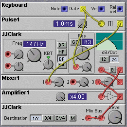
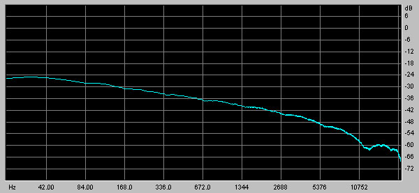
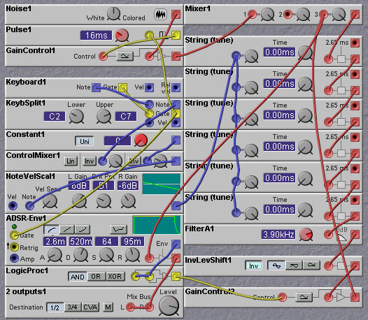
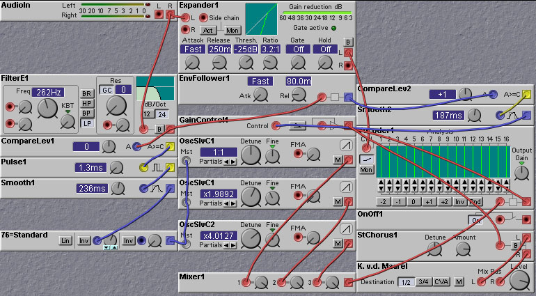
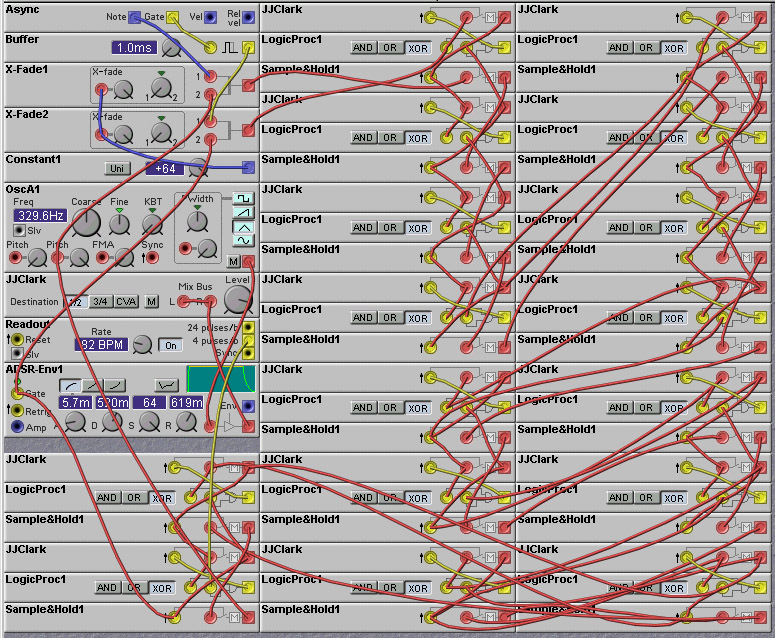
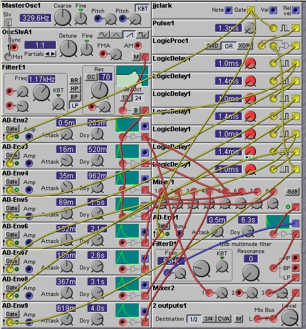
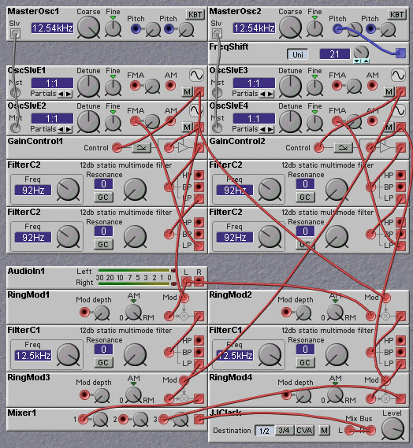

[(c) James Clark 2003](http://www.cim.mcgill.ca/~clark/)

\pagebreak

Table of Contents
-----------------

1 [Introduction](#nm_intro)

1.1 [The Purpose of this Document](#purpose)

1.2 [Acknowledgements](#acknowledgements)

2 [Oscillator Waveform Modification](#nm_oscillator)

2.1 [Sync](#sync)

2.2 [Frequency Modulation Techniques](#fm)

2.3 [Wave Shaping](#waveshaping)

2.4 [Vector Synthesis](#vector)

2.5 [Wave Sequencing](#wavesequencing)

2.6 [Audio-Rate Crossfading](#crossfade)

2.7 [Wave Terrain Synthesis](#terrain)

2.8 [VOSIM](#vosim)

2.9 [FOF Synthesis](#fof)

2.10 [Granular Synthesis](#granular)

3 [Filter Techniques](#nm_filters)

3.1 [Resonant Filters as Oscillators](#osc)

3.2 [Serial and Parallel Filter Techniques](#parallel)

3.3 [Audio-Rate Filter Cutoff Modulation](#audio-rate)

3.4 [Adding Analog Feel](#analog)

3.5 [Wet Filters](#wet)

4 [Noise Generation](#nm_noise)

4.1 [White Noise](#white)

4.2 [Brown Noise](#brown)

4.3 [Pink Noise](#pink)

4.4 [Pitched Noise](#pitched)

5 [Percussion](#nm_percussion)

5.1 [Bass Drum Synthesis](#bass)

5.2 [Snare Drum Synthesis](#snare)

5.3 [Synthesis of Gongs, Bells and Cymbals](#cymbal)

5.4 [Synthesis of Hand Claps](#claps)

6 [Additive Synthesis](#nm_additive)

6.1 [What is Additive Synthesis?](#sixintro)

6.2 [Resynthesis](#resynthesis)

6.3 [Group Additive Synthesis](#group)

6.4 [Morphing](#morphing)

6.5 [Transients](#transients)

6.7 [Which Oscillator to Use](#oscillators)

7 [Physical Modeling](#nm_physical)

7.1 [Introduction to Physical Modeling](#sevenintro)

7.2 [The Karplus-Strong Algorithm](#karplus-strong)

7.3 [Tuning of Delay Lines](#tuning)

7.4 [Delay Line Details](#delayline)

7.5 [Physical Modeling with Digital
Waveguides](#digital-waveguides)

7.6 [String Modeling](#strings)

7.7 [Woodwind Modeling](#woodwinds)

7.8 [Related Links](#links)

8 [Speech Synthesis and Processing](#nm_speech)

8.1 [Vocoder Techniques](#vocoder)

8.2 [Speech Synthesis](#speech)

8.3 [Pitch Tracking](#pitch)

9 [Using the Logic Modules](#nm_logic)

9.1 [Complex Logic Functions](#logic_functions)

9.2 [Flipflops, Counters other Sequential
Elements](#counters)

9.3 [Asynchronous Elements](#async)

9.4 [Arpeggiation](#arpeggiation)

10 [Algorithmic Composition](#nm_algorithmic)

10.1 [Chaos and Fractal Music](#chaos)

10.2 [Cellular Automata](#cellular)

10.3 [Cooking Noodles](#noodles)

11 [Reverb and Echo Effects](#nm_delay_effects)

11.1 [Synthetic Echo and Reverb](#synthetic)

11.2 [Short-Time Reverb](#short-time)

11.3 [Low-Fidelity Echo and Reverb](#lowfi)

12 [Distortion Effects](#nm_distortion_effects)

12.1 [Distortion using
Nonlinearities](#distortion)

12.2 [Multiband
Distortion](#multiband_distortion)

12.3 [Polynomial Distortion](#chebyshev)

12.4 [Distortion using Time-Variant
Systems](#time-variant_distortion)

13 [Frequency and Pitch Shifting](#nm_spectrum_shift)

13.1 [Frequency Shifting](#frequency_shift)

13.2 [Pitch Shifting](#pitch_shift)

14 [Spatialization](#nm_spatialization)

15 [Emulating Classic Synths](#nm_emulation)

15.1 [General Guidelines](#guidelines)

15.2 [Yamaha DX7](#dx7)

15.3 [Octave Cat](#octave)

15.4 [ARP Odyssey](#odyssey)

15.5 [Casio](#casio)

15.6 [Hallsey Mark 1 and 2](#hallsey)

15.7 [Other Emulations](#others)

A pdf file of the complete book can be downloaded from \
[www.cim.mcgill.ca/\~clark/nordmodularbook/nordmodularbook.pdf](http://www.cim.mcgill.ca/~clark/nordmodularbook/nordmodularbook.pdf)

A file containing all of the patches in book can be downloaded from \
[www.cim.mcgill.ca/\~clark/nordmodularbook/nm\_book\_patches.zip](http://www.cim.mcgill.ca/~clark/nordmodularbook/nm_book_patches.zip)

\pagebreak

[]{#nm_intro}

# Chapter 1. Introduction

[]{#purpose}

## 1.1 The Purpose of this Document

This web-based hypertext document is intended to provide the advanced
user of the Clavia Nord Modular synthesizer with a toolbox of techniques
for creating complex and interesting patches. Although the emphasis is
on the Nord Modular, the techniques described in this document can be
applied to any modular synthesizer, from a modular Moog to the Native
Instruments Reaktor softsynth. For more information on the Nord Modular,
check out Clavia's web page at <http://www.clavia.se>.

This document fills a need for more advanced material beyond what can be
found in the Nord Modular manual and in the Wizoo Guide to the Nord
Modular (by Peter Gorges and Len Sasso, 2nd edition 2000). While both of
these books are excellent introductions for the beginner, more advanced
users are left thirsting for more. This document aims to quench this
thirst!

In the online web-based document all of the patches shown in the figures
can be downloaded by clicking on the associated image. These can be then
be examined off-line with the Clavia Nord Modular editor (version 3.0 or
higher) or downloaded to an actual Nord Modular. The latter is
recommended as you can hear directly the sounds that are being talked
about in the text.

[]{#acknowledgements}

## 1.2 Acknowledgements

The document incorporates many random thoughts and ideas gleaned from
the Nord Modular mailing list, as well as, to a lesser extent, the
Native Instruments Reaktor and Analog Heaven mailing lists. All of these
mailing lists are excellent sources of information and support for
people interested in modular music synthesis.

Many people have contributed ideas and material to this work. I would
especially like to thank Rob Hordijk, Wout Blommers, Jan Punter, Kees
van der Maarel, Roland Kuit, Ico Doornekamp, Robin Whittle, Chet Singer,
Dave Peck, Sam Streeper, and K. Lex Pattyrson (or whatever his name is)
for their contributions and inspiration.

\pagebreak

[]{#nm_oscillator}

# Chapter 2. Oscillator Waveform Modification

Most of the oscillators in the Nord Modular provide only the most basic
waveform shapes: Sine, Triangle, Sawtooth, and Square (or Pulse). The
Formant oscillator and the Spectral Oscillator are exceptions to this,
and we will discuss them later.

The so-called *subtractive* approach to sound synthesis uses filtering
of these basic waveforms to provide control over the harmonic content of
a sound. A sinewave has only a single harmonic, and therefore filtering
does not alter its harmonic content at all, merely the amplitude of the
sound. A triangle wave has more harmonics, but with very low amplitudes,
so they too are not too useful as sources for subtractive synthesis. The
most useful waveforms for subtractive synthesis are the sawtooth and
square (or pulse) waveforms. These waveforms have strong harmonics,
suitable for alteration through filtering. A sawtooth waveform contains
all harmonics of the fundamental pitch of the waveform, while the square
waveform contains just the odd harmonics. A pulse waveform, with a duty
cycle different than 50% also has all harmonics, even and odd. Changing
the pulse width alters the relative strength of the individual
harmonics, with the harmonic levels become more equal as the pulse
narrows.

In the subtractive synthesis approach, variations in the spectrum of the
sound (or *timbre*) are usually generated by varying the
characteristics, such as cutoff frequency and resonance, of the filters
that the oscillator waveforms are passed through. While this is
effective for synthesizing many pleasing and interesting sounds, the
result is limited somewhat by the rather sparse choices of spectra for
the oscillators. Because of this, synthesizer manufacturers and patch
programmers have come up with a number of ways in which to expand the
spectral possibilities beyond those of the basic oscillator waveforms.
In this chapter we will examine some of these approaches and show how
they can be implemented in the Nord Modular. 

[]{#sync}

## 2.1 Oscillator Sync

Oscillator Sync alters the waveform of an oscillator by resetting the
phase of the oscillator waveform when a sync pulse is received. If this
sync pulse occurs at a rate faster than the nominal oscillator
frequency, the oscillator will become locked to the sync rate. The
specific harmonic structure of the synced oscillator waveform will
depend on the nominal oscillator frequency. If the sync pulse occurs at
a rate slower than the nominal oscillator frequency, the oscillator will
not become locked to the sync rate, but will gain strong harmonic
components corresponding to the sync frequency. I will not go into too
much additional detail here, but instead refer you to the excellent
tutorial on Oscillator Sync by Rob Hordijk, found on the Clavia web site
at
[www.clavia.se/nordmodular/Modularzone/Hardsync.html](http://www.clavia.se/nordmodular/Modularzone/Hardsync.html)
and
[www.clavia.se/nordmodular/Modularzone/Softsync.html](http://www.clavia.se/nordmodular/Modularzone/Softsync.html).

I will give here a soft-sync technique that was not covered in the
tutorial. This technique was used in the RMS (Rivera Music Systems)
synthesizer as well as in the Wiard synthesizers. In this technique, the
synced oscillator produces a triangle wave (which could be passed
through a wave shaper to produce other waveforms). To this triangle
waveform a narrow pulse from the syncing oscillator is added. The sum is
compared to a reference level. If the sum exceeds this reference level,
the synced oscillator is reset, or the triangle wave reversed. The
probability of a syncronization event being created can be seen to be
related to the amplitude of the syncing pulse as well as the amplitude
of the triangle wave output of the synced oscillator. If the syncing
pulse has a low amplitude, then syncing will occur only if the syncing
pulse happens very close in time to the peak of the triangle waveform.
Otherwise no syncing will occur. At the other extreme, if the syncing
pulse has a very large amplitude, then syncing will occur on every
pulse, no matter what the phase of the triangle waveform. In this case,
the sync action will be that of regular hard-sync. By adjusting the
amplitude of the syncing pulse one can vary the sync effect from soft to
hard. This technique is illustrated by the following Nord Modular patch.
It is not exactly as in the RMS and Wiard synths, since the triangle
wave is reset on reception of a sync signal, rather than being reversed.
But for those intrepid patchers who want more authenticity, follow the
instructions in Rob Hordijk's above referenced softsync tutorial, where
he describes how to reverse the slope of a triangle waveform on the Nord
Modular.

**Figure 2.1. Patch illustrating a softsync technique (J. Clark).**

For the technical minded among you, there are some ways to make sync
patches sound even better. The NM, as we all know, is a digital system
at heart, even though it might sound "analog" from time to time. Because
of the finite sampling rate used in the NM, the syncing waveform is
actually quantized in time. This means that the synced oscillator is not
only synced to the syncing waveform but also to the sampling clock. At
low frequencies of the syncing waveform the effect of the sampling clock
sync will not be too noticeable, but at high frequencies it becomes
quite significant. Rob Hordijk suggests a way to remedy this problem.
The jitter caused by the syncing to the sampling clock is most
noticeable at the transient that inevitably appears at the point where
the syncing signal causes the synced waveform to switch. One can apply a
mask, or envelope, over the synced oscillator waveform, to suppress this
transient. A simple way to do this is to use a downward sawtooth as the
syncing waveform and also use it as an amplitude envelope that modulates
the synced waveform. This has the drawback of distorting the synced
waveform, of course. An improvement can be had by crossfading two such
synced waveforms, each out of phase with respect to each other. This
will minimize the distorting effect of the masking. The following patch
by Rob Hordijk illustrates the approach.

**Figure 2.2. Patch illustrating a masked hardsync technique (R.
Hordijk).**

[]{#fm}

## 2.2 Frequency Modulation

Frequency modulation provides an easy way to alter the harmonic content
of a sound. The sounds of many instruments are characterized by the way
in which their timbre changes over time. To generate similar sounds
using FM is often merely a matter of varying the modulation level
appropriately, using envelope generators or LFOs.

The simplest FM techniques feed the output of one sine-wave oscillator,
called the modulator, into the frequency modulation input of another,
called the carrier. If the two sinewaves have relatively harmonic
frequencies, then the resulting waveform out of the carrier will be
harmonic as well. The presence and amplitude of the carrier's harmonics
is determined by the relative frequency of the carrier and modulator. By
adjusting the ratio between these two frequencies we can get quite a
range of different harmonic structures.

For example, to emulate Brass instruments using FM, set the frequency of
the modulating signal to be the same as that of the carrier. Use an
envelope generator to set the modulation level, resulting in the
characteristic brightening of the timbre during the attack.

 

**Figure 2.3. Patch illustrating a simple FM approach to obtaining a
brass-like sound (J. Clark).**

Instruments with cylindrical bores, such as the clarinet, have mainly
odd harmonics. To obtain this type of spectra we set the frequency of
the modulator to be twice that of the carrier. Conversely to the case of
brass instruments, the timbre of the clarinet starts out bright then
becomes duller during the attack phase. So use an inverted envelope
generator to adjust the modulation level.

**Figure 2.4. Patch illustrating a simple FM approach to obtaining a
clarinet-like sound (J. Clark).**

To model the sound of the Bassoon and similar instruments using FM, set
the frequency of the modulator to a sub-multiple of the carrier
frequency. This will weaken the strength of the fundamental relative to
the higher harmonics. All harmonics (odd and even) are present in these
types of instruments, due to the tapered bore.

**Figure 2.5. Patch illustrating a simple FM approach to obtaining an
oboe-like sound (J. Clark).**

FM synthesis is capable of much more than the simple examples shown
here. The output of one carrier oscillator can be used as a modulator
waveform as well, and one can create modulation chains, where the
spectrum gets more and more complex as one moves down the chain.
Modulating the amplitude of the carrier signals in such a chain using
envelope generators or LFOs can produce quite expressive and complex
time-varying sounds. The following patch shows a three-stage FM chain.
The sound is more lively than the simple clarinet patch given above.

**Figure 2.6. Patch illustrating the use of multiple modulation stages
in an FM patch (J. Clark).**

One can use non-sinusoidal waveforms for the carrier and modulators,
providing an even greater variety of harmonic spectra. There is no
reason one cannot use modulator and carrier frequencies that are
non-harmonic. Using these will result in waveforms that have
non-harmonic spectra, good for metallic sounds such as bells and gongs.
The following two patches illustrate the use of non-sinusoidal modulator
and carrier waveforms. The harmonic structure is more complex than in
the simple case of sinusoidal waveforms.

**Figure 2.7. Patch illustrating non-sinusoidal modulation waveforms in
an FM patch (J. Clark).**

**Figure 2.8. Patch illustrating non-sinusoidal carrier waveforms in an
FM patch (J. Clark).**

Feedback is a technique that always produces interesting, if not
musical, results, and this is true for FM synthesis as well. One can
modulate the first oscillator in a modulation chain with the output of
one of the other oscillators (or with its own output, for that matter).
The results of applying feedback can be very difficult to analyze
mathematically, even in the case where all oscillator frequencies are
nominally harmonic. For this reason it is advisable to experiment, and
see what comes about. Some general rules can be found, however. First is
that a little bit of feedback goes a long way - too much feedback causes
instability and even chaotic behaviour. Of course, this might be just
what you are looking for! Likewise, feedback from an oscillator output
closer to the oscillator being modulated gives a more gentle effect than
feedback from an output further down the chain. Inserting time delays
into the feedback patch can create very unpredictable shifts in the
timbre.

**Figure 2.9. Patch illustrating the effects of feedback back to the
first oscillator in an FM modulation chain (J. Clark).**

In the above patch Knob 2 selects the source of the feedback signal, so
that you can compare the effects of each. Selecting position 1 gives no
feedback, position 2 gives feedback from the first oscillator (i.e.
self-modulation of this oscillator), position 3 gives feedback from the
second oscillator in the chain, while selecting position 4 gives time
delayed feedback from the second oscillator. Play around with the amount
of feedback by adjusting the OscSlave1 FM Amount control (Knob 1). If it
is set too high a chaotic noisy waveform will be the result.

The oscillator modules on the Nord Modular are specifically designed to
permit useful Frequency Modulation synthesis. There are four types of
frequency modulation inputs on these modules - "Mst", "Pitch", "A" and
"B". The "Mst" and "Pitch" frequency modulation inputs are logarithmic,
while the "A" and "B" inputs are linear. The Pitch input is typically
used to set the basic pitch of the oscillator, for example, from a
keyboard note value. The "Mst" input is usually connected to the "Slv"
output of a master oscillator.

To understand the difference between the different input types, consider
a typical approach to FM synthesis, where we have two sources
determining the frequency of an oscillator. The oscillator adds these
two sources together to determine the actual frequency of the
oscillator. Typically, one source value is a \`stable' one that controls
the basic pitch of the waveform (e.g. the "note" being played). The
other source is some waveform that varies at an audio rate. The
\`stable' input should be logarithmic (=non-linear) to accomodate a
keyboardvalue on the NM. If the other modulation input (the one
connected to the audio rate signal) is also logarithmic the waveform
shape, and therefore the timbre, changes if the pitch is increased. A
low pitch will be relatively more modulated (have more harmonics) than a
high pitch. Sometimes this is desirable, for example when making a fat
bass sound, but it makes it not very useful for synthesizing a
\`physical instrument'-like sound. When modulating with a linear
modulating input the harmonic content will remain stable over the
complete pitch range.

But what if we selfmodulate a sine-oscillator with the FMA-input?
Opening the FMA-knob will not only change the timbre, but also the pitch
of the sound, since the average value of the sine output is non-zero.
This means that the pitch of the sound will no longer track the note
value being fed into the logarithmic pitch input. Not a good thing for
emulating standard instruments! Of course, you might be looking for just
that off-key type of sound... The FMB input is designed to prevent such
a shift in pitch when a waveform with a non-zero average value is used
as a frequency modulation source. This input is designed to mimic the
form of frequency modulation used on the Yamaha FM-synthesizers. On
these synthesizers, such as the DX-7, the pitch doesn't change when
selfmodulating. This is because Yamaha used \`phase modulation' rather
than frequency modulation. In this technique, it is not the frequency of
the oscillator that is modulated but it rather the phase of the wave. If
the modulating waveform has a non-zero average value, there will only be
an (inaudible) shift in phase, and not a shift in pitch. On the Nord
Modular we can obtain Yamaha-like FM patches by means of the FMB input.
The FMB input does not directly modulate the phase of the oscillator.
Instead, the FMB input is passed through a highpass filter (inside the
module) and the filtered result is used to frequency modulate the
oscillator. The highpass filter removes the DC component of the
modulating signal, thereby ensuring that the average value is zero.
Hence no pitch shift will occur. Also, consider that a highpass filter
acts like a signal differentiator for signals whose frequencies are on
the low frequency cutoff slope region of the filter. Frequency
modulation with the derivative of a signal is similar to phase
modulation with the signal itself (since frequency is the time
derivative of phase). Thus, signals applied to the FMB input result in
something similar to phase modulation, as in the Yamaha systems. For
modulating signals with frequencies above the cutoff frequency of the
highpass filter, the modulation will be of frequency and not of phase,
so the character of the sound created by the modulation with high
frequencies will be different than that for modulation with low
frequencies. One might want to lowpass filter the modulating waveform to
eliminate the high frequency components that will adversely affect the
sound.

Due to the great success and popularity of the Yamaha DX-7 FM
synthesizer, there has been much written on the programming of FM
synths. There is also a large number of patches available for study.
Wout Blommers has created a vast collection of Nord Modular patches
based on Yamaha DX-7 patches. These can be found, along with additional
information about FM synthesis in the section on [Emulating Classic
Synths](./#dx7). Rob Hordijk has also written a nice
tutorial on FM synthesis which can be accessed at
<http://www.clavia.se/nordmodular/Modularzone/FMsynthesis.html>.

[]{#waveshaping}

## 2.3 Wave Shaping

The timbre associated with a given waveform is determined primarily by
the harmonic content of the waveform. One can create new harmonics by
passing the waveform through a nonlinear element, normally referred to
as a *waveshaper*. The principal Nord Modular modules used for
waveshaping are the Signal Shaper, Wave-Wrapper, Quantizer, Diode, Clip,
and Overdrive modules. Note that the Ring Modulator is *not* a nonlinear
element, but is (bi-)linear. Nonlinearities can be created with
combinations of other modules (such as using the gain control and ring
modulator modules to multiply a signal by itself) or by (mis-)using the
Logic Modules.

Nonlinear elements are defined by the dependance of the element's output
on the amplitude of the input. In a linear system, if one increases the
input amplitude by a given amount, the output amplitude is also
increased by this amount. The shape of the output is not changed due to
the increase in input amplitude, just its amplitude. In a nonlinear
system this is not the case. It is therefore recommended to apply the
nonlinear element after a VCA in a signal chain. As the VCA gain is
altered, for example with an envelope or LFO, the amplitude of the
waveform is changed. Since the level of the harmonics created by the
nonlinear element depend on the amplitude of its input, applying the
nonlinearity to the output of the VCA will result in time-varying
harmonics. If the nonlinearity was applied before the VCA, the harmonic
levels would be static and uninteresting. Likewise you should apply a
filter *after* a nonlinear element rather than before (although
interesting effects can be obtained by feeding the output of a resonant
filter into a nonlinear element). If you are mixing together different
waveforms, it is best to apply the nonlinearity before the mixing. This
keeps the harmonics pure. If you are using VCAs you will need one for
each waveform. Of course, interesting results can be obtained with
applying nonlinearities after mixing, but the result is harder to
control and the sound can get muddy if you are not careful.

The following patch illustrates the use of nonlinear elements in
waveshaping.

**Figure 2.10. Patch illustrating waveshaping with nonlinear elements
(J. Clark).**

Note the use of a compressor after the nonlinear elements. The reason
for this is to even out the changes in overall amplitude that can result
from the application of the nonlinearities. Remember, the purpose of the
nonlinear elements here is to modify the *shape* of the waveform, but
not its amplitude. You want to use a VCA/Envelope Generator after the
compressor to provide the dynamics for the patch.

The waveforms that you use as input to the nonlinearities are not too
crucial but they do make some difference. In particular, you should
avoid using pulse or square waves as input, as their shape is not
affected by nonlinear elements, only their amplitude. In this regard,
they are much like sine waves with respect to linear filtering
operations - the shape of a sine wave is not affected by linear
filtering, only its amplitude. In mathematical jargon, sine waves are
*eigenfunctions* of linear time invariant systems (which is a fancy
germanic way of saying that the shape of sine waves are not altered by
linear filters) and pulse (two-level) waves are eigenfunctions of
(memory-less) nonlinear mappings. Typically triangle waves or sawtooth
waves are preferable, as their linear slopes makes predicting the effect
of nonlinear operations easier than for other waveforms. In some
synthesizers, many waveforms are derived from easy to produce triangle
waves. For example, one can use a nonlinear element that has a gradual
decrease in gain with amplitude to round off the corners of the triangle
waves, producing an approximation to a sine wave. This is also an
example of a case where application of a nonlinear process results in
fewer harmonics than exist in the input!

[]{#vector}

## 2.4 Vector Synthesis

Vector Synthesis is a waveform modification technique that was developed
by Sequential Circuits, and first appeared in their Prophet VS
synthesizer. Vector synthesis involves the crossfading of two (or more)
waveforms under user or program control. The Prophet VS used four
waveforms, visualized as lying on the four corners of a square, and the
performer used a 2-D joystick to move within the square. When the
joystick moves close to one of the corners, the waveform associated with
that corner becomes dominant and the other waveforms are attenuated.
When the joystick is in the interior of the square, a linear combination
of the waveforms is produced. In the Prophet VS a joystick was used to
scan the four waveforms. The following patch illustrates the vector
synthesis technique.

 

**Figure 2.11. Vector synthesis patch (J. Clark).**

The crossfading between the four oscillators is done via the
mathematical relation:

$$ F = ([A*(64-X)+B*(64+X)]*(64-|Y|)+[C*(64+Y)+D*(64-Y)]*(64-|X|))/128/64 $$

where A,B,C,D represent the four waveforms and X and Y represent the two
crossfade signals, which range from -64 to 64. The absolute value
operation (|X| and |Y|) is implemented with the diode modules. This
function has the desired properties that for X=64, Y=0, F=B; for X=-64,
Y=0, F=A; for X=0, Y=64, F=C; for X=0, Y=-64, F=D; and for X=Y=0,
F=(A+B+C+D)/2. Other crossfade schemes that have these properties are
possible, of course.

One can iterate the vector synthesis approach, so that the basic
waveforms used in these approaches are themselves vector synthesized
waveforms. If you have enough computational resources, you can carry
this iteration deeper and deeper, leading to fractal waveforms in the
limit. The patch shown in the following figure implements a 2-level
vector synthesis algorithm, using 16 oscillators (4 groups of 4
oscillators) with five 2-D waveform crossfade controls (4 to do the
second level waveforms, and one to do the top level waveform). LFOs and
envelopes are used to generate the crossfade controls, but, of course,
any source of control signal could be used.

[]{#wavesequencing}

## 2.5 Wave Sequencing

Wave sequencing is a descendent of vector synthesis. Wave sequencing
used up to 255 different waveforms rather than the four of vector
synthesis. In wave sequencing various waveforms from the set were
sequentially played back and crossfaded, according to some control
signal. A precursor to wave sequencing was found in the PPG Wave
synthesizer, which used a wavetable of 32 single cycle waveforms which
were selected by an index controlled by an envelope or LFO. The
waveforms in the set were all related, with little difference between
waveforms in adjoining locations in the wavetable. One of the first
instruments to employ wave sequencing was the Korg Wavestation. In this
machine, the wavetable could have up to 255 different samples. These
samples could be wildly different, and were not neccessarily of single
cycle waveforms. This flexibility comes at a cost, however, and that is
the increased complexity of designing suitable control sequences. One
can adjust the rate of crossfading from one wave to the next, as well as
the amount of time spent on each waveform. And then there is the
agonizing choice of which waveforms to use, and in what order!

In the following patch a wave sequencing algorithm is implemented to
generate a single complex waveform. In this patch the order of the
waveforms is specified, as well as the amplitude and tuning of each
step. The duration of each step is also specified.

One of the useful ways to work with wave sequencing is to arrange the
harmonic content (and the crossfade rate) to achieve a given effect. For
example, one can place bright sounding waveforms, with fast crossfade
rates, early in the sequence, with darker waveforms, with slow
crossfades later in the sequence. This will give the typical
early-bright-late-dull sound characteristic of many natural instruments.
This arrangement is implemented in the patch below. Of course, with the
Nord Modular, the range of waveforms that we have to work with is much
more limited than on a machine like the Korg WaveStation, so don't
expect results to be as spectacular. This patch also lacks some effects
that are found on the Wavestation, such as moving backwards and forwards
through a set of waveforms, and the specification of a controllable
starting point.

**Figure 2.12. Wave Sequencing patch (J. Clark).**

Note the use of oscillator sync in the above patch. This is to model the
fact that in wavetable instruments such as the Prophet VS and Korg
Wavestation, the generation of the waveforms is implemented by scanning
of waves in the wavetable, and crossfading between waveforms is
acomplished by interpolation between different wavetable entries. Thus
each waveform is effectively synchronized, and start at the same point.

In the patch above a 3-bit binary counter is constructed from clock
divider modules. This counter controls the crossfading of the waveforms
in a binary tree. Unfortunately, this approach requires that the
crossfades be done quickly, so there is no possibility for smoothing of
the crossfades. The next patch, designed by Rob Hordijk, uses a
different scheme for crossfading, which permits smoothing of the
crossfades. The amount, or smoothness, of the crossfading from one step
to the next can be set by the programmer. An abrupt crossfade will give
more high frequency components than a smooth crossfade.

**Figure 2.13. Wave Sequencing patch that allows smoothing of crossfades
from one wave to the next (R. Hordijk).**

The crossfader module can be used to interpolate between a current and a
previous output of a control sequencer to create a smooth wavetable
oscillator. It proved that using the first quadrant of a $sine^2$
function to interpolate the transitions sounds the most smooth. Nice, as
now only three DSP-cheap sinewave slaveoscs, a gain controller, two
S&H's, an inverter, the crossfade mixer and a control sequencer to hold
the table are needed to do the trick.

Using two (or more) control sequencers allows for fades between
waveforms. Its quite a cheesy sound, so to make the sound a bit grittier
a fuzz is added.

The control sequencers give up around E5 or so, from there up the patch
starts to freak out. Which can be quite nice when e.g. controlled from
an external sequencer. [

[]{#crossfade}

## 2.6 Audio-Rate Crossfading

A useful technique for obtaining interesting timbres involves the use of
crossfaders being modulated at audio rates. A crossfader combines two
input signals, $s_1(t)$ and $s_2(t)$ through a weighted sum controlled by
a modulating signal, m(t), as follows:

$$s_out(t) = K*[(1+m(t))*s_1(t) + (1-m(t))*s_2(t)] = K*[m(t)*s_1(t) - m(t)*s_2(t) + s_1(t) + s_2(t)]$$

This is equivalent to amplitude- (or ring-) modulation of each input
signal by the modulating signal, inverting one, and summing the results
with the unmodulated inputs. One could get the same timbre by using two
ring-modulators and a mixer module. The advantage of using the
crossfader approach is that it is slightly more efficient, and is often
easier to understand conceptually the resulting waveform. This is
especially true when the two input signals coming from synchronized
oscillators and have frequencies that are integer multiples of the
modulating signal's frequency, and when the modulating signal is a
square wave. In this case alternate cycles of the output waveform will
be copies of single cycles of the two input waveforms. Some examples of
the resulting waveforms are shown in the figure below, for the case
where one input signal has a triangle waveform and the other a sawtooth.

**Figure 2.14. Two examples of waveform modification using audio-rate
crossfading.**

A patch that implements this simple audio-rate crossfading idea is given
below. The two input oscillators are synced, so you can alter the
harmonic structure by adjusting the frequency of the synced oscillator.
Try changing the oscillator waveforms to hear the sound produced in the
various cases.

**Figure 2.15. Audio-rate crossfading patch (J. Clark).**

[]{#terrain}

## 2.7 Wave Terrain Synthesis

Wave Terrain synthesis is an extension of wavetable synthesis to the use
of 2-dimensional wavetables. Now a true 2-D wavetable would require a
very large amount of memory, so wave terrain synthesis seeks to save on
memory by defining the 2-D wavetable with a surface, called the
*terrain*, defined by a mathematical operation called the terrain
function. Two 1-D wavetables are then used to define the coordinates on
this 2-D surface. If we refer to the two 1-D waves as x(t) and y(t),
where t is the wavetable index, then the output of the terrain synthesis
is obtained by acting on x(t) and y(t) by the terrain function, z(x,y).
The signals x(t) and y(t) define an *Orbit* in the terrain, which
selects which values to be output.

Wave Terrain synthesis is described in the book *Computer Music
Tutorial*, by Curtis Roads, pp.163-167. In an example of its usage, he
implements the following terrain function, and scans it with two
signals, x and y:

$$z = (x - y) * (x - 1) * (x + 1) * (y - 1) * (y + 1)$$

A Nord Modular patch based on this example has been created by *Chet
Singer*, and is shown below.

**Figure 2.16. A simple Wave Terrain patch (C. Singer).**

In this patch the two 1-D waves which define the orbit on the terrain
function are enveloped sine waves. The resulting orbit traces out two
circular paths connected by a spiral on the terrain surface. At the
beginning of the envelope, the path follows the outer circle, then
quickly moves to the inner circle during the sustain phase. Upon the
release of envelope the orbit moves to the center of the circular paths
and stays there. The circles are offset somewhat from the center of the
terrain (see the "Offset" control modules in the patch). This adds some
assymmetry to the sound and makes it more interesting.

**Figure 2.17. The Terrain function used in the above patch, with a
typical circular orbit.**

[]{#vosim}

## 2.8 VOSIM

For a description of the VOSIM technique, with Nord Modular patch
examples, read Rob Hordijk's tutorial on the subject,
<http://www.clavia.se/nordmodular/Modularzone/VOSIM.html>. [

[]{#fof}

## 2.9 FOF (Fonction d'Onde Formantique) Synthesis

FOF synthesis is a technique for producing waveforms with a specific
spectral shape. It was developed by Xavier Rodet at IRCAM. Similar to
the VOSIM technique, sounds are produced from a sequence of *excitation*
pulses in the form of enveloped sine waves. The rate of generation of
the excitations specifies the fundamental frequency of a formant region.
Harmonics of this fundamental are also present, and their amplitude is
determined by the shape of the envelope that is applied to each sinusoid
in formaing the excitation pulses. The shorter this envelope, the more
gradual the falloff in harmonic amplitude in the frequency domain.
Lengthening the envelope, on the other hand, reduces the harmonic
amplitudes quickly in the the frequency domain, narrowing the width of
the formant region. Other details of the local envelope shape, such as
the rise and fall rates, affect the shape of the harmonic amplitude
curves in subtle ways, allowing for precise control of the harmonic
structure. Of course, the shape of the local envelope can be changed
over time, permitting dynamic timbres to be produced. Typically, many
such excitation waveforms are added together, each providing a different
formant region. In this way vowel-like vocal sounds can easily be
created, although non-vocal sounds are also possible.

The following patch, designed by *Pere Villez*, implements a basic FOF
synthesis system. A slightly more complex patch,
[FoFGen01Cello02.pch](./patches/FoFGen01Cello02.pch) by the same
designer, shows the ease with which FOF synthesis can model string
instruments.

**Figure 2.18. A FOF patch (P. Villez).**

[]{#granular}

## 2.10 Granular Synthesis

Granular synthesis is similar in many ways to the VOSIM and FOF
synthesis techniques described above. A grain is a short piece of a
waveform (which can come from any source, but is typically a sample
stored in a wavetable) which has a short-time envelope applied to it.
Each grain is generally 10-100 milliseconds in length. Many individual
grains are combined with various relative timings and overlaps to create
a composite "cloud" of sound. The individual grains can be modified by
altering their envelope (lengthening or shortening, changing the rise
and fall time, etc) and changing the frequency of the grain waveform (by
changing the scan rate of the wavetable, for example). The relative
positions of the grains in the cloud can be altered as well. All of
these changes can either be deterministic or random.

The total number of grains, the grain pitch, the inter-grain interval
(or overlap if interval is negative), grain envelope shape (attack and
decay), and grain length are commonly altered in a granular synthesis
algorithm.

The following patch, by *Pelle Dahlstedt*, illustrates how Granular
synthesis can be implemented on the Nord Modular.

**Figure 2.19. A Granular synthesis patch (P. Dahlstedt).**

\pagebreak

[]{#nm_filters}

# Chapter 3. Filter Techniques

Much of the character of a given synthesizer sound comes from the
filters that are used to sculpt the spectrum of the sound. While the
Nord Modular provides a wide range of different filter modules, one can
obtain an even wider array of filtering possibilities by applying
various patch design techniques.

[]{#osc}

## 3.1 Resonant Filters as Oscillators

Filters need not be used only for filtering. They can (in some cases)
also be used to generate signals.

The Classic filter on the Nord Modular can be made to oscillate if its
resonance setting is high enough. The frequency of the oscillation is
the same as the cutoff frequency, and can therefore be controlled with
the cutoff frequency knobs, the key-follow, and the frequency control
inputs. The resulting sound is a sine-wave. Non-sinusoidal waveforms can
be obtained by passing the filter output through a wave-shaper,
wave-wrapper or overdrive distortion modules.

With digital filters you have to give the filters a bit of a push to get
them oscillating. This is true for analog filters as well, but in analog
systems there is always a bit of noise around to do the job. In a
digital system you have to explicitly provide this. There are a couple
of ways to do this:
- add a small amount of noise to the filter input.
- add a bit of the envelope or note gate to the filter input.
It doesn't take much to destabilize these self-oscillating filters, so
these extra inputs can be at a very low level, and hence should not be
audible.

The patch shown below uses two self-resonant F-filters (classic filters)
with their resonant peaks slightly separated (controlled by an LFO). A
wavewrapper is used to add some harmonics to the sinusoidal output of
the filters.

**Figure 3.1. Resonant filter oscillator patch (J. Clark).**

A soft attack can be generated without an envelope generator by using a
filter with a resonance control input, and connecting the note gate
signal to the resonance input. When the note gate is low, the filter
resonance will be too low to support oscillation. When the gate goes
high, the filter will begin to self-oscillate, but will take some time
to reach its full amplitude.

The patch shown below implements this idea. We use the E-filter, as this
provides a control input for the resonance level. Unfortunately, the
E-filter does not self-oscillate, so we add a little bit of extra
positive feedback (via the mixer) to make the filter self-oscillate.

**Figure 3.2. Resonant filter resonance controlled soft attack patch (J.
Clark).**

Resonant filters can also make good sources of drum sounds. They need
not be self-oscillating, but just have a high enough resonance level so
that they "ring" for a while. The following patch shows this. The
resonance is set to a fairly high level and the filter input is
connected to a pulse derived from the note gate. The pulse causes the
filter to ring. The higher the resonance level, the longer the ringing
period. The filter rings for longer times at low cutoff frequencies than
at high, so we adjust the resonance level with the note output to
compensate.

**Figure 3.3. Resonant filter used to produce drum sounds (J. Clark).**

The same ringing resonant filter technique can be applied to the
generation of envelopes.

**Figure 3.4. Resonant filter used to generate envelope waveforms (J.
Clark).**

[]{#parallel}

## 3.2 Serial and Parallel Filter Techniques

There are a small number of variable filter modules provided with the
Nord Modular, which might seem to limit the possible ways to filter
sounds. Indeed, the Nord Modular filters to a large extent define the
distinctive Nord Modular 'Sound'. But, remember that the Nord Modular is
a *Modular* synthesizer, and so we do not have to just use a filter all
by itself! We can combine filters in many different ways to produce new
types of filtering action. In this way we can obtain patches that sound
different than the normal ones.

There are two basic structures to be used when combining filters -
serial and parallel. We will begin by discussing serial filter
structures. In a serial filter structure, filters are connected in
chains, with the output of one feeding into the input of another.

We can make filters whose cutoff slope changes with frequency. For
example, we can have a filter whose slope starts out as 12dB and then
increases to 24dB. This is done by having a 12dB filter followed by a
24dB filter, with the cutoff frequency of the second filter being higher
than that of the first. The effect of this type of filter is subtle
compared with a normal 12dB filter but can be useful when you want a
12dB filter sound, but also want to reduce the buzziness caused by the
very high frequency components.

Perhaps ones of the best uses of serial structures is to alter the
character of a filter's resonance. For example, one can construct a 'two
pole' 12dB filter with a serial connection of two 6dB filters. Resonance
can be obtained by feeding back the output (inverted) to the input. One
can also obtain a resonant 12dB filter by stringing together four 6dB
filters in series, feeding the output of the fourth filter back to the
input, but taking the overall filter output only after the second
filter. This will result in a 12dB filter with a resonant characteristic
different than the first type of 12dB filter. The resonance
characteristics can also be altered by modifying the feedback path.
Putting filters, delays, or distortion elements in this path will all
change the sound. The following patch allows a comparison between the
resonance of the different Nord Modular filters, as well as to a custom
filter constructed using four 12dB filters, with a feedback path, and
output taken from the first 12dB filter. You can hear that the filters
with the feedback taken from the higher order sections (beyond the 12dB
point) all have a more pronounced resonance than the simple 12dB filter.

**Figure 3.5. A comparison of four different 12dB resonant filters (J.
Clark).**

Serial structures are also useful for adding in multiple resonances to
the filter's frequency response. We can do this by stringing together a
number of resonant filters in series. Each filter should have a
different cutoff frequency. This will result in a falloff that is more
rapid than any filter taken alone, but will also result in multiple
resonance peaks. This is useful for implementing 'body' resonances, such
as found in physical instruments. Unlike real instruments, we can shift
these 'body' resonances dynamically, with LFO or Envelope control
signals, for example.

**Figure 3.6. Slightly detuned serial resonant filters (J. Clark).**

By using a set of filters in parallel (with each filter having the same
input, and summing their outputs), one can obtain spectral
characteristics different than that of the common second order resonant
filter. For example, connect two lowpass second order filters with
slightly different cutoff frequencies. Use an intermediate-to-high
resonance level on each filter. The slightly different frequency
components that are emphasized by the resonant peaks will interfere with
each other, producing a beating or phasing sound. This effect is similar
to that obtained with serially connected filters, but without the
drawback of increasing the cutoff slope. Thus the resonant peaks can be
stronger than in the serial configuration.

**Figure 3.7. Slightly detuned parallel resonant filters (J. Clark).**

Parallel structures can be used to adjust the slope of the cutoff
region. The non-static filter modules provided in the Nord Modular come
in only 12, 18 and 24 dB varieties but we can construct filters with
cutoff slopes that fall in between these values. This is done by
combining filters in parallel that have different cutoff frequencies. As
one filter drops off, there will be a corresponding reduction in the
overall spectrum, but some of the other filters will still be passing
these frequencies, so that the overall falloff rate is less than the
individual filters. An example is shown in the following patch, where a
(more-or-less) non-static 6dB filter is constructed from three 12 dB
filters. As the input signal frequency passes the cutoff frequency of
the filter with the lowest cutoff, the amplitude will start to drop off,
but the other two filters will still be passing this frequency. As the
signal frequency passes the cutoff of the filter with the next highest
cutoff frequency, the signal amplitude will again start to drop, but
some of the signal will still be passed by the third filter. Finally,
when the signal frequency passes the cutoff of the third filter, the
cutoff slope will be that of the third filter, 12dB. Thus the overall
effect is of a filter with a reduced falloff rate over a certain range
of frequencies. One can get an increased accuracy and increased range of
applicability by using more filters, with cutoff frequencies closer
together.

**Figure 3.8. Constructing filters with a lower cutoff slope by
combining filters in parallel (J. Clark).**

One common use of parallel filters is to split a sound into various
frequency bands and process them separately, then recombine them. For
example, you can distort the separate signals by differing amounts. The
Roland SE-70 has a band chorus which breaks the sound into two bands
(low pass and high pass filter) and allows different chorus settings to
be applied to each band. Another possibility is to use phase shifters
for each band. A good way to get a nice wide stereo sound is to direct
different frequency bands to the left and right outputs. Some examples
of this can be found in the chapter on effects.

[]{#audio-rate}

## 3.3 Audio-Rate Cutoff Frequency Modulation

The cutoff frequency control input on the Nord Modular's E-filter can
take an audio signal. So, the obvious thing to try is to feed an audio
signal into this input! What is the effect of this? Well, it depends on
the nature of the audio input and on the filter characteristics. The
effect can be seen to be similar to amplitude modulation of the filter
input signal. To see this, consider an ideal lowpass filter, with no
resonance peak, and an infinitely sharp cutoff. Consider a signal that
is rich in harmonics being fed into the filter. The filter will cutoff
all the harmonic components above the current cutoff frequency, and pass
through all the ones below. Now, suppose we lower the cutoff frequency a
bit. Some of the harmonic components that were previously passed through
by the filter will now be cutoff completely. If we then increase the
cutoff frequency back to where it was, then these components will be
passed through once again. If we periodically vary the cutoff frequency
in this manner, then it should be clear that the amplitude of the
harmonic components whose frequencies lie in the range of variation of
the cutoff frequency will appear to be periodically amplitude modulated.
Because of the sharp cutoff of the filter, the amplitude modulation will
have a \`pulse-wave' shape. If we use a filter will a gradual cutoff
(such as the Nord Modular filters) the amplitude modulation will still
have a pulse-wave shape, but with rounded corners. The more gradual the
cutoff, the more rounded the amplitude modulation shape. If there is
more than one harmonic component in the cutoff frequency range of
variation, each of these components will have some amplitude modulation,
but this modulation will be different for each component. Components
with frequencies near the far edge of the cutoff frequency range of
variation will have modulation shapes that are more pulse like, while
components with frequencies near the center of the range will have
modulation shapes that are almost square. Harmonics with frequencies
outside of the range will have no amplitude modulation. Thus, the sound
of the audio-rate cutoff frequency modulation will sound somewhat
different than pure amplitude modulation, since in the latter case, all
harmonics will have the same modulation shape.

The graph below shows this effective amplitude modulation. The graph
shows the output of a second order filter in response to a 1KHz
sinusoidal input. The cutoff frequency control is being fed with a 100Hz
sinusoidal input. The different plots depict different modulation
levels, which translates into different cutoff frequency ranges. The
nominal cutoff frequency is set to 1KHz.

 

**Figure 3.9. Audio rate filter FM. Effect of modulation level. Left -
modulation level = 5, Right - modulation level = 50.**

In the next graph, the modulation level is fixed, and the frequency of
the input sinusoid is varied. As the frequency of this sinusoid moves
from the center of the range of variation of cutoff frequency to the
edge of the range, the effective amplitude modulation shape changes from
a rounded square wave to a pulse wave. The modulation level was set to
25 in producing these graphs.

 

**Figure 3.10. Filter FM - Effect of the input signal frequency. Left -
input frequency = 1000 Hz, Right - input frequency = 1200 Hz.**

Finally, the next graph shows the effect of varying the filter cutoff
slope from 18 dB/octave to 24 dB/octave. As the slope gets gentler, the
shape of the amplitude modulation becomes rounder. In obtaining these
graphs an input frequency of 1KHz was used, with a modulation level
amount of 25.

 

**Figure 3.11. Filter FM - Effect of filter cutoff slope. Left - cutoff
slope = 18 dB/octave, Right - cutoff slope = 24 dB/octave.**

The following patch implements audio rate filter cutoff modulation. Play
around with this patch, changing the filter order (and therefore the
slope of the filter cutoff), the filter type (from lowpass to highpass),
and the filter resonance setting. Also try changing the input waveform
type.

**Figure 3.12. Audio-rate filter cutoff frequency modulation patch (J.
Clark).**

(Those of you with some background in signal processing theory may be
wondering how it is that a completely linear system (which the filter
is, even if we can modulate its cutoff frequency) can generate
harmonics? The reason is that the system is time-variant. A linear
time-variant system can generate harmonics, just as a non-linear
time-invariant system can. It is only linear time-invariant systems that
do not generate harmonics. You should also note that a ring-modulator is
also a linear system (or, more precisely, a bilinear system). Doubling
the amplitude of (one of) the inputs doubles the amplitude of the
output. The ring modulator is a time-variant system, however, from the
perspective of one of the inputs.)

[]{#analog}

## 3.4 Adding \`Analog Feel' to Filters

Some purists argue that digital filters sound lifeless and sterile.
While they may be right, there are some things that can be done to
improve upon the basic digital filter sound and make them closer to
their analog counterparts.

One way in which to provide a better approximation to analog filters is
to vary the resonance with the cutoff frequency. For example, the Moog
classic filters do not have a constant resonance. Their resonance
decreases significantly when their cutoff reaches and goes below about
130Hz. The Modular Moog filters do not self-oscillate below that
frequency. Another aspect of true analog filters is that they have
nonlinearities (changes in response as the input signal amplitude
changes) that can cause distortion, or creation of harmonics, in the
output. Finally, the properties of true analog filters change over time,
primarily due to variations of component values resulting from changes
in temperature. These slow variations cause subtle changes in the
response of the filter, and are a big part of the "analog" sound.

The following patch includes an emulation of an analog filter. It uses
explicit feedback to implement resonance, rather than using the
resonance control of the Nord Modular filter modules. This allows us to
insert a clipping distortion in the feedback path, which models one of
the most common causes of distortion found in analog filters. This
approach to implementing resonance also has the by-product of reducing
resonance as the cutoff frequency drops (or increasing resonance as
cutoff frequency increases). Clipping is also added after each filter,
to emulate the saturation of the analog filter stages. To accentuate the
analog feel, we add small random variations to the filter cutoff
frequencies, and to the clipping levels. Finally, portamento is added,
to give the patch that classic synth sound!

**Figure 3.13. An emulation of an analog filter, which includes
distortion and variation of resonance with cutoff frequency (J.
Clark).**

Rob Hordijk has developed a very nice sounding "analog" style filter.
His filter avoids the "buzzy" sound produced by many digital resonant
filters. The buzziness arises because digital oscillators contain a
relatively large amount of energy above 10kHz. Most analog oscillators
have less energy in this region, as the analog circuitry itself filters
part of it away. Imagine a sawtooth set to 200 Hz, therefore having
overtones 200 Hz apart from each other. This means that in the area
between 10 kHz and 20 kHz there are 50 overtones present, all crowded
together within a single octave! When using, for example, 3 slightly
detuned oscillators you're talking about 3 \* 50 = 150 overtones all in
that one high octave, and all phasing fast with each other. The
amplitudes of these overtones are very small, but there are a lot of
them and very high sounds are perceived quite well, so there is a
distinct buzz in the high. If the cutoff frequency is set to this area
the buzziness is increased even more at high resonance levels. The
resonance band of a 12 dB filter is a bit broader than that of a 24 dB
filter, so the 12 dB filter suffers a bit more from the buzz.

The problem with this buzz is that it can mess up those other sounds
that have by nature lots of energy in the same band, notably hihats and
cymbals and some dipthongs in the vocals. Thus it is a good practice to
filter everything above 10kHz away from all instruments when there are
hihats and cymbals in the rhythm track, or if you use vocals from
someone with a clear voice. Otherwise these hihats and the s's and t's
will drown in the high of the other instruments. Its even worse if the
10kHz+ area gets in a reverb with a very bright tail. That will start to
produce lots of noise.

For most synth sounds, especially strings, its not the 10kHz+ area which
is important, but the area between 3.5kHz and 10 kHz. So filtering away
all above 10kHz but slightly emphasizing the 3.5 to 8 kHz area greatly
improves the warmth and depth of stringsounds. A single 6 dB LP filter
set to 10kHz won't do the job, the cutoff frequency should be set to 2.5
kHz or less to effectively remove the buzz. Even the cutoff frequency of
a 24 dB filter should be set to something like 5kHz. But in both cases
you would also lose part of the important 3.5 to 8 kHz area. The most
useful solution is to use a dipfilter with a notch around 12 kHz.

The filter is composed of two 12 dB filters that are cascaded to get a
24 dB filter. On the first filter a little bit of the HP output is mixed
to the LP output. This is tuned by a MasterOsc module. As it apparently
needs some bizarre overexponential control to get everything right, the
grey signal is raised to the power of two and mixed with the grey signal
to control the amount of HP. This creates a notch at the top end of the
spectrum, which does three things:

1) it attenuates the very high end, making the filter less "buzzy ".
2) it reduces the resonance at the top end of the spectrum relative to
the rest of the spectrum, especially at high resonance settings. This
also makes the sound less buzzy.
3) the notch increases the filter slope slightly.

The messing about with that grey signal is just to keep the notch at the
right place, which is tuned to taste by ear.

The second 12dB filter increases the filter cutoff slope to 24 dB. The
feedback from the LP output of the second filter increases the bottom
end of the spectrum, giving the sound a little bit more guts.

This filter can give good analog bass sounds with even a single sawtooth
oscillator.

**Figure 3.14. A bass patch employing a filter having a high frequency
notch to reduce "buzziness" (R. Hordijk).**

By filtering away a conflicting band in one of the sounds, especially if
that band is emphasized in another sound, you can get much more control.
In fact thats what most of postproduction is about and why multiband
compressors have become so important. And why professional records sound
so good. In well-produced recordings there is hardly ever a moment when
a sound is soundwise conflicting with another sound, instead they all
seem to emphasize each other to get that snappy drive. Rob Hordijk
suggests using the shaper module to make the filter envelope signal
reverse exponential. That way the filter stays a bit longer in the
higher regions and the env doesn't have to sweep the filter above 10kHz,
where all the horrible aliasing noise and hiss lives.

To get a good idea of how the presence of a notch in the filter response
improves the sound, listen to the following patch for a couple of
minutes. The patch includes a string-like waveform generator and a
hi-hat sound. Without the notch on the strings the sound is 'tense' and
the HH drowns in the stringsound. With the notch present, the sound is
open and the tension is gone.

**Figure 3.15. A patch demonstrating the effectiveness of high frequency
notches in reducing "buzziness" and interference with instuments like
HiHats in the mix (R. Hordijk).**

In listening to this patch there is also a slight formant effect that
you can hear. If the sound is slightly more like 'aah' or 'uuh' it is
generally felt as pleasant, whereas if it sounds more 'ooh' or 'iih'-ish
then it has a bit more tension. The 'uuh' formant makes the sound
neutral, an 'aah' effect asks for attention, 'ooh' makes it severe and
'iih' is like a conclusion. This has much to do with harmonicity, an
obscure subject at first, but basically if too many overtones of
different sounds and notes start to conflict with each other it starts
to feel tense. One can use this to good effect in constructing string
patches. Add a vocal filter module to the output and use it to add
expressiveness or "emotion" to the sound. For example, use key velocity
to modulate the vocal filter from "AA" through "UU" to "OO". Thus, at
low velocities the sound will be mellow, while at high velocities the
sound will be more tense. This is illustrated in the following patch:

**Figure 3.16. A string patch using a vocal filter to provide an
expression of emotion to the sound (J. Clark).**

Much of the 'analog' sound of classic synthesizers was created by small
differences in the filters' pole frequencies due to component
tolerances. A big feature of the Nord Modular is that it is no problem
at all to combine a number of filters in all sorts of combinations. For
example, the following patch illustrates the use of a custom filter
structure. Four 12dB lowpass filters are strung together in a serial
arrangement. A feedback path is formed from the output of the final
filter in the chain back to the first. A static lowpass filter is
inserted at the end of the feedback path to limit the resonance at high
frequencies that would otherwise cause the sound to become very buzzy.
The outputs of three of the serial filters are fed into static lowpass
filters, which provide some additional filtering and also introduce some
phase shift. These three signals are then summed together to provide the
final filtered result. The input waveform comes from a synced sawtooth.
The resulting sound is reminiscent of a bassoon.

**Figure 3.17. A bassoon patch using a custom filter arrangement (J.
Clark).**

[]{#wet}

## 3.5 Wet-Sounding Filters

In my studies of sonic alchemy I have come to the conclusion that the
wetness of wet filters comes from 'dispersion' which is a technical term
for different frequencies having different delays. (the term comes from
the effect of a prism on white light in dispersing the lights spectrum).
Adding in frequency dependent delays definitely makes sounds 'wet'.
Typically delays up to 100 msec or so sound good and wet, but the Nord
Modular can only do delays up to about 10msec. Nonetheless, this is
enough to moisten the sound somewhat. Check out the patch shown below,
which dampens the sound of a percussion module. Twisting knob 2 takes
the sound from 'dry' to 'wet'.

**Figure 3.18. Obtaining a "wet" filter using frequency dispersion (J.
Clark).**

\pagebreak

# Chapter 4. Noise Generation

My mother used to say that the music I listened to was just a bunch of
noise. That was even before my Einsteurzende Neubauten phase! But on
reflection, there really was a lot of noise pouring out of my speakers.
Of course, most of it was noise harnessed to serve the needs of the
composition. In this chapter we look at different types of noise that
are used in synthetic music, and how they can be implemented on the Nord
Modular.

[]{#white}

## 4.1 White Noise

***White Noise***

In its oscillator section, the Nord Modular contains a *white noise*
module. The waveform produced by this module has a flat spectrum, out to
about 20KHz. That is, the waveform contains frequency components of
equal amplitude over this range. The spectrum is shown in the following
figure.

**Figure 4.1. White noise spectrum.**

(Note: this spectral plot, and other plots which follow, was obtained by
digitizing the output of the Nord Modular feeding through a Mackie 1402
mixer, with a 20-bit Event Gina audio card. The spectrum was computed by
CoolEdit Pro, in 32-bit mode.)

[]{#brown}

## 4.2 Brown Noise

The sound produced by the white noise generator is quite harsh, too much
for many applications. Thus one would like to generate somewhat smoother
noise signals. This can be easily done by filtering the output of the
white noise generator with a lowpass filter. In fact, the Noise module
in the Nord Modular has a \`color' control, which adjusts the cutoff
frequency of a first order lowpass filter applied to the output of the
noise generator. At the minimum setting of the color control the cutoff
frequency is set to 20KHz (or above), essentially giving no effect. As
the color control is increased the cutoff frequency decreases, filtering
out more and more of the high frequencies. At the maximum setting of the
color control, the cutoff frequency is about 20Hz, and the spectrum of
the noise output has a falloff of 6dB/octave. Noise with this rate of
falloff in its spectrum is commonly known as \`brown noise'. This name
comes from \`Brownian motion' which produces random signals with this
spectrum.

**Figure 4.2. Brown noise spectrum.**

[]{#pink}

## 4.3 Pink Noise

White noise is characterized by having equal power over frequency ranges
of equal width. That is, the white noise signal has the same power in
the range of 10-20 Hz as it does over the range of 100-110 Hz. Our ears,
however, tend to perceive frequency ranges in a logarithmic manner. To
us, the interval from 10-20 Hz is equivalent in range to the interval
from 100-200 Hz. Because of this a white noise signal is perceived to
have much more energy in high frequencies than at low. A noise spectrum
which would be perceived to be more evenly spread would be one which had
equal powers over equal frequency ranges *in a logarithmic scale*. Such
a noise is referred to as *pink* noise. This type of noise is also
called *1/f* noise, which refers to the fact that the spectral falloff
of such noise is 3dB/octave, or a factor of 2 in power for every factor
of 2 increase in frequency. Thus, the power in a frequency band is
inversely proportional to its frequency.

Pink noise is \`self-similar' in that if you increase its time scale by
a factor of 2, it looks the same (in a statistical sense). This
self-similarity property has inspired many applications to random
compositions, where the micro-structure of the piece (e.g. individual
notes) are mirrored by its macro-structure (e.g. thematic variations).
For this reason, as well as the fact that it sounds more uniform than
white noise, pink noise is very useful in music.

At first glance, it may appear simple to generate pink noise. All we
have to do is filter white noise with a lowpass filter having a falloff
of 3dB/octave. Well, yes, but you might notice that the Nord Modular
does not include a filter with a 3dB/octave falloff. In fact, the first
order filter has a 6dB/octave falloff. We need a 1/2 order filter! Or so
it seems. Fortunately, there are a couple of tricks that we can play to
get a filter with a 3dB/octave falloff, or to generate a noise directly
that has the desired spectrum.

The first approach is due to R. Voss, and was described in a Scientific
American article by Martin Gardner (M. Gardner, "White and Brown Music,
Fractal Curves and One-Over-f Fluctuations", Sci.Amer., 16 (1978)
p.288). The idea behind this approach is to sum the output of a sequence
of *clocked* white noise generators, each being clocked a factor of two
slower than the preceding one. The clocking can be thought of as a
sample/hold operation on the output of a continuous white noise
generator. The holding process has the effect of lowpass filtering the
noise signal. The lower the clocking rate is, the lower the effective
cutoff frequency of these lowpass filters. Summing the outputs of the
sample/hold units then yields an overall frequency falloff with the
desired 3dB/octave value.

The Nord Modular has exactly the module that we need for this process,
the **ClkRndGen** module. This module acts like a sample/hold being
applied to the output of a white noise generator. The pink noise
generation patch using these modules is shown below:

**Figure 4.3. Clocked pink noise patch (J. Clark).**

The spectrum of the noise generated by this patch is shown in the
following graph:

**Figure 4.4. Pink noise spectrum with summed ClkRndGen module outputs**

The spectrum is not perfectly straight, as you can see flat spots. The
average falloff is approximately 3dB/octave, over the range of 30-3000
Hz or so.

A second approach to obtaining pink noise is to sum the weighted outputs
of a set of first order (6dB/octave) lowpass filters being fed white
noise. If the cutoff frequencies and weights are chosen properly, then
the overall spectrum will have the desired 3dB/octave falloff. A Nord
Modular patch based on this approach is shown below.

**Figure 4.5. Multi-filter pink noise patch (J. Clark)**

Only three filters are used in this patch. More accurate results (with
less ripple in the falloff) can be obtained with more filters. The
cutoff frequencies of the filters are set to be multiples of 10 apart
(30 Hz, 300 Hz, 3000 Hz), and the weights of the summing operation were
chosen by trial and error to give the desired response. The spectrum of
the noise generated by this patch is shown in the following graph:

**Figure 4.6. Pink noise spectrum with summed LPF outputs**

Note that the falloff is smoother than that obtained with the summed
ClkRndGen approach. The range of frequencies where the falloff is about
3dB/octave is about the same, however. The falloff rate begins to
increase past about 6 KHz.

[]{#pitched}

## 4.4 Pitched Noise

Many musical uses of noise requires *pitched noise*, that is, noise that
has a definitely perceptible pitch. For example many percussive sounds,
such as cymbals, have a definite pitch but are still rather noisy.

There is a wide range of different approaches to generating pitched
noise. We will cover a few of these here.

One way of producing pitched noise is to modulate an oscillator with a
noise signal. The modulation will spread the spectral peaks of the
oscillator. The following patch uses frequency modulation of a sinewave
oscillator by a white noise signal.

**Figure 4.7. Patch for creating pitched noise with frequency modulation
(J. Clark).**

The spectrum of the noise generated by this patch is shown in the
following graph:

**Figure 4.8. Spectrum of the pitched noise generated using FM.**

Note the presence of one main peak that is quite wide. The noise
modulation has broadened the very sharp peak of the sinewave oscillator.
As one increases the modulation amount, the width of the peak increases
and the sound becomes less pitched.

Another approach to generating pitched noise is to pass a noise signal
through a resonant bandpass filter. The filter will preferentially pass
frequencies near the filter's resonant peak, causing a noise spectrum
similar to the one obtained with the FM technique shown above. The width
of the peak can be adjusted with the filter's resonance control. The
higher the resonance, the narrower the peak, and hence the more pitched
the sound becomes.

**Figure 4.9. Patch for creating pitched noise with a resonant filter
(J. Clark).**

Chaotic systems can also be used to create pitched noise. We won't go
into the details of chaos here, but you can read the chapter on chaos to
learn the ideas underlying chaotic systems. The following patch uses a
chaotic system of the *Henon* type. The oscillator is used to clock the
dynamic system to go from one state to the next. This clocking gives the
sound its basic pitch. The chaotic behaviour of the system gives the
sound its noisy aspect. Adjusting the level of the Parameter1 setting
causes the system to move between chaotic and non-chaotic (period)
regimes. Different types of sounds are obtained in this way, so
experiment!

Note carefully that in this patch there are no noise source modules at
all, just an oscillator and some multipliers and adder modules. Even so,
noise appears! Such is the power of chaotic systems - even simple
systems can exhibit very complex behaviour.

**Figure 4.10. Patch for creating pitched noise with a chaotic system
(J. Clark).**

The spectrum of the noise generated by this patch is shown in the
following graph:

**Figure 4.11. Spectrum of the pitched noise created by a chaotic
system.**

The spectrum is more or less flat until the frequency approaches that of
the clocking oscillator, at which point the spectrum drops rapidly to a
minimum. After this point, the spectrum exhibits a shape similar to a
noisy square wave oscillator.

Another useful technique for altering the spectrum of noise is to pass
white noise through a nonlinearity such as the shaper module. If the
shaper is set to exponential (curving up) it enhances the peaks and
suppresses the valleys in the noise waveform. This makes the noise
signal more \`spiky'. Try using such an expanded noise signal to excite
a filter module. Using a single filter with high resonance only excites
a single particular frequency. The phaser module and the vowel filter
can resonate on more frequencies at the same time. The phaser seems to
create the most interesting result, a bit like stroking a hard brush at
the side of a metal sheet. An example of this is shown in the following
patch which implements a 'shaker' or maracas.

**Figure 4.12. Putting white noise through an expansive nonlinearity to
ake it more spikey. A phaser then selects certain frequencies (J.
Clark).**

\pagebreak

[]{#nm_percussion}

# Chapter 5. Percussion Synthesis

Every kid wants to be a drummer before they want to be a guitar player
(or keyboard player). And every synth seems to want to do percussion,
even if it wasn't designed to do so. The Nord Modular is no different,
and this chapter explores ways in which the Nord Modular can generate
percussive sounds (beyond the percussion modules that are already
provided).

## 5.1 Bass Drum Synthesis

[]{#bass}

Bass drums may appear to be rather simple instruments, just producing a
simple "thump". The simplest bass drum patch consists of a resonant
filter set just below the self-oscillation resonance point. A fast,
narrow pulse fed into the filter input will cause the filter to
\`\`ring'', providing a nice exponentially decaying sinusoid. Adjusting
the resonance setting will adjust the decay rate, and adjusting the
filter cutoff will set the pitch of the drum.

**Figure 5.1. A simple bass drum patch (J. Clark).**

But bass drum sounds are actually somewhat more complex than those that
this patch produces. The spectrum of a bass drum sound is harmonic at
low frequencies (i.e. it consists of components with frequencies that
are integer multiples), perhaps slightly shifted in frequency by 5-10 Hz
or so, depending on how the drum is tuned. At higher frequencies the
spectrum of the bass drum sound becomes more and more inharmonic. The
sound produced by the bass drum consists of two parts - the vibrating
drum head, and the sound of the mallet striking the drum head. This
latter sound is very short and impulsive. The pitch of the drum's
vibration increases when the drum membrane is struck, due to the
increase in tension of the membrane. This causes an initial rapid rise
in pitch, followed by a slower decay in pitch as the membrane relaxes.

The following patch shows a rather complicated implementation of a bass
drum. The low frequency components are produced by a master sine
oscillator and a sinebank module containing six slave oscillators. The
frequencies of these oscillators are adjusted to more or less correspond
to the spectral components of a typical bass drum. The higher frequency,
inharmonic, components are created by a pair of oscillators each
frequency modulating the other. A short click is created by passing the
keyboard gate signal through a pulse module. This produces the sound of
the mallet hitting the drum. The overall amplitude of the sound is
controlled with an AD envelope, with a very short attack and a
relatively short decay. The envelope is also used to alter the pitch of
the drum to mimic the change in pitch due to the stretching of the drum
membrane when struck. Oscillator sync is used to ensure that the
oscillator waveforms always start at the same phase when the attack
begins.

**Figure 5.2. A rather complicated bass drum patch (J. Clark).**

The following patch uses distortion to create harmonics from a
low-frequency sinewave. A filter is used to tailor the spectrum.
Distortion is applied before and after the filter for greater
flexibility in the setting of harmonic levels. Separate envelopes are
used for amplitude and pitch.

**Figure 5.3. Another bass drum patch, which uses filter, distortion and
compression modules (P. G. Christensen).**

## 5.2 Snare Drum Synthesis

[]{#snare}

A snare drum has two heads or vibrating membranes. The lower one (the
one which you don't pound on) has a number of cables stretched across it
(making up the "snare" which gives the drum its name). If we ignore the
effects of the snare cables for the moment, the acoustic coupling of the
two vibrating membranes by the air between them, and by the shell of the
drum, causes a complex set of resonant modes to arise. Apart from the
lowest two resonant modes, the resonant frequencies are seen to form two
groups, each of which are nearly evenly spaced in frequency. Each of
these groups is similar to that of the bass drum sound.

If we just synthesized these resonant modes, our "snare drum" would
sound sort of like a bass drum. It wouldn't sound much like a snare at
all. To get the snare drum sound we have to also simulate the effects of
the snare cables. Basically the snare cables act as resonant structures,
which interact with the vibrating heads of the drum, through contact
with the lower head. The cables are effectively one-dimensional
structures and behave quite differently than the two dimensional drum
head membranes. Thus the resonant modes of the snare cables are very
different than those of the drum head membranes. The transfer of energy
between the lower drum head and the snare cables will therefore be very
complicated, almost random. To make matters even more complicated, the
lower drumhead and the snare cables make physical contact in a nonlinear
fashion (i.e. sometimes they are in contact, sometimes they are not).
This nonlinearity causes all manner of inharmonic frequencies to be
generated.

The upshot of the physical analysis of the snare drum is that it is very
complicated, impossible to model exactly and impractical to implement
even an approximate physical model on the Nord Modular. Instead, we take
an empirical approach and try to capture essential features of the
sound. There are two main parts to the sound - the basic (in)harmonic
tone of the two vibrating drumheads, and the noisy sound caused by the
snare cables. We could implement the drumhead sound in much the same way
that we did for the bass drum. However, higher frequency components are
mainly masked by the snare noise, so we can get away with just
synthesizing the lowest frequency components. The following patch
emulates the snare drum circuit in the Roland TR-909 drum machine. It
uses two triangle oscillators to provide the basic drumhead vibratory
modes. LFOs are used for this to save on processing power. The
inaccuracies caused by the lower sampling rate of the LFO oscillators
add a bit to the dirtyness of the sound. As in the TR-909, each
oscillator has its own envelope. The lower frequency oscillator is given
a slightly longer decay. The effect of the snare cables is emulated with
a white noise source passed through a lowpass-highpass filter chain. The
outputs of the low and high pass filters are passed through their own
envelopes and then mixed together with the drumhead mode oscillator
signals. The overall effect is rather plain, but definitely recognizable
as a snare drum sound. The patch could be livened up by adding LFO
control over the filter cutoff frequencies and applying distortion to
the output. The mixing ratio between the snare noise component and the
drumhead mode vibration component could be altered by key velocity, to
emulate the natural effect of increased snare noise with striking force
(since there is more interaction between the snare cables and the lower
drumhead when the upper drumhead is struck more forecefully). I will
leave it to you to try these enhancements!

**Figure 5.4. Snare drum patch based on the Roland TR-909 snare circuit
(J. Clark).**

## 5.3 Synthesis of Gongs, Bells, and Cymbals

[]{#cymbal}

One of the most difficult of all instruments to synthesize accurately
are bells, gongs and, especially, cymbals. Part of the difficulty lies
in the fact that the sound of these instruments are \`inharmonic'. That
is, their frequency spectrum does not consist entirely of harmonically
related sine waves, but instead includes components whose frequencies
are not integer multiples of the fundamental frequency. These inharmonic
frequency components result in the \`metallic' sound characteristic of
gongs, bells, and cymbals.

***Additive Synthesis***

All periodic waveform generators produce harmonically related frequency
components. One cannot, therefore, create inharmonic sounds directly
using a single periodic waveform generator. There are a number of
techniques for creating inharmonic waveforms. The most commonly used
technique is [*additive synthesis*]() which linearly
adds two (or more) periodic waveforms that are detuned relative to each
other. If the fundamental frequencies of the two waveforms are
incommensurate (that is, they do not have any harmonics in common) then
the resulting waveform will be aperiodic (it will never repeat exactly).
An example would be with a wave of fundamental frequency 1, and another
with fundamental frequency $1\*square_root(2).$ In general, it is
difficult to tune two oscillators to incommensurate frequencies. It is
more likely that the two oscillators will have some rather high
frequency harmonic in common. To make a convincing metallic sound, one
needs to combine a large number of detuned waveforms, each tuned to
frequencies incommensurate (or nearly so) with the others. For this
reason, making inharmonic instruments via additive synthesis of this
sort is tricky, but not impossible.

An example of using additive synthesis to get inharmonic sounds on the
Nord Modular is shown in the figure below:

**Figure 5.5. An additive synthesis approach to obtaining inharmonic
sounds (J. Clark).**

In this patch we use the sinebank slave oscillator module, which
contains 6 separate sinewave oscillators. We set the relative frequency
of the six oscillators to values which result in inharmonic frequencies.
The amplitude of the second and third oscillators are modulated by two
LFOs. This modulation provides some variation to the sound, making it
more realistic. The envelope generator provides the bell-like amplitude
dynamics.

***Ring-Modulation***

An easier way to get a lot of inharmonic frequencies is to use a
nonlinear operation, instead of merely adding waveforms together.
\`Ring-modulation' is probably the most frequently used classic approach
to generating inharmonic sounds. A ring-modulator essentially multiplies
the two voltage waveforms together. This results in frequency components
being generated which have frequencies equal to the pairwise sum and
differences of each of the frequencies components contained in one
waveform with each of those present in the second waveform. The original
frequency components found in the two waveforms are suppressed and not
found in the output. A modified version of the ring-modulator called the
Amplitude modulator retains the original frequency components in
addition to the new components. For example, if waveform 1 has
components with frequencies of 1KHz and 1.2 KHz, and waveform 2 has
components with frequencies of 2.7KHz, and 3.3 KHz, then the
ring-modulated waveform will have components with frequencies of 1.7KHz
(2.7-1), 3.7KHz (2.7+1), 2.3KHz (3.3-1), 4.3 KHz (3.3+1), 1.5KHz
(2.7-1.2), 3.9KHz (2.7+1.2), 2.1KHz (3.3-1.2) and 4.5KHz (3.3+2.2).

If the fundamental frequencies of the two waveforms input to a
ring-modulator are incommensurate, or nearly so, the set of sum and
difference frequencies that are generated will be inharmonic. The
advantage of using a ring-modulator over merely adding two waveforms is
that the number of distinct frequency components that are generated is
much greater. For example, if the two waveforms have 3 harmonics each,
adding the two waveforms will yield 6 components, while ring-modulating
will yield 18 components. For more complex waveforms, with richer
spectra, the difference will be even more pronounced. This efficiency in
generating inharmonic spectral components is the main reason
ring-modulation has found so much use in generating metallic sounds in
synthesizers.

In the Nord Modular, ring-modulation is easy to do. There is now a
ring-modulator module, which can also be adjusted to provide amplitude
modulation (which leaves the original spectral components). One can also
use the controllable amplifier to do ring-modulator (and this is how it
was done before the OS upgrade that gave us the ring-modulator module).

An example of using ring-modulation to create inharmonic sounds on the
Nord Modular is shown in the following figure:

Figure 5.6. Using ring-modulation to obtain inharmonic sounds (J.
Clark).

Even though a single ring-modulator can give us a very rich inharmonic
spectrum, we need not stop there! Connecting two ringmodulators in a row
with only slightly detuned sinewaves gives a nice detuning effect like
the big double gamelan gongs in addition to the ring-modulation effect.
To make that a stereo effect we can use four. The detuning can be done
by feeding only a slight constant value to the FMA inputs, one sine
oscillator a negative value and the other a positive value. The
advantage of using the FMA inputs is that the detune amount stays
constant over the frequency range. To make a more realistic sound, one
can follow the ring-modulators with a resonant filter, or delay line
based \`tube'. The frequency of the oscillators in combination with the
frequency of the 'resonating body' controls the timbre of the metallic
sound. Keeping the frequencies not too high is best for replicating the
bronze sound of gongs. Using sawwaves or squarewaves instead of
sinewaves can also provide richer sounds..

***FM Synthesis***

The other most commonly used technique for obtaining inharmonic
waveforms is [frequency modulation (FM)](nm_fm.html). Frequency
modulation is a technique for non-linearly combining two waveforms. One
waveform is used to vary the frequency (or the phase) of the other. The
resulting spectrum is very complex and generally contains an infinite
number of harmonics.

Implementing FM on the Nord Modular is very straightforward, thanks to
the frequency modulation inputs on the slave oscillator modules. A
simple FM bell patch is shown below:

Figure 5.7. An FM synthesis approach to obtaining inharmonic sounds (J.
Clark).

In this patch a master oscillator is used to provide both a fixed
frequency reference for the slave oscillator as well as a frequency
modulation signal for the slave oscillator. The nominal ratio of the
slave oscillator frequency to that of the master is set to a non-integer
value, which will result in inharmonic frequency components in the
output of the slave oscillator. The first envelope generator modulates
the amplitude of the master oscillator output. As the master output is
used to frequency modulate the slave, increasing its amplitude results
in a brighter sound for the slave output, with more frequency
components. Thus, this envelope generator acts very much like a filter
envelope in a standard subtractive synthesis patch. The second envelope
generator is used to provide the overall amplitude dynamics associated
with bell-like sounds. The initial \`blip' or transient models the
striking of the bell.

***Cymbal Synthesis***

As mentioned earlier, perhaps the most difficult instrument to get right
is the cymbal. Its sound is very complex. It contains inharmonically
related frequency components, but unlike other metallic instruments,
these components are not pure sinusoids, but rather components that are
somewhat spread in frequency. These "wide-band" frequency components
give the cymbal its noisy sound, and in fact noise can be used to spread
the frequency components of a sinusoidal oscillator. To see how we can
begin trying to synthesize a cymbal, examine the following patch:

**Figure 5.8. Cymbal synthesis using noise-FM (J. Clark).**

In this patch, we use two sinusoidal oscillators which are frequency
modulated by noise sources. This modulation spreads the bandwidth of the
single frequency component of the sine wave oscillators, producing a
form of "pitched noise". We want the variation of the two oscillators to
be somewhat uncorrelated, so we produce two different noise signals. To
make sure the noise sources are different we use two clock noise sources
and clock one with a noise signal and clock the other with the inverse
of the noise signal. In general, the timing of the rising and falling
edges of a noise signal will be uncorrelated, so this will give us what
we want. (to make this need for de-correlation obvious, try modifying
the patch to connect the same noise signal to both oscillators - the
sound is much less random).

The nominal frequencies of the two oscillators are set to inharmonic
intervals. The master oscillator should be set to a fairly high
frequency (5-7 Khz works well). The outputs of the oscillators are sent
through bandpass filters and then through overdrive modules which
distort the waveforms, thereby generating additional harmonics. The
outputs of the overdrive module are fedback to mixers, which combine
with the opposite pre-overdrive signals. The outputs of the mixers are
then ring-modulated. This ring-modulation produces even more
inharmonicity.

The cymbal patch given above is far from realistic, and perhaps is only
useful for a hi-hat buried in the mix. There are many analog drum
machines, such as the Roland TR-808 that do a decent job of synthesizing
cymbal sounds. [Robin Whittle](http://www.firstpr.com.au) (the maker of
the TB-303 Devilfish mod) posted a message on the music-dsp mailing list
on how the TR-808 cymbal sound is created. He writes:

*"The Roland TR-808 drum machine uses six audio square-wave oscillators,
all mixed together with no precise tuning. These are mixed together and
used as the input of two separate bandpass filters. The output of one
bandpass filter drives one "gating" circuit. The output of the other
drives two "gating" circuits.*

Each gating circuit is an inspired concoction of transistors, diodes,
resistors and capacitors which distorts the signal - imagine limiting a
wide ranging signal between two limits, so it is basically a square-
wave, and then changing the limits to control the volume. The three gate
circuits have various time-constants for their volume.

Their outputs go into three separate high-pass filters, whose outputs
are summed to produce the final signal."

The Nord Modular patch shown below is a (perhaps not entirely accurate)
implementation of this approach.

**Figure 5.9. Cymbal synthesis using many detuned square-wave
oscillators (J. Clark).**

This patch produces a much more realistic cymbal sound, although still
far from perfect. One of the limitations of this patch has to do with
the limited frequency range of the Nord Modular. Even though we can't
hear frequencies above 20KHz (or not even that high!) the cymbal
vibration includes many frequencies above this limit. These high
frequency components can then interact nonlinearly with each other which
can generate sum and difference frequencies just as in ring-modulation.
While the individual frequency components might be too high in pitch to
hear, their difference frequencies may be audible. The Nord Modular
cannot replicate these effects, and so the complex variation of a real
cymbal will not be captured.

[*Physical modeling* has also been suggested as a way to synthesize
cymbal sounds. In contrast to the physical modeling approach to
synthesizing woodwind and stringed instruments, which use
one-dimensional digital waveguides, physical modeling of cymbals
requires the use of two- (or even three-) dimensional digital
waveguides. While, one could conceivably implement two-dimensional
waveguides with the Nord Modular (by constructing two coupled
one-dimensional waveguides), accurate synthesis of cymbals would require
a very large number of elements. The distinctive sound of the cymbal
comes in large part from the grooves and ridges embossed on its
surfaces. These influence the propagation of and reflection of waves
along the surface. The propagation velocity, which determines the
frequencies of individual waves, varies nonlinearly with the stress at
each point in the cymbal. To model accurately, one would need nonlinear
waveguide segments for each of these grooves and ridges. Thus hundreds,
if not thousands, of delay line elements would be needed, something
which is not possible with the current version of the Nord
Modular.](./nm_physical.html)

## 5.4 Synthesis of Hand Claps

[]{#claps}

Hand claps are very popular in many musical styles. Getting a rather
artificial clap sound is not too hard. The basic idea is to generate a
brief percussive burst that is quickly repeated. These repeats simulate
the echoes and reverberations produced in an enclosed environment from
the slapping together of the hands. An example is shown in the following
patch (by *Grant Ransom*).

**Figure 5.10. A patch for generating hand clap sounds (G. Ransom).**

In this patch, white noise is amplitude modulated by a fast envelope to
create the direct hand clap impulse. The envelope is triggered by a
series of four pulses, each about 11 msec apart.

I will leave it as an exercise for the reader to synthesize the sound of
one hand clapping!

\pagebreak

[]{#nm_additive}

# Chapter 6. Additive Synthesis

In the usual subtractive synthesis approach, a complex waveform is
incrementally whittled away to produce the wanted sound. To use an
artistic analogy, subtractive synthesis is like sculpting marble - the
marble is chipped away to reveal the statue beneath. Another approach
would be like sculpting with clay, where the clay is molded and clumped
together to create the desired shape. Such a way of doing sound
synthesis is known as additive synthesis.

## 6.1 What is Additive Synthesis?

[]{#sixintro}

Additive synthesis is a technique which builds sounds from the bottom
up, by incrementally adding simple waveforms together to achieve the
desired resultss. Additive synthesis can be used to very accurately
model almost any musical instrument, given enough computational
resources. Computational resources are limited on the Nord Modular,
however, implying that perfect emulations of instruments will not be
achievable. But, very good results can be obtained in some cases!

Besides the high demand on computational resources, additive synthesis
has some implementational quirks which can affect the quality of the
synthesized sound. One of these arises from the fact that a large number
of sound sources are being added together. Since each of these sound
sources has some noise, adding them together will neccessarily increase
the noise level. Compare this to the situation in subtractive synthesis
where the output noise can be less than the noise level of the input
waveform, due to the filtering. Thus, instruments created using additive
synthesis can be noisy. Another factor to consider is the relative
fragility of the harmonic structure of the additive sound. If the user
has some control over some aspect of the additive process, say in the
amplitude or frequency of some overtone, the complex harmonic structure
that provides a certain type of sound can be destroyed, leading to a
thin sound. In fact, one of the main criticisms of additive synthesizers
is that they produce rather thin sounds. This is not an problem with
additive synthesis per se - additive synthesis does have the capability
to make rich powerful sounds. The problem is that the characteristics of
the overtones must be carefully and precisely set in order to achieve
such sounds. It may be difficult to do this just by manually adjusting
the sound parameters. Resynthesis based on mathematical analysis of the
target sound is usually required to obtain good results. Another problem
with additive synthesis is that transient sounds are very difficult to
synthesize. This is because transients require a large number of rapidly
varying overtones to obtain accurate reconstructions. The phase
relationships between the various oscillators must also be carefully
controlled to get a sharp attack. Even though the harmonic structure of
a sound does not depend on the relative phases of the individual
oscillators (except in rare cases of complete cancellation), temporal
events such as rapid attacks or decays are very much dependent on the
oscillators phases. Noisy instruments, such as drums, flutes, and
cymbals, are also hard to synthesize, again due to the large number of
overtones required. One can overcome this difficulty somewhat by
modulating the overtone frequencies and amplitudes with noise signals.
This has the effect of spreading the sinewave frequency, which is itself
just an impulse in the frequency domain, to a broader range of
frequencies. In general, however, additive synthesis is at its best when
synthesizing sounds that are quasi-periodic.

The basic additive synthesis patch is shown below.

**Figure 6.1. A basic patch that can be used as a template for additive
designs (J. Clark).**

## 6.2 Re-Synthesis

[]{#resynthesis}

If you play around with the patch shown in figure 6.1, trying to adjust
the parameters to achieve a certain sound, you quickly realize that it
is not so easy to get what you want. You can learn quite quickly how
filters affect the sound of square waves and sawtooth waves, and so
using subtractive synthesis it is not too hard to make something close
to the sound you are thinking of. Even getting FM synthesis using a
fixed patch setup such as in the Yamaha DX-7 to do what you want can be
learned after a bit of practice. But Additive synthesis never seems to
get any easier no matter how long you work at it. Doing additive
synthesis by hand is always a matter of tedious setting of partial
frequencies and sculpting partial envelopes. Having a table of partial
frequencies and partial amplitude time variations constructed from
spectrographic measurements of a real sound (such as a clarinet or
piano) can help remove the trial and error part of the additive
synthesis design process. This sort of design process is probably better
left to automated, computerized, *re-synthesis* methods. In
re-synthesis, a real instrument is sampled, and the measured waveform
subjected to a time-varying spectral analysis. For example, spectra
could be computed using an FFT algorithm over moving time windows of 20
milliseconds width, over the extent of the instrument's sample. Peaks in
each of the spectra are detected and localized, and the strong ones
identified as partials. These peaks are tracked from time-window to
time-window. The amplitude and frequency variation of each tracked
spectral peak are then measured. From these variations the parameters
for the partial frequency and amplitude envelopes are generated.

Re-synthesis is not a simple process, even for computers. It is often
difficult to detect spectral peaks, as the peaks may widen and merge
with others, or be weak. Tracking peaks from one time segment to the
next is also a difficult problem, as peaks may be created, disappear, or
merge with other peaks. Nonetheless, quite good results can be obtained.
This is not something that the Nord Modular is capable of doing itself,
at least not with sufficient accuracy. One could write a computer
program that would take in a wave file containing an instrument sample
and spit out a Nord Modular patch (similar to that of figure 1) which
would give an additive synthesis approximation to the sound. If you, or
someone close to you, ever writes such a program, let me know!

If you are the patient type, you could try to do re-synthesis by hand,
from a table or chart of partial frequencies and amplitudes. Since
partial amplitudes in such charts are usually expressed in decibels
(dB), it is neccessary to know the attenuation of the mixer and/or
sine-bank level controls in dB. Ico Doornekamp has tabulated a list of
gain values for the Nord Modular mixer level control in dB. Apparently
(although I have not confirmed this) the same conversion factor can be
used for the level control in the sinebank oscillator. The values are as
follows:

  -------------------- -------------------- -------------------- -------------------- -------------------- -------------------- -------------------- ---------------------
  127 1.00000 0.000    126 0.97852 -0.094   125 0.94617 -0.240   124 0.91984 -0.363   123 0.89383 -0.487   122 0.86836 -0.613   121 0.84320 -0.741   120 0.81852 -0.870
  119 0.79414 -1.001   118 0.77023 -1.134   117 0.74680 -1.268   116 0.72370 -1.404   115 0.70109 -1.542   114 0.67883 -1.682   113 0.65703 -1.824   112 0.63570 -1.967
  111 0.61480 -2.113   110 0.59422 -2.261   109 0.57406 -2.410   108 0.55445 -2.561   107 0.53523 -2.715   106 0.51641 -2.870   105 0.49805 -3.027   104 0.48008 -3.187
  103 0.46250 -3.349   102 0.44539 -3.513   101 0.42867 -3.679   100 0.41237 -3.847   99 0.39648 -4.018    98 0.38102 -4.191    97 0.36602 -4.365    96 0.35133 -4.543
  95 0.33711 -4.722    94 0.32328 -4.904    93 0.30984 -5.089    92 0.29680 -5.275    91 0.28431 -5.462    90 0.27183 -5.657    89 0.25787 -5.886    88 0.24391 -6.128
  87 0.23461 -6.297    86 0.22530 -6.472    85 0.21600 -6.655    84 0.20425 -6.898    83 0.19249 -7.156    82 0.18466 -7.336    81 0.17682 -7.525    80 0.16898 -7.722
  79 0.15923 -7.980    78 0.14948 -8.254    77 0.14298 -8.447    76 0.13648 -8.649    75 0.12998 -8.861    74 0.12204 -9.135    73 0.11409 -9.427    72 0.10880 -9.634
  71 0.10350 -9.851    70 0.09820 -10.079   69 0.09186 -10.369   68 0.08551 -10.680   67 0.08128 -10.900   66 0.07705 -11.132   65 0.07282 -11.377   64 0.06784 -11.685
  63 0.06286 -12.017   62 0.05953 -12.252   61 0.05621 -12.502   60 0.05289 -12.766   59 0.04907 -13.092   58 0.04525 -13.444   57 0.04270 -13.696   56 0.04015 -13.963
  55 0.03760 -14.248   54 0.03517 -14.539   53 0.03273 -14.850   52 0.03030 -15.186   51 0.02820 -15.498   50 0.02609 -15.835   49 0.02399 -16.200   48 0.02189 -16.598
  47 0.02049 -16.885   46 0.01908 -17.193   45 0.01768 -17.524   44 0.01618 -17.909   43 0.01468 -18.332   42 0.01368 -18.639   41 0.01268 -18.969   40 0.01168 -19.326
  39 0.01063 -19.734   38 0.00958 -20.185   37 0.00888 -20.514   36 0.00818 -20.870   35 0.00748 -21.258   34 0.00678 -21.689   33 0.00607 -22.168   32 0.00560 -22.519
  31 0.00513 -22.900   30 0.00466 -23.320   29 0.00419 -23.774   28 0.00373 -24.281   27 0.00342 -24.657   26 0.00311 -25.067   25 0.00280 -25.521   24 0.00251 -25.999
  23 0.00222 -26.539   22 0.00202 -26.939   21 0.00183 -27.380   20 0.00163 -27.871   19 0.00145 -28.377   18 0.00128 -28.945   17 0.00115 -29.375   16 0.00104 -29.847
  15 0.00092 -30.383   14 0.00081 -30.919   13 0.00070 -31.520   12 0.00063 -31.987   11 0.00056 -32.499   10 0.00049 -33.079   9 0.00044 -33.590    8 0.00038 -34.170
  7 0.00034 -34.677    6 0.00030 -35.274    5 0.00025 -35.940    4 0.00022 -36.478    3 0.00019 -37.128    2 0.00017 -37.768    1 0.00015 -38.285    0 0.00000 -infinity
  -------------------- -------------------- -------------------- -------------------- -------------------- -------------------- -------------------- ---------------------

**Table 6.1. Gain levels for different audio mixer level settings. The
first number in each cell of the table refers to the mixer setting, the
second to the linear gain level, and the third to the gain level in dB
(I. Doornekamp).**

## 6.3 Group Additive Synthesis

[]{#group}

Having a separate frequency and amplitude envelope for every sinusoid in
the set of overtones is very resource intensive. This is a serious
problem in systems like the Nord Modular in which these resources are
limited. One way in which to increase efficiency is to group sets of
overtones and associate just a single amplitude/frequency envelope pair
to each group. This grouping makes the design process more difficult, as
the designer must now identify those overtones which have similar
frequency and amplitude dynamics. One commonly used grouping technique
is to identify groups consisting of overtones that are harmonically
related. The advantage of such groups is that they can be generated
using single, filtered, non-sinusoidal, waveforms. This approach can be
thought of as a hybrid of additive synthesis and subtractive synthesis,
where the subtractive process controls the spectral properties of the
individual groups, and the additive process combines different groups to
obtain the overall desired result.

Figure 2 shows an additive synthesis patch that divides 24 partials into
5 groups, each with its own amplitude envelope. A manual re-synthesis
approach was taken for the design of this patch. A piano sample was
examined using the spectral analysis capabilites of Cool-Edit. Spectra
were obtained at 50 millisecond intervals over the length of the sample
(to give 20 spectra for a one second long sample). First, a spectrum
from near the middle of the sample was examined to determine the
location of the strongest spectral peaks. The relative amplitudes (in
dB) of these peaks were measured. These amplitudes were used to set the
levels of the sine-bank oscillators, using the conversion factor given
in table 6.1. Then, the peaks were tracked (manually!) in the other time
window spectra by a nearest-neighbor heuristic (the peaks don't shift
very much in this sample) and their amplitudes roughly plotted. The
partial groups were assigned from the amplitude plots by grouping
together spectral peaks whose amplitude curves looked qualitatively
similar. Multi-stage envelope modules were used to implement amplitude
curves that more-or-less matched the general shape of the partial
amplitude plots. The resulting sound is something like a piano, at least
more like a piano than a saxophone. The sound is rather organ-like, a
common result of additive synthesis.

## 6.4 Morphing

[]{#morphing}

Additive synthesis may be used to great effect to synthesize a single
type of sound created by an instrument, but has difficulty in
synthesizing changing sounds. Most musical instruments are *expressive*,
which means that their sounds can be altered by the performer. Many
synthesis techniques, such as FM synthesis, can be controlled with a few
parameters. These parameters affect the sound in a global fashion. In
additive synthesis, the parameters determining the sound are the partial
amplitudes, phases, and frequencies. Changing a single one of these will
have little effect on the sound, unlike the changing of a single
parameter in an FM synthesised instrument. In order to get an expressive
change in the sound of an additive synthesized instrument, a large
number of parameters need to be changed at once - a difficult task for
the performer!

A solution to the problem of adding expressiveness to additive synthesis
is *morphing*, where the performer controls a morph, or smooth
transition, between two different sets of additive synthesis parameters.
One could also use an approach similar to wave-terrain synthesis, in
which the performer specifies a one-dimensional *trajectory* or curve in
the high-dimensional space of additive synthesis parameters. Different
points in this space correspond to different sounds, and in this way the
performer can move from one sound to the next.

Morphing can be accomplished in many ways. Two of the most common are
cross-fading of two different waveforms, and varying, in a concerted
manner, a number of parameters between two different settings. In the
Nord Modular the cross-fade module can be used to implement the first
type, while the Morph controller groups can be used to implement the
second type. It is greatly preferable to use the Morph controller group
than cross-fading, as cross-fading requires duplication of most of the
patch. Besides using the Nord Modular morph groups, morphing of
voltage-controllable parameters can be implemented using cross-fading of
the parameter values between two different levels. This approach is more
tedious to implement than the morph groups but is very flexible, and can
control a large number of parameters, whereas the morph groups are
limited to controller a maximum of 25 parameters in the Nord Modular.

The patch shown in figure 6.2 is an example of such a morphing approach.
The morph group is assigned to knob 1 in this patch, but could also be
assigned to a MIDI controller such as key velocity or aftertouch. The
sound morphs from the (re-synthesized) piano sound to a rather
clangourous sound. Note the switch (controlled by knob 2) that enables
syncing of the oscillators. When the morph knob is fully clockwise (to
play the piano sound), the sync switch has little effect. This is
because most of the partials are harmonic. When the morph knob is fully
clockwise, so that the clangorous sound is being played, the sync switch
has a significant effect.

**Figure 6.2. An additive synthesis patch illustrating grouping of
partials, and morphing of parameter settings (partial amplitudes and
frequencies) (J. Clark).**

## 6.5 Adding Transients

[]{#transients}

It is difficult to create sounds having percussive attacks just with the
addition of sine-wave partials. Taking a page from the Roland D-50
synthesizer, which combined subtractive synthesis steady tones with PCM
samples of transient sounds, we can combine additive synthesis sound
generation with subtractive synthesis generated transients. This is
illustrated in the following patch:

**Figure 6.3. Adding transients to an Additive synthesis patch (J.
Clark).**

In this patch, an impulsive noise burst and a short pulse-wave transient
are mixed with a simple 5-voice additive synthesis sound. The fifth
partial of the additive part is implemented with a pulse generator
rather than with a sine-wave. This is a useful trick when you have a
limited number of partials to work with - let the highest partial be a
non-sinusoidal wave, with lots of harmonics. This non-sinusoidal partial
then fills in the higher harmonics. Otherwise, the sound would be dull
and lacking in sparkle. A couple of LFOs are added to give some extra
motion to the sound.

## 6.6 Which Oscillator to Use?

[]{#oscillators}

In the Nord Modular there are a wide range of oscillator modules to
choose from. Which of these modules are best for implementing additive
synthesis?

The slave sinewave oscillator is good for additive synthesis for a
number of reasons:
- It produces a single sinusoidal harmonic.
- It is the single oscillator that uses the least DSP cycles (3%), and
uses just a bit more DSP resources than 1/6 of the sine-bank.
- It has an FM input, which can be used to provide dynamic variation of
the pitch of the partial.
- It has an AM input, which can be used to control the amplitude of the
partial.

The slave FM sinewave oscillator is also very good for additive
synthesis. It is slightly more expensive in terms of DSP usage than the
non-FM slave sinewave oscillator (3.2% vs. 3.0%) but has one important
advantage, that is, it has oscillator sync. This can be used to ensure
that all harmonic partials will have a fixed relative phase. Be careful
in using oscillator sync on non-harmonic partials, as this will
introduce extra harmonics which will be hard to control (of course,
these extra harmonics might just give you that sound you are looking
for!). The FM sine slave oscillator also has an FM input, which can be
used to provide dynamic variation of the pitch of the partial. Use this
carefully if you are also using oscillator sync, as the FM then will not
cause a change in pitch, but will create extra harmonics.

The number of oscillators that we can use in a Nord Modular additive
synthesis patch is limited by the available DSP resources. But what if
your grand scheme for the greatest patch ever requires more oscillators
than this? Well, one way to get a larger number of oscillators is to go
cheap and dirty and use LFO modules as the partial generators. An
example is shown in the patch below, which uses 64 slave LFOs. You could
probably squeeze in more oscillators, but I think you get the point.
Triangle oscillators are used as they use the least DSP cycles of any of
the LFO slave oscillators. Triangle waves have some low-amplitude higher
harmonics, which limits the types of sounds that can be achieved. This
slight drawback is insignificant in face of the other drawbacks of using
the LFO slave oscillators - the aliasing that is present at higher
frequencies, and the limited control one has over the frequency of the
harmonics. This patch seems best for generating noisy clangourous
sounds! One might question the use of audio mixers in this patch.
Wouldn't it be cheaper to use control mixers? Yes, it would, but it
would not make any difference to the overall number of oscillators or
polyphony that we can achieve, since this is set by the zero-page usage
rather than by DSP cycles. And using 8-input audio mixers is much more
convenient and simpler to wire up than the 2-input control mixers that
are available. You need 7 of these control mixers to construct an
8-input mixer, and the amount of wiring is considerable. Note that group
synthesis is used in this patch - the oscillators are partitioned into
groups of eight, and each group is amplitude modulated by a single
envelope generator.

**Figure 6.4. Additive synthesis patch using LFOs as partial sources (J.
Clark).**

\pagebreak

[]{#nm_physical}

# Chapter 7. Physical Modeling

Physical modeling refers to a synthesis technique that aims to model,
using simple mathematical approximations, the physical processes that
give rise to the sound in a real acoustic instrument.

[]{#sevenintro}

## 7.1 Introduction to Physical Modeling

The physical modeling approach can be applied, in principle, to any
musical instrument, the most success has been obtained in modeling the
physical processes involved in stringed instruments and in
woodwinds.

The reason for the relative success of physical modeling in synthesizing
strings and woodwinds is that the sound generation process in these
instruments can be described as an excitation of a transmission line or
waveguide. The mathematical equations describing such structures are
rather simple (wave equations) and straightforward to implement
computationally.

In a waveguide or transmission line model, the vibrating portions of an
acoustic instrument are broken up into short segments. In each of these
segments the incoming wave is partially transmitted to the next segment,
and partially reflected back to the previous segment. A portion of the
input is also lost (neither reflected or transmitted) as heat. In more
complex models, a portion of the input can also be stored, typically in
the elastic material making up the instrument. These complex models can
be very nonlinear and difficult to control. They are also very
challenging to implement computationally in a stable manner.

Another important aspect of the waveguide segments is the propagation
delay time for the input to make its way to the next segment. This delay
time can also vary with the frequency of the signal. Frequency dependent
delays result in spectral dispersion, which can be useful in modeling
complex sounds such as cymbals.

The relative amounts of input that are transmitted, reflected, lost, or
stored in a waveguide section, along with the delay time of the section,
are the parameters that determine the sound of the instrument. These
parameters can also vary with the frequency of the input. For example,
more high frequency energy can be lost than low frequency energy,
resulting in a sound that progressively gets duller. By piecing together
a string of such sections, with appropriate values of the parameters, we
can get a sound which closely approximates that of a given acoustic
instrument.

7.2 The Karplus-Strong Algorithm

[]{#karplus-strong}

Before plunging ahead into all the details of physically modeled
instruments, let us look at a precursor to modern digital waveguide
designs, the Karplus-Strong approach. The Karplus-Strong algorithm was
developed as a simple model of the oscillation of a plucked string. The
basic element of the Karplus-Strong model is a short delayline whose
length is equal to that of one cycle of the waveform to be produced. The
delayline is initially filled with noise, or with a triangular waveform,
whose peak corresponds to the location of the plucking action being
modeled. The average value of the initial delayline values should be
zero. The contents of the delay line are then read out serially,
providing the first \`cycle' of the sound. The delay line is then
re-filled, but this time with an averaged waveform obtained by adding
two adjacent delayline values together, dividing the result by two and
put the result back into the first of the two locations. The delayline
is then read out, providing the second \`cycle' of the sound. This
averaging and delayline readout process is repeated continually.
Eventually all of the delayline values will approach the average value
of the initial delayline waveform. That is, they will approach zero, and
the sound will be perceived to have died away. The rate of decay depends
on the details of the averaging process and on the length of the
delayline. A shorter delayline will create a faster decay than a longer
one. The pitch of the sound will also depend on the length of the
delayline, with longer delaylines giving lower frequencies. The timbre,
or brightness, of the sound depends on the shape of the initialization
waveform.

One can combine the averaging process with the delayline readout and
re-writing process. To do this, the delayline can be continually
read-out and re-written, one sample at a time. The output of the
delayline can be passed into a lowpass filter (which does the averaging)
and the output of the filter fed to the input of the delayline.

Implementing the Karplus-Strong algorithm on the Nord Modular is simple.
Connect a crossfade module in the feedbackloop of the delay. Switch the
crossfade with a short pulse from the logic pulse module filling the
delay with some sound, which might be noise, or your voice. Then you
hear this little 'soundsample' play a frequency that is controllable by
the delaytime. To attenuate the input to the delay line in a frequency
dependent manner a simple 6dB fixed lowpass filter module can be used.
This filter's response is very similar to the 'summing and divide by
two' method, but is more flexible, as by varying the frequency of the
filter one can obtain a longer or shorter decay time.

Such a simple implementation of the Karplus-Strong algorithm is shown in
the figure below:

[]{#karplus-strong}

**Figure 7.1. An implementation of the Karplus-Strong algorithm (J.
Clark).**

****

There are some improvements possible on the algorithm, but sadly not on
the Nord Modular. For instance, by having a table (looped delayline) of
fixed length and separating the averaging routine and the table readout
routine reading out in variable interpolated steps the decay is no
longer frequency dependant but can be varied by the speed that the table
is averaged. Also there is better control over the frequency that is
hard to control on the Nord Modular. By using two tables and
'pre'-filling one table and switch to the new table on the next
gatepulse, the averaging can start immediately without having to wait to
fill the table. That definitely improves the attack with longer tables
and non-noise audio-input. It can sound much better that it does now.
When the averaging goes with less speed a nice very lifelike and an
\`acoustic' soft phasing is introduced in the sound.

*Sean Costello* points out that one can simulate guitar feedback with a
simple Karplus-Strong algorithm (this was described in a CMJ article in
the early 90's). To do this, feed the output of the Karplus-Strong delay
lines (one for each of the 6 strings) into a nonlinear shaping function
that simulates an overdriven amplifier and fuzzbox. You can also
compress the output to provide *sustain*. Feed a portion of the output
into another delay line, to simulate the distance from the amplifier to
the "strings". This delay line then feeds back into the Karplus-Strong
delay lines. By controlling the amount of the output fed into the delay
line, and the length of the delay line, you can control the intensity
and pitch of the feedback note. A Nord Modular patch that implements
this feedback guitar is shown below. In this patch knob 3 controls the
"distance" between the simulated amp/speaker and the string. Changing
the distance changes the feedback delay time as well as changing the
amount of feedback.

**Figure 7.2. Guitar feedback emulation with a Karplus-Strong algorithm
(J. Clark).**

****

[]{#tuning}

## 7.3 Tuning of Delay Lines

The pitch of acoustic sounds generated with digital waveguide models
depends mainly on the delaytime of the waveguide segments. Thus, tuning
the instrument involves setting the proper delaytimes. On the Nord
Modular, this is a bit trickier than it may seem at first, due to a
number of factors.

[The first factor to consider is that the delaytime of the Nord Modular
delaytimes is a linear function of the delay control input. But the
pitch of the resulting sound is inversely proportional to the delaytime.
Thus, we need some way of computing the reciprocal of the pitch control
value (e.g. from the keyboard module). Clavia does not (yet) supply an
inversion module. Fortunately, there is a module that can be coerced
into doing what we want. *Richard Thibert*, in
his]{#tuning}["physicflute"](http://www.cim.mcgill.ca/~clark/nordmodularbook/patches/physicflute.pch)
patch, discovered that a NoteVelScaler module can be used to implement
the required reciprocal computation. More precisely, it computes the
reciprocal of the exponential of the note number, which is actually what
we want, since the pitch is exponentially related to the note number.

This approach to tuning is illustrated in the following Nord Modular
patch, made by *Rob Hordijk*:

**Figure 7.3. Tuning of a Karplus-Strong delay-line using the
NoteVelScaler module (R. Hordijk).**

****

Note that the gain of the NoteVelScaler has been set to -6dB/octave.
This value gives the desired reciprocal operation. A short pulse of
noise is inserted into the delay line whenever a key is pressed. This
simulates the plucking of a string. The feedback level of the delayline
back into itself can be adjusted. This sets the decay rate of the
waveform. If the feedback is too high, the loop can become unstable. The
filter in the loop controls the relative rate at which high and low
frequencies become attenuated. Adjusting the cutoff frequency of this
filter controls the \`brightness' of the sound.

Another, more subtle, factor influencing the tuning of physical models
are the computational delays inherent in the various operations going
on. For example, the filters that are used to provide the frequency
dependent attenuations generate some delay. Since the filter delay is
not influenced by the delayline delay time (since they are independent
modules) the result will be a fixed shift in delay, causing a detuning
of the sound, especially at high frequencies, where this fixed filter
delay is relatively larger in comparison to the delay line delay time.
This high frequency detuning can be compensated for somewhat by adding
in an extra pitch-dependent delay time (what in the older days was
called 'high frequency-tracking') or by slightly reducing the control
value being sent to the delaylines by small amounts at high pitch
values. In the above patch this is accomplished by adding in a
note-value dependant \`constant' to the tuning signal coming from the
NoteVelScaler module.

Another issue to consider when trying to tune delay lines is whether the
delayline has a variable length, but constant time step, or a constant
length with variable time step. Think of modeling a guitar. You can
increase the pitch either by tightening the string (which increases the
propagation speed) or by making the string shorter. When working with a
variable length/fixed step delayline the decay of the plucked string
gets shorter in proportion to the pitch of the sound. But in a guitar
the high strings have more or less the same decaytime as the low
strings. So for KarplusStrong patches it's much better to work with a
fixed length / variable step delayline. Then you can have the whole
frequency range from very, very low to over 20kHz within a 256 sample
delayline! It also gives the possibility to 'eat' the samples up with a
steprate independent of the frequency! Unfortunately, this is not an
option with the Nord Modular, as the only delayline modules that are
available are of the variable length fixed step size type.

Finally, one should consider the total range of pitches that are
available to physically modeled instruments on the Nord Modular. The
maximum frequency depends on the minimum delay of a string of
delay-lines. This is not a problem, as one can readily make an
instrument that can produce supersonic pitches. The major difficulty
arises when trying to achieve low pitches. The lower the required pitch
the longer the required delay line. Because of the amount of memory and
DSP resources used by the delay line module, one can only string
together at most 6 delay lines. One trick of waveguide synthesis is to
make sure that the reflected portion of the waveguide segment has an
inverted sign relative to the input. This will effectively drop the
pitch by one octave. This trick also cancels 'DC' components that could
build up while feeding back, if the average DC of the input signal would
be different to zero level (which would eventually force the delayline
to overflow).

## 7.4 Delay Line Details

[]{#delayline}

The delay line modules provided by Clavia in the Nord Modular are the
fundamental components of any physically modeled instrument, so it is
useful to know a little about their characteristics.

The first thing that people notice about the delay line modules is that
they use a relatively large proportion of the systems's DSP cycles and
memory. The reason for the high memory usage is basically that the Nord
Modular has very limited memory available resources, so it doesn't take
much to use it all up.

The high DSP load for the delay lines may appear to be puzzling at
first, especially when you consider that to compute a delay line should
only require one memory read, one memory write, and one pointer
increment. But the Nord Modular delay line module has the ability to
have delay times that are non-integer (i.e. fractional) multiples of the
sampling period. In order to achieve this high resolution, interpolation
is performed, which involves filtering of the data stored in the delay
line. This filtering is what consumes most of the DSP cycles. This DSP
usage is a good price to pay for the ability to accurately tune the
delay lines. If interpolation was not done, then it would not be
possible to have a properly tuned physically modeled instrument.

The actual resolution of the delaytime in the Nord Modular is very high.
Although Clavia has not released any figures on this, it is estimated
that the resolution is 2\^19 steps in 64 control units, or 5.05 nsec
over the 0-2.65 msec range.

One of the drawbacks of using interpolation to obtain high delaytime
resolution is that the interpolation always attenuates the signal in a
frequency dependent manner. If you apply a Gaussian Blur (a form of
weighted interpolation) to an image, the sharp edges and details -- the
high frequencies -- get lost. The same takes place if you interpolate an
audio signal. After a single pass, the loss of high frequencies is not
that noticable, but if you repeatedly pass the signal through the
process of interpolation, the signal is attenuated, and eventually
decays down to zero. In any delay line, there is always this trade-off
between accurate delay time (giving acurate pitch in a physical
modelling waveguide configuration) and accurate frequency response.

[]{#delayline}

7.5 Physical Modeling with Digital
Waveguides

[]{#digital-waveguides}

The transmission lines or waveguides that make up a physically modeled
acoustic instrument are easily implemented with digital filter
structures. These have been termed *digital waveguides*. The typical
form of a digital waveguide is shown in the figure
below.

**Figure 7.4. Digital waveguides consist of digital filter
implementations of lumped waveguide sections.**

Making a physically modeled instrument consists of connecting a series
of these waveguide sections. Note that each waveguide section has two
signals going into it, and two signals going out. These two sets of
signals model the waves travelling in one direction, and the waves
travelling in the opposite direction. Each section contains two summers,
six attenuators, and two delay lines. The delay lines models the time it
takes for the wave to propagate from one end of the section to the
other, in either direction. The attenuators with values g and -g model
the losses that may occur in the waveguide. For example, energy can be
lost in a vibrating string by acoustic radiation, or by heating the
surrounding air. These losses can be frequency dependent, and typically
losses are greater for high frequencies than for low frequencies. In
this case the attenuators would be implemented with lowpass filters. The
other attenuators (with values of r, -r, 1+r and 1-r) model the
scattering of the signal at the junction between two sections - part of
the signal is transmitted across the junction, while the rest is
reflected back in the opposite direction. These attenuations are also
usually frequency dependant, that is, the relative proportion, r, of
signal that is reflected at a junction depends on frequency. Thus these
attenuators are often implemented with filters. Typically the reflection
coefficient r has a lowpass characteristic (and therefore 1-r has a
highpass characteristic), modeling the usual physical situation that
high frequencies are transmitted preferentially, and low frequencies are
reflected preferentially. Different sections can have different
characteristics. This change in characteristic from section to section
can model physical systems that have changing geometry, such as a
woodwind with a non-constant bore diameter. A termination of the
waveguide can also be modeled in this way, by setting the reflection
coefficient to r=1, thereby causing all of the energy to be reflected.
In some instruments, such as brass instruments, sound can be radiated
from the termination point. In this case r is not set to one, but is set
to a lowpass characteristic, with the low frequency response equal to
one. The transmitted energy will have a high pass characteristic and
will form the output signal.

7.6 String Modeling

[]{#strings}

Perhaps the most straightforward instrument to model with a digital
waveguide is a string. A string is modeled as a set of waveguide
sections connecting two special \`termination' waveguide sections. The
termination sections model the rigid connections at either ends of the
string. The model for these terminations is quite simple - just an
inverter. This inverter implements the inversion of the wave that occurs
during reflection at the rigid termination. This inversion occurs
because at, the end point, the forward and reflected waves must sum to
zero in order to keep the end point from moving. This is equivalent to
setting the reflection coefficient of the terminating waveguide sections
to r=-1.

The reflection coefficients for the intermediate waveguide sections are
set to zero. This models the fact that the strings are uniform along
their length, and do not have any discontinuities that would cause
reflections. The only reflections occur at the termination points of the
string. The loss coefficients k are taken to have a lowpass
characteristic, modeling the loss of high frequency energy as waves
propagate along the string.

The string is set into motion by creating an initial displacement
somewhere (anywhere) along the string. This models a percussive
\`striking' of the string.

The output can be taken from any point along the modeled string, and is
obtained by summing together the forward and backward waveforms (as
these together determine the string displacement). The overall model for
the string is shown in part A) of the figure below.

**Figure 7.5. Digital waveguide model of a vibrating string. A) A
multiple-section model. The inverters at either end model the rigid
terminations of the string, which requires that the amplitudes of the
forward and backward going waves at these terminations sum to zero. B)
The individual waveguide sections consist of two delay lines and two
lowpass filters. The reflection coefficient is set to zero, modeling the
uniformity of the string. C) A simplified model, using the linearity of
the network to combine elements.**

This model is more complicated than it needs to be, however. The circuit
is completely linear in the mathematical sense. This means that we can
combine all of the delaylines into one delayline. Similarly, we can
combine all of the lowpass filters into a single lowpass filter, which
models the overall frequency dependent losses. We can even combine the
inverters, which, since their effect cancels, means that we can remove
them. Doing these modifications results in a much simpler model, shown
in part C) of the figure above. This simplified model is implemented in
the following patch:

[]{#strings}

**Figure 7.6. A Nord modular patch implementing a lumped digital
waveguide model of a vibrating string (J. Clark).**

****

Notice the similarity between this patch and the Karplus-Strong patches
shown earlier. The only real difference is in the way in which the
string is excited, or struck. In the Karplus-Strong patch, white noise
was used to initialize the delayline (and hence the initial string
displacement). In the digital waveguide patch, the initial displacement
is an impulse at one end of the string. The impulse could be modeled as
occuring anywhere along the strong. But to do this, one needs to break
the waveguide into two parts - one before and one after the point of the
impulse. Thus it will be a somewhat more complex model than the simple
one shown above. Using an impulsive (in space, along the string)
excitation is not very realistic. In a real guitar, for example, the
string is excited by pulling it sideways at the plucking point. Thus the
initial waveform is a smooth displacement along the length of the
string. To accurately model such an excitation we would need a large
number of waveguide sections, each with a small delay, and relatively
little frequency dependance in the transmission and reflection amounts.

***Coupled Strings***

In most stringed instruments there is more than one string present.
These strings do not oscillate independently of each other, but
interact. The interact takes place through transmission of some of the
energy of each vibrating string to the other strings. This transmission
takes place through the body of the instrument that the strings are
attached to. In a guitar, for example, most of this coupling takes place
at the bridge, where the strings are fixed in close proximity. If the
bridge was infinitely stiff there would be no coupling, but if it is
somewhat non-rigid, part of the vibrational energy of a string will go
into creating a small vibration of the bridge, which will then be
transferred in part to the other strings. Coupling between strings can
be implemented in a digital waveguide model as shown in the following
diagram:

**Figure 7.7. Physical model of two coupled vibrating strings.**

****

A non-rigid bridge will introduce losses, and one can eliminate the loss
filters in the individual string models, thereby simplifying the design.
Only one filter is needed, that modeling the bridge. A Nord Modular
patch implementing this simplified model is given in the following
figure.

**Figure 7.8. A Nord modular patch implementing coupled vibrating
strings (J. Clark).**

****

## 7.7 Woodwind Modeling

[]{#woodwinds}

Woodwinds are also suitable candidates for physical modelling. As with
strings, waveguide sections can be used to model the propagation of
waves up and down the tube of the instrument. Woodwinds are somewhat
more complicated to model than strings, because the bore of the woodwind
can change along its length, whereas the string has a more or less
constant thickness along its length. In addition, the bore can contain
holes which also need to be modeled. That being said, a simple woodwind
model looks very much like a string model. We can assume that the
instrument bore has a constant diameter (as in a clarinet), and has no
holes, except at the end. Clearly, the lack of holes is not a realistic
assumption, as it doesn't seem to give us anyway of changing the pitch!
We can cheat, however, and vary the pitch by changing the delay time of
the waveguide section delays, much as is effectively done in instruments
such as the kazoo or trombone.

The excitation process is more complicated in woodwinds than in strings.
One does not \`pluck' a clarinet, one blows into it. The key aspect of
the excitation of a clarinet is the reed. The reed acts as a
nonlinearity, affecting the flow of air into the bore, as well as the
reflection of the pressure wave at the mouth end. In simple terms, as a
pressure differential across the reed is built up by blowing into the
mouthpiece, the amount of reflected energy increases. Further pressure
increases, however, begin to close the reed, and the amount of reflected
energy begins to drop, going to zero once the reed closes. This
nonlinearity, driven by the pressure provided by the player, provides
amplification or gain in the loop formed by the outgoing and reflected
pressure waves. If the gain is high enough, oscillation can occur. This
oscillation is what provides the basic tone of the clarinet. The
frequency of oscillation depends on the total delay time of the loop.
Unlike a string, the nonlinearity at the mouth end of the clarinet
causes the creation of harmonics, giving the characteristic square wave
tone of the clarinet. In a physical model on a computer or a Nord
Modular, one can increase the gain of the nonlinearity, and create
different regimes, including chaotic ones, where the frequency
components created by the nonlinearity are inharmonic and noisy.

In the Nord Modular it is difficult to implement a precise model of the
nonlinearity of the clarinet excitation, but one can easily implement an
approximation. In the patch shown below we use the WaveWrapper module to
provide an approximation to a cubic nonlinearity, which is known to work
well in generating oscillations. We use the Shaper module to round off
the corners of the WaveWrapper function a bit. The effect of the mouth
pressure is faked somewhat as compared with what occurs in a real
clarinet. In this patch the breath input (modeled as the output of the
Envelope Generator module) is used to vary the gain of the nonlinearity.
If the gain is too low, no oscillation will occur. In real clarinets the
effect of the mouth pressure is to shift the nonlinearity along a 45
degree line. This is hard to implement with the Nord Modular, so we will
stick with the simple approximation.

You should play around with this patch a bit, and especially explore the
effect of changing the gain of the nonlinearity by adjusting the level
of the third input to the Mixer module. It is quite easy to get chaotic
sounds. A schematic diagram of this model is shown in the next figure,
and the Nord Modular is shown in the figure following it.

**Figure 7.9. A simple digital waveguide model of a clarinet.**

[]{#woodwinds}

**Figure 7.10. A Nord Modular implementation of the simple clarinet
model (J. Clark).**

***Tone-hole Modelling***

In the above patch, while it sounds like a clarinet, we cheated in
modeling the tuning. The pitch of a real clarinet isn't changed by
changing the length of the instrument bore! Rather, pitch changes are
obtained by opening and closing \`tone-holes' in the instrument body.

To a first approximation, one can consider the sound emitted by the
instrument as coming entirely from the first open tonehole (nearest to
the mouthpiece). The tonehole will transmit a portion of the energy and
reflect the rest. Typically high frequency energy is transmitted and the
low frequencies are reflected. Thus we can implement the tonehole as a
pair of filters, a lowpass for the reflection and a highpass for the
transmission. To reduce computational load, we can implement the
highpass filter simply by subtracting the lowpass output from its input.
To reduce computation even further we can model the tonehole just as a
switch. When it is closed it transmits all of the energy, and reflects
nothing, and when it is open it reflects all of the energy and transmits
nothing. The losses can be lumped together in a single loop lowpass
filter. The energy transmitted by each tonehole are summed together,
although in the simple model being used only one tonehole at a time (the
one closest to the excitation) will have any output. In a multiple
tonehole instrument we can use switches to select which tonehole the
sound will be reflected from/transmitted through. This simple approach
is used in the patch shown in the figure below.

**Figure 7.11. A digital waveguide model of a clarinet with toneholes
(J. Clark).**

****

In this patch NoteDetect modules are used to select which toneholes are
*open*. This is opposite to what you would normally do with your fingers
when playing an instrument with toneholes, i.e. press down your fingers
to close the tonehole. The reason for doing it this way in the patch is
to allow MIDI'ed wind-controllers to drive the patch. These controllers
convert the closures on the instrument into corresponding MIDI note
values. They do not transmit tone-hole closures. If you want to change
the patch so that key-downs close the toneholes instead of opening them,
you simply need to swap the outputs of each of the Pan modules in the
patch.

Note that the outputs of the NoteDetect are passed through Smoothing
modules before being fed into the Pan control inputs. This is to
eliminate the objectionable elastic click which would otherwise occur
when closing one tonehole and opening another. This click is caused by
discontinuities in the audio DelayLine modules. Going from one note to
another requires a re-configuration of the instrument's overall delay
line structure. If one plays in a legato style, and moves from a low
pitched note to a higher pitch, there will be little problem. Playing in
a staccato fashion, or moving from a high pitch to a lower requires
switching in extra delay line sections to the currently active ones. The
currently active section has the ongoing wave passing through it,
whereas the new sections will just have zeros in them. Thus there will
be a significant discontinuity in the wave passing through the
reconfigured delay line section. This discontinuity will be quickly
smoothed out but it is enough to give a noticeable transient. Transients
such as these DO occur in real instruments, but they are of a less
objectionable nature than in our simple model. We will have to do a
better job of modelling the tonehole-bore interfaces to obtain more
natural transitions between notes.

***Slide-Flute***

Perry Cook has devised many physical models of musical instruments. One
of them is the "Slide-Flute", which he described in the following
conference paper:

Cook, P., "A Meta-Wind-Instrument Physical Model, and a Meta-Controller
for Real Time Performance Control", Proceedings of the ICMC, 1992.

The slide flute model consists of two delay lines, one to model the
flute's bore and the other to model the embouchure (the opening into
which the player blows to sound the flute). The length of the flute bore
delay is twice that of the embouchure delay line. A Nord Modular patch
implementing this model is shown below. In this patch a wave-wrapper
module is used to simulate the nonlinearity of the excitation and the
interaction between energy bouncing back from the end of the flute bore
with incoming breath pressure. The output from the bore delay line is
fed back into the system in two places. The jet delay knob simulates
changing the angle with which the player blows into the flute - thereby
allowing overblowing techniques. In this patch the jet delay is also
controlled by the mod wheel.

**Figure 7.12. Cook's physical model of a slide-flute.**

****

**Figure 7.13. Nord Modular implementation of Cook's slide flute model
(J. Clark).**

****

***All-Pass Filter Delays***

There are other ways to obtain delays with the Nord Modular than the
delay module. For example, delays in analog and digital signal
processing systems are often obtained with *all-pass* filters. An
all-pass filter is a filter that doesn't change the spectrum of the
input, that is, the frequency response of the filter is flat. What is
the use of this, you ask? Well, while the frequency response of the
filter may be flat, its phase response is not. If the phase shift
imposed by the filter changes linearly with frequency, the effect will
be to cause a constant delay. We can implement an all-pass filter in the
Nord Modular by combining a low-pass filter and a high-pass filter in
parallel. In fact, we can use the multi-mode "D"-filter module and just
sum its HP and LP outputs. The resulting phase is not linear, however.
The delay is greatest near the cutoff frequency of the HP and LP
filters. The frequency-dependent delay will cause 'dispersion', which
may distort the sound if harmonics exist. For a pure sinusoidal
waveform, there should be no distortion.

An example of this approach is given in the slide flute patch shown
below. It is more difficult with this patch to ensure that the flute
bore delay is twice that of the embouchure delay, so the sound is not as
good as the previous slide flute patch, but it uses about 25% less DSP
power.

**Figure 7.14. A slide flute model using all-pass delay lines (J.
Clark).**

****

## 7.8 Related Links

[]{#links}

[This chapter has just given the briefest of overviews of physical
modelling of instruments. There are many, many, more details and issues
to be considered, and many other instruments to be analyzed (such as
brass instruments and percussion). If you are interested in implementing
more complex physical models there is a wealth of literature on the
topic. A good introduction to physical modeling can be found
at]{#links}[harmony-central.com/Synth/Articles/Physical\_Modeling](http://harmony-central.com/Synth/Articles/Physical_Modeling/).

For a thorough analysis of the subject of interpolation in delay lines,
see the paper "Discrete-Time Modeling of Acoustic Tubes Using Fractional
Delay Lines", by Vesa Vlimki, available at
[www.acoustics.hut.fi/\~vpv/publications/vesa\_phd.html](http://www.acoustics.hut.fi/~vpv/publications/vesa_phd.html).

Rob Hordijk has a good overview of the Nord Modular delay lines at
[www.clavia.se/nordmodular/Modularzone/DelayModule.html](http://www.clavia.se/nordmodular/Modularzone/DelayModule.html)

Chet Singer (creator of many wonderful physical model patches for the
Nord Modular) provides the following links:

1.
<http://www-ccrma.stanford.edu/software/clm/compmus/clm-tutorials/pm.html>
This has examples of the Karplus-Strong algorithm and a flute. The flute
is difficult to tune on the NM, because there are two different
waveguides in it, and they must be precisely tuned one octave apart.

2\. <http://ccrma-www.stanford.edu/~jos/>
This is Julius Smith's home page. He didn't invent physical modeling,
but he's probably advanced it as far, or further, than anyone else.

3\. <http://www-ccrma.stanford.edu/~jos/waveguide/waveguide.html>
This is a particularly good document within Julius Smith's home page.
It's huge. Some of it gets kind of deep, but it also includes block
diagrams of clarinets and violins.

4\. <http://www-ccrma.stanford.edu/software/stk/>
If you're familiar with computer programming, this is Perry Cook's
Synthesis ToolKit software package. It contains some examples of
physical models written in C++.

5.
<http://windsynth.org/iwsa_labs/patch_programming/prog_techniques/VL1_Guide/>
This is a VL programming guide. There's some interesting information in
here, especially after reading some of Julius Smith's stuff, and some of
the Yamaha patents.

6\. [http://www.delphion.com](http://www.delphion.com/)
This is a patent search site. Some relevant US patents are:

5,117,729: basic woodwind, brass, and a synthetic wind instrument
model.
5,157,216: using pulsed noise for simulating bow scraping.
5,272,275: really complicated brass model.
5,286,914: multiple-model instrument. I think it's the VL1.
5,438,156: modeling a conical tube.
5,508,473: simulating period-synchronous noise in a wind instrument.
5,748,513: using coupled waveguides to create inharmonic sounds.
6,175,073: an improved bowed model.

These are all either Yamaha or Stanford patents. A list of the Stanford
patents can be found at <http://www.sondiusxg.com/patent.html>.

7\. M. E. McIntyre, R. T. Schumacher, and J. Woodhouse. "On the
Oscillations of Musical Instruments". J. Acoust. Soc. Amer., Vol. 74,
No. 5, pp. 1325-1345, 1983.
introduced the driver-and-waveguide idea. It describes a clarinet, a
bowed string, and a flute.

8\. <http://www.sospubs.co.uk/sos/1997_articles/jul97/ronberry.html>
This describes some work done by Ron Berry on implementing physical
modeling on his modular analog synth.

\pagebreak

[]{#nm_speech}

# Chapter 8. Speech Synthesis and Processing

Perhaps the most complex musical instrument of all is the human voice.
Because of this, synthesists have been long trying to recreate the sound
of the human voice. Of course, there are many non-musical applications
of synthetic voice, and these have driven the development of much of the
speech synthesis technology. In this chapter we examine some of the
techniques that have been developed for doing speech synthesis and
processing and see how these techniques can be implemented on the Nord
Modular.

## 8.1 Vocoder Techniques

[]{#vocoder}

A channel vocoder is a device for compressing, or encoding, the data
needed to represent a speech waveform, while still retaining the
intelligibilty of the original waveform. The first channel vocoder was
developed by Homer Dudley in 1936. It passed the speech signal through a
bank of band-pass filters. These filters each covered a portion of the
audio spectrum. The energy of each filter's output was then measured, or
sampled, at regular time intervals and stored. This collection of filter
energy samples then comprised the "coding" of the speech signal. This
code could then be transmitted over a communication channel of lower
bandwidth than would be neccessary for the raw speech signal. At the
receiving end, the speech signal is reconstructed from this code by
using the time sequence of filter energy samples to modulate the
amplitude of a pulse signal being fed into a bank of filters similar to
the ones used for the encoding. The result, while clearly not the
original speech signal, is nonetheless intelligible, and one can, in
most cases, understand what is being said.

The idea for the channel vocoder technique arises from the manner in
which speech is generated in the human vocal tract. Simply put, the
vocal chords produce a periodic, pulse-like, stream of air, which is
then acoustically filtered by the elements of the vocal tract: the
esophagus, tongue, lips, teeth, and the oral and nasal cavities. As one
speaks different sounds, the shape and elastic properties of these
elements are being constantly changed in response to neural signals
arising from speech centres in the brain. This causes a time-varying
filtering, or spectral variation, of the excitation arising from the
vocal chords.

The channel vocoder, then, first analyzes the speech signal to estimate
this time-varying spectral variation. To do this it uses the filters in
the filter banks to determine how a particular frequency component of
the speech signal is changing with time. On the output end, this
analysis of the spectral variations are used to synthesize the speech
signal by using another filter bank to apply these same spectral
variations to an artificial periodic pulse like signal. The output
filter bank acts as an artificial vocal track and the pulse signal acts
as a set of artificial vocal chords.

Some sounds produced during speech do not arise from the vocal chords,
but are produced by turbulent air flow near constrictions in the vocal
tract such as may occur between the tongue and the teeth. For example,
such sounds as "SSS", "K", "SSHH", "P", and so forth arise in this
manner. These sounds would be poorly reconstructed using a pulse
excitation source, and so most channel vocoders also have a noise signal
that can be used as an excitation source as well. A "Voiced/Unvoiced"
detector circuit is used to detect whether the speech signal is arising
from vocal chord excitation (Voiced speech) or is arising from noise
excitation (Unvoiced speech), and the appropriate excitation source is
then selected at the output end.

Channel vocoders were originally developed for signal coding purposes,
with an eye (ear?) towards reducing the amount of data that would be
needed to be transmitted over communication channels. In fact, speech
coding system development continues to this day to be a vigorous area of
research and development. These systems have far outstripped the basic
channel vocoder idea in complexity, coding efficiency, and
intelligibilty, however. So why do we still care about channel vocoders?
The reason is that channel vocoders (and the functionally equivalent,
but computationally quite different, phase vocoder) have found
application to music production. In the 1960's Siemens in Germany
produced a vocoder which was used in some recordings. The BBC
Radiophonic Workshop in England likewise pioneered the use of vocoders
in recording and in radio and television. The vocoders used in these
early musical efforts were very large and unsuited to general use. In
the mid-70's a breakthrough of sorts came about when a number of
companies, notably EMS (Electronic Music Studios) in England, produced
relatively small and easy to use vocoders designed for use in musical
applications. After that, the vocoder sound became a staple of the music
and entertainment industry. Many extremely popular records (Kraftwerk!),
TV shows (the Cylons of Battlestar-Galactica), and movies (Darth Vader
in Star Wars) are identfied with vocoders. Although the introduction of
these relatively small vocoding systems made it possible for the wide
application of vocoders to music and film, they were still quite
expensive for your average musician in the street. The EMS vocoder cost
upwards of 6500 UK pounds! There are now, however, a number of
inexpensive hardware vocoders available, as well as a few software
emulators (including the world-famous Cylonix vocoder, developed by the
yours truly).

The Nord Modular is also capable of implementing very nice vocoders. The
following patch, developed by Kees van de Maarel, shows how to make an
8-band channel vocoder from the Nord Modular static filter modules. The
quality of this vocoder implementation is nowhere near that of systems
like the EMS vocoder, due to the relatively small number of bands and
the slow cutoff rate (12dB) of the filters used. But the sound is still
quite nice, and the patch illustrates the idea. It has a number of
features not found on many cheaper vocoders - sampling and holding of
the spectral features, and control of the speed of the envelope
detectors. By slowing down the envelope detectors one can obtain a
"slewing" effect where phonemes appear to get blurred together. This can
produce a smoother sound.

**Figure 8.1. A vocoder made from bandpass filter modules. Includes
features such as spectrum sample/hold and freeze (K. v.d. Maarel).**

Of course, the Nord Modular also provides a self-contained vocoder
module, so one does not have to go through all the trouble of
constructing a vocoder patch from scratch, as in the patch shown
earlier. The Vocoder module has a limited number of features, however,
so there may still be some need to construct a custom vocoder patch.
Some features can be added to the Vocoder module, however. For example,
we show in the patch below how to add a Voiced/Unvoiced detection
feature. In this patch the input signal is passed through two filters -
a lowpass and a highpass, to estimate the frequency content of the input
signal. If the lowpass filter output has an amplitude greater than the
highpass filter output, then the input signal is mostly likely a pitched
signal, such as a vowel sound. If, on the other hand, the highpass
filter output has a higher amplitude then the input signal is most
likely an *unvoiced* sound, such as a consonant. To do the decision as
to the type of input signal we pass the filter outputs through envelope
detectors (to estimate the amplitude of the filter outputs) and then
compare the envelope detector output values. We use the output of the
comparator module to switch, with a cross-fade module, between two
signal sources - a mixed set of three square waves and a noise waveform.

**Figure 8.2. A vocoder patch made from the Nord Modular vocoder module.
Includes a voiced/unvoiced decision process to distinguish between
vowels and plosives (J. Clark).**

Note the use of a compressor in the above patch. This is a common
technique used with vocoders, as it prevents the sound from becoming too
"choppy" due to the relatively low amplitude of vocal sounds at the
beginning and end of spoken words.

The Nord Modular vocoder module allows the remapping of analysis
channels to synthesis channels. This warping of the frequency content of
a sound can be used in many ways; one of the most interesting being its
effect on percussive sounds (try it!). It can also be used to make a
male voice sound more feminine as crossing over some of the higher
frequency bands can simulate the differences in the resonant structures
of the male and female vocal tract. This is demonstrated in the
following patch by Tommi Lindell.

**Figure 8.3. A patch that emulates female voices, with vibrato (T.
Lindell).**

## 8.2 Speech Synthesis

[]{#speech}

One of the most popular uses of the vocal filter is to make the Nord
Modular 'talk'. Speech for the most part consists of sequences of
phonemes. Phonemes are the sonic building blocks of speech and are short
segments of sound.

There are four main forms of phonemes - vowels, diphthongs, semivowels,
and consonants. We will examine the synthesis of each of these types of
phonemes.

### *Vowel Synthesis*

The vowel sounds are pitched and have a definite spectral structure. The
vocal filter module is designed to produce the spectrum of vowel sounds.
Vowel sounds are created by passing a periodic pulse waveform (which
sets the basic pitch of the voice) through a complex filter with
multiple resonances. The pulse waveform models the vibration of the
vocal cords. In the patches below we use a narrow pulse wave, but
half-wave rectified sine-waves and sawtooth waves could also be used.
The complex filter models the effect of the vocal cavity, formed by the
mouth, throat, and nasal passages. Because of the complicated shape of
these passages, some frequencies are enhanced while others are
diminished in strength. This results in resonances and anti-resonances.
The resonances are known as *formants*. There are usually only three
formants with a significant presence in vowel sounds. The first two
formants play the biggest role in distinguishing one vowel sound from
another. The center frequencies and bandwidths of these formants depend
on the shape of the vocal tract. People can change this shape quite
dramatically, mainly through changing the position of the tongue,
resulting in large shifts of the formant frequencies. It is this
shape-dependent shift of the formants that gives rise to the different
vowel sounds. For some sounds, such as the vowel /a/ (as in "father"),
the vocal tract is open at the front and constricted at the back by the
tongue. In this case the frequency of the first formant is rather high
and the frequency of the second formant is quite low. On the other hand,
for sounds such as the vowel /i/ (as in "eve"), the tongue is raised
towards the palate, constricting the front of the vocal tract while
opening up the back. In these vowels, the first formant frequency is
rather low, while the second formant frequency is high. Sounds like /uh/
(as in "but") are somewhere in the middle, with a relatively open vocal
tract throughout.

The following patch is a demonstration of vowel sound creation. It uses
three bandpass filters to form the formants. Control sequencers are used
to adjust the formant frequencies (the sequencers are stepped on each
keypress). Five different vowels are implemented -
ee - as in "beet"
eh - as in "bet"
ah - as in "bought"
oo - as in "boot"
uh - as in "but"

**Figure 8.4. A patch illustrating the generation of five different
vowel sounds (J. Clark).**

In the above patch the bandwidths of the bandpass filters were held
constant. In reality, the bandwidths of the formants will change
somewhat from vowel to vowel. If we wanted to go to that level of detail
in our model, we could use a filter with a voltage controllable
resonance level.

### *Semi-Vowel and Diphthong Synthesis*

Some sounds are made by a rapid transition between two different vowels.
Such sounds are called *diphthongs*. An example is shown in the
following patch which generates a "aye" sound by sliding from the /a/
(as in "hot") vowel to the /i/ vowel. This is mainly implemented as a
rise in the frequency of the second formant, and a slight drop in the
first formant frequency.

**Figure 8.5. A patch that generates the diphthong "aye", by sliding
between two vowel sounds (J. Clark).**

Note the use of the AHD envelope type in the patch above. These are
convenient for speech synthesis for two reasons - they allow holding of
the vowel for a certain length of time, and they have a trigger input
rather than a gate input, which allows for repeatable timing when using
a keyboard key press to begin the sound.

Related to diphthongs are so-called semivowels, such as /w/, /l/, /r/
and /y/. These are also created by a slide between two different
phonemes as with diphthongs. The rate of the glide is somewhat slower
than with the diphthongs. They can be difficult to synthesize, as they
are often not even explicitly generated, but instead are inferred to
exist between succesive two phonemes.

The following patch demonstrates the synthesis of a /w/ sound. This
sound is not synthesized on its own, but instead arises when a glide
between phonemes is created, starting from a /u/ sound. In the patch we
follow the /w/ sound with a /ai/ diphthong to form a 3-way glide from
/u/ to /a/ to /i/. The first glide creates the /w/ sound and the second
glide creates the final vowel sound. The overall result is the sound
"why". In general, any slide from /u/ to some other vowel will create a
/w/ sound.

**Figure 8.6. A patch that asks 'why' (J. Clark).**

The next patch shows how to synthesize a "y" sound. Again, it is created
by doing a slide from one vowel to another, in this case from the /i/
vowel to the /ae/ (as in "bat") vowel. In general, as slide from an /i/
vowel to any other will be heard as beginning with a /y/. This is almost
the opposite of the "Aye" patch seen above.

**Figure 8.7. A patch that says 'yeah' (J. Clark).**

The semivowel "r" can be made by sliding relatively slowly from the
vowel /ir/ (as in "bird") to some other vowel. The /ir/ sound has a
lowering of the 3rd formant frequency. This is due to the retroflexion
(rounding) of the tongue. This is demonstrated in the following patch.

**Figure 8.8. A patch that goes 'rah' (J. Clark).**

### *Consonant Synthesis*

Consonants are created when the vocal tract is constricted in some way,
usually with the tongue, teeth or lips. There are five types of
consonants employed in European languages - nasals, stops (voiced and
unvoiced), fricatives (voiced and unvoiced), whisper, and affricates.

### *Synthesis of Stops*

Stops are transient sounds created by the buildup and release of
pressure behind a complete constriction somewhere in the vocal tract.
There are three main types of stops, defined according to the location
of the constriction of the vocal tract. In the alveolar stops /t/ and
/d/, the constriction is formed by the tongue resting against the
alveolar ridge behind the teeth. In the labial stops /p/ and /b/, the
constriction is formed by the lips coming together. In velar stops /k/
and /g/ the constriction is created by pushing the back of the tongue
against the soft palate (velum).

There are two forms of stops - voiced and unvoiced. These are
distinguished by the presence (in unvoiced stops) or absence of an
unvoiced excitation phase. In the unvoiced excitation phase, the vocal
chords do not vibrate. Pressure builds up behind the closure site, and
when the pressure is released there is a brief period of friction
followed by a period of aspiration (steady stream of air passing through
the vocal tract, exciting its resonances). In the voiced stops, the
unvoiced excitation phase does not take place, and there is only a brief
silent period.

Similar to the semivowels (/r/, /w/, /y/) the different voiced stops
(/d/, /g/, /b/) are distinguished mainly by different shifts in the
first two formant frequencies from a fixed locus to the frequencies
associated with the following vowel. This shift in formant frequencies
is caused by the changing configuration of the vocal tract from the
initial closed form to the final vowel form. For /b/ sounds the second
formant is initially in the range 600-800 Hz. For /g/ sounds F2 is
initially around 1300 Hz, and is around 2KHz for /d/ sounds. In all
stops the first formant frequency starts out very low and rises rapidly
to that of the following vowel sound. There is also a brief percussive
transient which has a broad spectrum falling off slightly with
frequency. A brief silent period before the onset also emphasizes the
consonant. The formant transition begins during the silent period.

The following patch illustrates the synthesis of the voiced stops /d/
and /b/. The patch says "daddy" and "babby", selected by knob 1.

**Figure 8.9. A patch demonstrating the synthesis of the voiced stops
'd' and 'b' (J. Clark).**

As mentioned above, unvoiced stops differ from voiced stops in that they
have an unvoiced excitation phase consisting of a noise burst (due to
the turbulent release of air past the constriction) and a brief period
of aspiration(a sort of whispering sound). The nature of the different
sounds obtained by having the constriction at different places is mainly
manifest in the spectrum of the noise burst and aspiration. For /p/
sounds, made by a closure at the lips, the spectrum is concentrated at
low frequencies. For /t/ sounds the spectrum is concentrated at high
frequencies. For /k/ sounds, the spectrum has a shape somewhere between
the /b/ and /t/ cases. The aspiration sound is created by passing a
noise waveform with the same spectrum of the noise burst through the
vocal tract filter. Thus, there will be formants in the aspiration
spectrum, just as in the voiced excitation case. There is also the shift
in formant frequencies to the following vowel as in the case of voiced
excitation.

The following patch shows how unvoiced stops (as well as voiced stops)
can be synthesized. Knob 1 selects the particular stop to be
synthesized, and selects the appropriate noise spectrum and formant
transition. Knob 2 switches between voiced and unvoiced synthesis, by
gating in and out the unvoiced excitation.

**Figure 8.10. A patch demonstrating the synthesis of voiced and
unvoiced stops (J. Clark).**

### *Fricative Synthesis*

There are two types of fricatives, voiced and unvoiced. In unvoiced
fricatives, the vocal tract is excited by a steady flow of air which
becomes turbulent (noisy) in a constricted region of the vocal tract.
The location of the constriction determines the nature of the resulting
sound. For the fricative /f/ the constriction is at the lips, for /th/
sounds the constriction is at the teeth, for /s/ the constriction is
near the middle of the oral cavity, and for /sh/ sounds the constriction
is at the back of the oral cavity. The constriction divides the vocal
tract into two sections. The sound radiates from the front part, and the
back part traps energy and creates "anti-resonances" or dips in the
overall spectrum of the sound. Fricatives that are made with the
constriction near the front of the vocal tract have a broad spectrum,
while those with the constriction near the rear have a more narrowly
distributed spectrum.

The patch shown in the following figure shows how unvoiced fricatives
can be implemented on the Nord Modular. Filter banks are used to
sculpture the required spectral characteristics which distinguish the
various types of fricatives.

**Figure 8.11. Implementation of unvoiced fricatives. The patch
generates the sounds "Fee", "Thee" (unvoiced, like a lisped version of
"See"), "See", and "Shee". The spectrum for each fricative is set by the
filter banks.**

Voiced fricatives are similar to the unvoiced ones, except that the
vocal chords vibrate, causing a period pulsing of the air passing
through the turbulence inducing constriction. The vocal chord vibration
reduces the airflow, which lowers the amount of turbulence relative to
the unvoiced fricatives. The patch shown in the next figure illustrates
how we can implement voiced fricatives on the Nord Modular. This patch
is essentially the same as the patch for generation of unvoiced
fricatives. The major change is that the output of noise source
modelling the turbulence is amplitude modulated by the oscillator
modelling the vocal chord vibrations. This amplitude modulation
simulates the pulsing of air through the turbulent constriction of the
vocal tract.

**Figure 8.12. Implementation of voiced fricatives. The patch generates
the sounds "Vee", "Thee" (voiced), "Zee", and "Zhee". The spectrum for
each fricative is set by the filter banks.**

### *Putting it All Together*

Now you have most of what you need to make the Nord Modular say what you
want (you might also want to find some tables of formant frequencies for
the various vowels, these can be found on the net or in the library).
You should tweak the formant frequencies, bandwidths, and envelope time
constants to obtain just the sound you are looking for.

The following patches (by Kees van der Maarel) give examples of
implementing various long utterances with the Nord Modular, combining
vowels, semivowels, and consonants.

**Figure 8.13. A talking patch. This one says 'Clavia' (K. v.d.
Maarel).**

**Figure 8.14 Another talking patch. This one says 'West' (K. v.d.
Maarel).**

## 8.3 Pitch Tracking

[]{#pitch}

Musicians often want to control a synthesizer with another instrument -
one that they have more skill in playing. For example, guitarists might
want to control a synthesizer through playing their guitar, or a
vocalist through means of their voice. The most important pieces of
information that a performer would like to convey to the synthesizer are
the pitch and amplitude of the sounds that are to be generated. The
amplitude of the sound is usually measured through the use of an
*Envelope Generator*. This is a circuit that estimates the RMS
(root-mean-square) level of a signal over some time interval. The Nord
Modular provides such a module. There is no module provided, however,
for measuring the pitch of an input signal. Part of the reason for this
is probably that it is very difficult to determine the pitch of a signal
in an accurate and noise free manner. But there are some simple
teachniques that can be applied with some success. We will look at a few
of these techniques here.

The first approach we will look at involves synchonization of an
oscillator to the input signal. This uses oscillators whose waveform
cycle can be reset by an external signal. Review the section on
[oscillator sync](./nm_oscillator.html#sync) for more details. The
following patch demonstrates this approach. In the patch an oscillator
is synced to the zero crossings of an input signal. If the input signal
is a relatively pure tone, the rate of its zero crossings will be more
or less the same as its fundamental frequency. Hence the synced
oscillator will track the pitch of the input.

**Figure 8.15. Another pitch follower patch. This uses an oscillator
synced to the zero crossings of the input signal (N. Beogh).**

Rather than directly synchronizing an oscillator to the zero crossings
of an input signal, we can instead measure the zero crossing rate of the
input signal and use this rate measure to adjust the pitch of a slave
oscillator. The following patch demonstrates this approach. A lowpass
filter removes most of the energy of the input signal above 262 Hz. This
is done to emphasize the fundamental frequency component, so that the
zero crossings occur at the same rate as the fundamental. For most male
speakers (and many female), the pitch of the voiced speech signals is
less than 250 Hz. At each zero crossing a pulse of fixed width (1.3msec)
is generated. These pulses are then smoothed out, or averaged, with a
smoothing filter. This produces a control value which is proportional to
the zero crossing rate. The control value is then used to vary the pitch
of an oscillator, through the grey MST oscillator inputs (which provide
linear frequency control).

One of the most common uses for a pitch tracker is to tune the carrier
signal for a vocoder. In this way the vocoder can follow the pitch of
the incoming signal. This avoids a 'robotic' sound, and is especially
useful when you want to shift the apparent pitch of a sound (e.g. to
make a male speaker sound female). Of course, sometimes you WANT the
robotic sound, so in that case you should leave out the pitch tracking!
The following patch illustrates how to use a pitch tracker in
conjunction with a vocoder.

**Figure 8.16. A pitch follower feeding into a vocoder (K. v.d.
Maarel).**

The final pitch tracking patch that we will look at uses a
*phase-locked-loop* to track the pitch of the input. The
phase-locked-loop is a circuit that is used extensively in communication
systems, and in high-speed computer chips. Phase-locked-loops work by
measuring the difference in phase between two signals - an input signal,
and the output of an oscillator. The phase difference signal is smoothed
with a lowpass filter and then used to change the frequency of the
oscillator. If the phase difference is negative (phase of the oscillator
lower than that of the input) the oscillator frequency is raised
slightly, increasing the phase of the oscillator. This will tend to make
the phase difference less negative. Similarly if the phase difference is
positive (phase of the oscillator waveform is higher than that of the
input signal) then the frequency of the oscillator is lowered slightly.
When the phase difference is exactly zero, the oscillator frequency is
held constant. In the following patch the phase comparator is
implemented with a multiplier. The input signal is heavily amplified and
clipped with an overdrive module to make it binary-valued (like a square
wave). This binarised input is multiplied by the output of the tracking
oscillator and the product is smoothed by the loop filter. In this
design the phase-locked-loop tries to make the phase difference between
the binarised input and the oscillator waveform 90 degrees. When the two
signals are 90 degrees out of phase their product waveform (the output
of the multiplier) will be half the time positive and half the time
negative. Therefore the output of the loop filter, which averages out
the multiplier output, will be zero (save for some ripple). If the input
frequency rises, the phase difference will rise, and the output of the
multiplier will have a duty cycle of more than 1/2, and the loop filter
output will therefore also rise, causing the tracking oscillator
frequency to rise. Similarly, when the input frequency drops, the phase
difference will drop slightly causing the loop filter output to drop,
resulting in a decrease in the frequency of the tracking oscillator.

**Figure 8.17. A phase-locked-loop pitch follower (J. Clark).**

Pitch tracking can be used to control more than just the pitch of an
oscillator. It can also be used to control filter cutoff, for example.
Or even something non-frequency related, like the slope of an envelope
generator attack (using a modulated enveloped generator module). The
following two patches demonstrate such uses of a pitch track signal. The
first uses the pitch track signal to control the cutoff frequency of a
filter, the second to control the center frequency of a phaser module.

**Figure 8.18. Using a pitch track signal to control filter cutoff
frequency (J. Clark).**

**Figure 8.19. Using a pitch track signal to control the center
frequency of a phaser (J. Clark).**

\pagebreak

[]{#nm_logic}

# Chapter 9. Using the Logic Modules

Music synthesizers contain more than just the circuits involved in the
generation of sound. In addition to the oscillators, filters, envelope
generators and the like, are other circuits whose job it is to
re-configure the audio chain and to control when and how various events
occur. These circuits are usually logical in nature, and are implemented
most often in software, with microprocessors or micro-controller chips.
In some older and simpler synthesizers, microprocessors are not used.
Instead logical operations are implemented with collections of small and
medium complexity logic gates. And in Nord Modular patches there are no
"microprocessor modules" to be had, so one is forced to construct logic
processing structures out of the basic logic modules that ARE available.
In this chapter we look at a few types of useful logic circuits and how
they can be implemented on the Nord Modular. [

[]{#logic_functions}

## 9.1 Complex Logic Functions

***Universal Logic Modules***

The Nord Modular provides only the most basic logic functions - AND, OR,
XOR, and NOT (or Inversion). Fortunately, one can make *any* Boolean
function (logic function) out of AND gates and NOT gates alone. In the
following figure we show a "Universal Logic Module", which can implement
any of the 16 different possible Boolean (logical) functions of 2
inputs. The different logical functions are selected with the two 1-of-4
switches, according to the table given in the figure.

**Figure 9.1. Schematic for a universal logic module. The different
logic functions are selected by the two 1-of-4 switches, S1 and S2.**

The universal logic module is easily implemented in the Nord Modular, as
shown in the following patch. The envelope generator is used just for
testing purposes; its gate LED can be used as a logic level indicator.

**Figure 9.2. A Nord Modular implementation of the Universal Logic
Module (J. Clark).**

***Multiplexers***

One of the more useful logic functions is the multiplexer. You can think
of a multiplexer as a "voltage-controlled switch". A binary-encoded
select input is used to choose one of a number of inputs and pass the
value of the chosen input to the output. Although they could be formed
from many logic gates, multiplexers are most easily implemented on the
Nord Modular using X-Fade (Cross-Fader) modules. The following figure
shows how to construct a 1-of-4 multiplexer on the Nord Modular. You
could use these circuits in place of the 1-of-4 switches in the
universal logic module patch, to obtain a voltage-controlled universal
logic module. The multiplexer circuit works in a hierarchical fashion.
The first select bit is fed into the fade control input of two X-Fade
modules. This selects one of the two inputs to the X-Fade modules. The
outputs of the 2 X-Fade modules are then fed into another X-Fade module.
The fade input of this module is controlled by the second select bit.
This circuit can be extended to larger numbers of inputs, by adding more
levels. The number of levels that is needed is given by the logarithm
base 2 of the number of inputs (rounded up to the next integral value).
For example, if you had 12 inputs (which we do in the arpeggiator
circuit described later in this chapter) you would need $ceil(log_2(12))=4$ levels. The last level always has one X-Fade module,
the preceding level has two, and so on, increasing the number by a
multiple of 2 for every level. Thus, for a 4-level circuit there would
be a total of 1+2+4+8 = 15 X-Fade modules. Since, in our example, we
only have 12 inputs, some (2 in this case) of the X-Fade modules in the
first level can be deleted, as they will have no inputs.

**Figure 9.3. A Nord Modular implementation of a 4 to 1 multiplexer
circuit using X-Fade modules (J. Clark).**

***Decoders***

Another useful complex logic circuit is the Decoder circuit. This
circuit takes in a binary input which is used to select which of a
number of outputs will be set to a high level. All the other outputs are
set to a low level. This can be used, for example, to select one of a
number of oscillators or envelope generators to activate, or to choose a
particular sample/hold module to sample. The patch shown in figure 9.4
shows how to make a 1-to-4 decoder on the Nord Modular.

**Figure 9.4. A Nord Modular implementation of a 1-to-4 decoder circuit
(J. Clark).**

***Analog to Digital Converters***

In this chapter we are concentrating mainly on binary signals, which
take on either a low or high value. This is the case for the yellow
logic signals in the Nord Modular, but the blue and red (control and
audio) signals have a wide range of possible values. It is sometimes
useful to be able to convert from a binary coded version of a quantity
(using a set of binary signals to encode the number) to an integer
valued signal such as the control or audio signals. And vice-versa. We
will refer to the process of converting the integer valued signal to its
binary coded version as "Analog to Digital Conversion". Of course, all
of the signals in the Nord Modular (apart from the signals at the input
and output jacks) are digital, so this terminology is inaccurate at
best. But it captures the spirit of what we are trying to do.

There are a number of ways to implement A-to-D conversion, borrowed from
techniques used to implement real A-to-D circuits. One of these
techniques is shown in the following figure. The figure shows a fully
combinational logic (i.e. no memory elements) approach. The basic idea
is as follows. The input value, to be converted, is compared with a
value of 2\^N, where N is the number of bits to use in the binary code
of the output. If the input is greater than or equal to 2\^N, we set the
Most-Significant-Bit (MSB) of the output code to 1 and subtract 2\^N
from the input value. Otherwise we set the MSB to 0 and do not alter the
input. We then take the (possibly altered) input and repeat the process,
this time comparing it to the value of 2\^(N-1). Again, if the (altered)
input is greater than or equal to 2\^(N-1) we set the value of the next
MSB output to 1 and subtract 2\^(N-1) from the input, otherwise set the
next MSB to 0 and pass the input on unchanged. We continue in this
fashion, level by level, until we reach a comparison with 2\^(N-N)=1.
The output of this comparison represents the Least-Significant-Bit. A
4-bit implementation of this approach on the Nord Modular is shown in
the following figure.

**Figure 9.5. A Nord Modular implementation of a 4-bit Analog to Digital
converter circuit (J. Clark).**

[]{#counters}

## 9.2 Flipflops, Counters and Other Sequential Elements

The capabilities of logic circuits are greatly expanded if they contain
some form of storage or memory. Circuitry containg storage elements is
often refered to as "sequential logic" referring to the time dependent
behavior that such circuits posess. The memory can store intermediate
results or keep track of various counts, which can then be used to
modify the circuit's functioning in complicated ways. In this section we
will look at a few ways in which sequential logic blocks can be
implemented on the Nord Modular.

***Flipflops***

The Nord Modular does not include a flipflop module, but we can make one
using the sample-hold module. This is shown in the following patch,
which implements a "toggle" flipflop. On each rising clock transition
the output of the flipflop alternates, or "toggles", between high and
low values. In the patch pressing the C4 key alternately turns the sound
on, and then off. This toggling action is very useful in a wide variety
of control tasks, and is also very useful in making so-called "noodles"
or auto-play patches.

**Figure 9.6. A toggle flipflop made using sample-hold modules (R.
Hordijk).**

One can use the sample/hold feedback approach to make a so-called "D"
flipflop (D is for "data"). A D-flipflop merely holds the value of its
input when the clock goes high. Now this seems to be the exact operation
performed by the sample/hold modules. So why do we need to do anything
else? Well there is a small problem, one that is actually quite
prevalent whenever you try to emulate parallel or concurrent systems
(such as analog synthesizers), in which every thing happens at the same
time, with digital systems where only a few things (or only one thing)
happen at a time. In the Nord Modular, on a single DSP slot, operations
are executed one at a time. This means that the outputs of some modules
are actually computed before the outputs of others. Normally the order
in which computations are done does not matter. But sometimes it does,
and in obtaining the proper functioning of a D-flipflop is one of these
times. To see this, consider a string of sample/hold modules, intended
to emulate a string of D-flipflops. Such strings are referred to as
*shift registers* and are very useful. So encountering such a situation
is not unlikely. Now consider two adjacent sample/hold modules, where
the output of one feeds into the input of the other. Suppose that the
operation is synchronous, which means that every unit should change
state at the same time, usually in response to a clock signal
transition. So let both the of sample inputs of these two sample/hold
modules be connected to the same clock signal. Let the output of both
sample/hold modules be initially zero, and let the input to the first be
connected to a high signal. Now, what will happen when a rising
transition of the clock signal is received? Well, the answer depends on
the order of the computations! If the second sample/hold module is
computed first, everything will be OK. After all the computations are
done, the output of the first sample/hold will be high, and the output
of the second will remain low. But if the order of the computation is
reversed, the answer will be "wrong". Look carefully. If we compute the
output of the first sample/hold first, it will sample its input, which
is high, and therefore set its value to be high. Now we compute the
output of the second sample hold, but its input is now high, since we
have already computed the first module's output! Thus the output of the
second sample/hold module will also be high. This behaviour is bad for
two reasons. First is that sometimes we get the wrong answer. But worse
still, we can't say for sure when designing the patch whether we will
get the right answer or not, since we have no control over the order of
computation.

But we *can* design circuits that are insensitive to the order of
computation. We can use pairs of sample-hold modules that are clocked
with different signals, out of phase relative to each other. This
*dual-phase clocking* allows us to control when things happen. The
resulting circuit is called a "Master-Slave" D-flipflop. The master is
the first of the two sample/holds in the pair, and the slave is the
second, which merely follows the lead of the master. A master-slave
D-flipflop is shown in the following patch.

**Figure 9.7. A master-slave flipflop made using sample-hold modules (J.
Clark).**

The patch shown above exhibits two different ways of clocking the
flipflop from a single clock signal. The first way is to clock the first
sample/hold module with the clock signal, and clock the second with the
inverse of the clock signal. This has the drawback that the clock signal
has to go high and then low again before the input value appears at the
output of the second sample/hold module. In many situations, especially
those in which the clock signal is a regular periodic signal, this will
cause no problem. In some situations, it may be a long indeterminate
time before the clocking signal goes low. For example, in the above
patch, to get a new value latched into the D-flipflop one has to first
press the C4 key and then release it. It might be a long time before you
release the key. It would be preferable if the value could be stored in
the flipflop whenever you press on the key. In this case the second
clocking technique may be better. In this technique the clock signal is
used to clock the first sample/hold as before, but is also fed into a
positive edge delay module to generate a slightly delayed version of the
clock signal. This delayed pulse is used to clock the second sample/hold
module. This will guarantee that the first sample/hold module is clocked
before the second. The delay time is set to the minimum non-zero value
of 1 millisecond. If the clock rate is faster than 1KHz, this delay
value will be too long and the second sample/hold will never be clocked.
In this case an audio-rate delay line would have to be used. This is an
expensive solution, however, so in such high speed situations it is
better to use the first clocking technique and merely use an audio
inverter to invert the clock signal.

***Counters***

Counters are useful for many musical tasks. There are many different
ways to construct counters in the Nord Modular. Which way is best
depends on the application. Many sequencing tasks require counters, and
for these the ready-made sequencer modules fit the bill. The control and
note sequencer modules are very good for general purpose counter design
as well. They are easy to use and involve merely setting the levels of
the sequence step values to the desired count values. For example, if
you wanted to count repeatedly in the sequence 1,2,4,5,1,2,... you could
take a control sequencer and set the loop period to 4 and set the first
four levels to 1,2,4 and 5. Voila! Instant counter.

Using the sequencer modules as counters is an easy solution, but
sometimes one needs more flexibility. Often one requires a "binary"
output from the counter, where the count value is not in a "voltage" but
rather represented as a multiple-bit digital word. One could use a
"digital to analog converter" to convert a voltage level from a
sequencer module into a digital word, but this would be inefficient.
There are more straightforward techniques. One could implement a binary
counter directly using toggle flipflops, or even D-flipflops, but unless
you need to process audio-rate signals it is more efficient to use
ClkDiv modules. If you need a binary counter that counts on its own at a
certain constant rate (rather than using an external clock signal) you
can use synced square-wave LFOs, whose frequencies are powers-of-2
multiples. The lowest frequency square wave output is the
Most-Significant-Bit (MSB), while the highest frequency square wave
output is the Least-Significant Bit (LSB).

Counters can be made with sample/hold modules feeding back to themselves
through summing (or mixing) modules. The output of the sample/hold is
added to a set value (say 1 or -1, for example) and the sum fed back to
the sample/hold input. When the sample/hold is triggered, the new count
value is loaded. This technique is used in the patch shown below, an
absolutely delightful classic created by *Keith Crosley*:

**Figure 9.8. A patch simulating a wind-up toy. It contains many
different uses of the logic modules (K. Crosley).**

In this patch, an "Up/Down" counter (one which can either count up or
count down) is formed from the sample/hold module labelled "Spring
Tensi.." and the summing modules labelled "+1" and "-1". Which of these
summing modules gets fed back to the sample/hold input determines
whether the counter counts up or counts down. The selection of this
feedback is done by the crossfade module labelled "+/- Control", under
the direction of the "Unwinder" signal derived from the Squarewave LFO
module labelled "Unwind Rate". When the phase of the squarewave output
of this LFO is high, the input to the sample/hold comes from the "-1"
summing module, turning the counter into a down counter. When the LFO
waveform is in its low phase the counter is an up counter. This part is
simple enough. The counter alternates between being an up counter and a
down counter following the squarewave output of the "Unwind Rate" LFO.
The actual *clocking* of the counter, on the other hand, is somewhat
more complicated. 

[]{#async}

## 9.3 Asynchronous Elements

Although most synth programmers are comfortable with sequential logic
elements such as counters, much of music cannot be tied to a rigid
clock. In fact, it is better to think of an electronic musical
instrument that is involved in a performance as an *Event-Driven*
system. In such a system, what drives transitions from one state to the
next is not the transitions of a clock signal, but the occurence of an
Event, usually generated externally to the system. For example, events
can be created by the pressing of a key on the keyboard of a
synthesizer, or the striking of a drumstick on an electronic drum pad.
As you are no doubt aware, even when playing music such as Bach, where a
very precise periodic rhythm is desired, the events produced by human
performers are by no means periodic. Some players are much better than
others, of course, but then there is the drummer from your neighborhood
garage band. Some music is arrhythmic. Some music has the timing of its
events derived from the environment. In all of these cases, musical
events essentially occur *asynchronously*, that is to say, they occur
independently of a periodic clock.

Asynchronous systems have been studied extensively by computer engineers
and many useful basic building blocks have been developed. One of these
building blocks is the "C-element". A C-element can be thought of as an
"AND-gate" for events. An event is generated on the output of the
C-element only after an event has been received on both of the inputs.
Thus, the C-element acts as a synchronizer - if an event occurs on one
of the inputs, the C-element will wait until an event occurs on the
other input before changing the output. The symbol for an inverting
C-element is shown in the following figure, along with its truth table,
and its implementation in the Nord Modular using an XOR gate and
Sample/Hold module.

**Figure 9.9. The (Inverting) Muller C-element. Upper-left: graphical
symbol. Upper-right: truth table. Lower-left: an implementation using an
XOR gate and a sample-hold module. Lower-right: implementation using
Nord Modular modules.**

The output of an inverting C-element is held whenever the inputs both
have the same value. If the values are different, the output is set to
the value of the A input (the non-inverting one).

C-elements are often used in control mechanisms for various asynchronous
operations. One example that is useful in music applications is the
asynchronous FIFO (first-in-first-out) buffer. In an asynchronous FIFO
events arrive (asynchronously) and stored in the buffer, and then read
out asynchronously. Think of the FIFO as a tube in which one can insert
balls in one end and can remove them out the other end. Clearly the
first ball in will be the first one out. There is no need to put balls
in at the same time you take them out, nor do you have to do the
insertion or removal at regular time intervals. Of course, if the rate
of insertion events is greater than the rate of removal events, events
will tend to pile up in the FIFO, which might then overflow at some
point.

The following diagram shows how such an asynchronous buffer can be made
out of inverting C-elements. This circuit was invented by Ivan
Sutherland, who termed it a micro-pipeline. The key aspect of this
buffer is the "hand-shaking" that is going on. Data is not just crammed
into the buffer indiscriminitely. Instead, the source of data makes a
"request" for data to be read into the buffer. This is done by raising
the $Request_In$ control line to a high value. If the $Ack_Out$ line is
low, then the request will be passed on, and the storage element will be
loaded (in this case the storage element is a sample/hold module). If,
on the other hand, the $Ack_Out$ line is high, then the request will be
blocked, until such time as the $Ack_Out$ line does go low. The $Request_Out$ line is connected to the $Ack_In$ line, so that when a
request is honored, any requests upstream will be blocked until the $Request_In$ goes low again. In this way, a block at one point in the
buffer (usually at the last stage, where data is waiting to be read out)
will eventually propagate all the way to the first stage if the last
stage block lasts long enough for all of the buffer cells to be loaded.
If the last stage is being read out at a rapid enough rate, there should
be no blocking anywhere, and data loaded into the first stage should
quickly find its way to the last stage, where it is then read out.

**Figure 9.10. An asynchronous FIFO buffer made using C-elements. a) A
block diagram of the async FIFO consisting of chained storage element
blocks with asynchronous hand-shaking to control transfer of data from
one block to the next. b) Circuit for one of the micro-pipeline blocks.**

The following patch shows an implementation of a 16-stage asynchronous
FIFO buffer on the Nord Modular. The input events come from the keyboard
module, and hence are generated by the external world, perhaps by a
garage band drummer, and therefore not guaranteed to be periodic. The
output events are generated by a clock. Therefore this patch has the
effect of making the possibly irregular input events into a nice smooth
sequence (as long as the input events come in as fast, or faster, than
the output events, otherwise the outputs will stop). Of course, one can
just as easily do the opposite, where a regular sequence of events is
input to the buffer, while the readout events are irregular. The last
cell blocks until the readout clock occurs, at which time the buffer is
shifted by one place, and then resumes blocking. As long as the
read-outs occur more often than the input requests, the buffer will
never become full, and the input (first) stage will never become
blocked.

**Figure 9.11. A 16-element asynchronous buffer Nord Modular patch (J.
Clark).**

[]{#arpeggiation}

## 9.4 Arpeggiation

Constructing an arpeggiator in the Nord Modular (or in any modular, for
that matter) is deceptively difficult. It might seem that one just needs
to throw together some sample/holds and be done with it, but things are
not that simple. The main problem is that the order in which notes are
played in an arpeggiaton is usually in order of pitch, rather than in
order of being played. This means one can not just store the sequence of
notes (e.g in sample/hold modules) as they are played. Instead one must
scan the notes that are being played, in pitch order. This scanning must
be done continually, as notes can be played or released at any time.

I will describe one particular implementation bit by bit. The patch is
loosely based on the Korg Mono/Poly arpeggiator. It works by quickly
scanning one octave of key detectors once during each arpeggiation
cycle.

Let us start by looking at the part of the patch that scans the octave
of keys. Twelve note-detect modules are used to detect the pressing of
each of the twelve keys in the octave. Each of these modules outputs a
high logic level when the corresponding key is pressed (based on NOTE-ON
commands in the MIDI stream input to the Nord Modular). We use a counter
to scan through each of the note-detect modules one by one. The scan
counter is implemented with a set of ClkDiv modules. The outputs of the
ClkDiv modules are passed through XOR gates which permits the scanning
to be either upwards or downwards. The XOR gates either invert the
counter outputs or leave them unchanged. The effect of inverting the
counter outputs is to have the counter count downwards instead of
upwards. The counter bits are used to control a 12-input multiplexer. A
multiplexer is a circuit which selects one of a set of inputs and passes
that signal to the output. So here, the scan counter selects which of
the twelve NoteDetect module outputs to examine. The multiplexer is
implemented on the Nord Modular with a set of CrossFader modules acting
as binary analog switches. An expensive solution perhaps, but in the
absence of voltage-controlled switches on the Nord Modular, the best we
can do.

**Figure 9.12. The portion of the arpeggiator patch that implements the
scanning of one octave of keys (J. Clark).**

When the scan detects a key down (i.e. when the output of the scan
multiplexer goes high), the scan is halted until the arpeggiator clock
goes low, at which point the scan is restarted and searches for the next
key that is down. The envelope generators are triggered on the rising
edge of the arpeggiator clock. Let's pause here and look at an example.
Suppose there are three keys pressed, say the C\#, F, and A keys of the
octave we are scanning. Suppose the scan counter is counting up (we will
look at up/down counting in a bit) from 0, which corresponds to note C
of the octave. The output of the scan multiplexer will be low until the
scan count reaches the count selecting the NoteDetector tuned to C\#.
Then the output of the multiplexer will go high. At this point the scan
is stopped. Therefore the multiplexer output will stay high. The desired
operation of an arpeggiator is to progress from one note to the next at
times specified by some arpeggiation clock. Thus we restart the scan
when we see the next rising edge of the arpeggiator clock. At this point
the scan will continue until the next key that is down is found, in this
case the F key. Then the scan stops again until the next rising edge of
the arpeggiator clock. You might complain that there will be a bit of
timing irregularity caused by the fact that there will be some time
elapsed after the rising of the arpeggiator clock to the detection of
the next key. So there will be a slight delay in the setting of the
pitch to the new value from when the envelope generators were triggered
by the arpeggiator clock. And you would be right, but the scan clock
frequency is set to be quite high, so that this time delay is very small
and unnoticeable in practice, and at worst adds a bit of pitch
modulation.

The key scanning process is the difficult and tricky part of the
arpeggiator design. The rest of the arpeggiator patch is just adding in
the bells and whistles which make arpeggiators so much fun. As mentioned
earlier, this arpeggiator is based on the one found on the Korg
Mono/Poly synthesizer, which had a number of different modes of
operation. The different features of the Nord Modulator implementation
are as follows:
\* The arpeggiation direction can be either UP, DOWN, or UP/DOWN. The
direction is set by the XOR gates acting the output of the scan counter.
In the UP/DOWN mode the input to the XOR gate is toggled (alternated
between high and low values) at the end of each 1 octave scan. This
toggling is implemented by a ClkDiv module acting on the Most
Significant Bit of the scan counter. LogicProc3 is an XOR gate which
combines the UP/DOWN toggle signal with the output of the "Up or Down"
switch, which selects whether the direction is UP or DOWN when UP/DOWN
mode is not active (i.e. when the "Up and Down" switch is off).
\* The arpeggiation pattern can be repeated in higher octaves. Either 1,
2 or 3 octave jumps can be selected. To see how this works, one should
first understand how the pitch is determined. The scan count at the time
when the scanning is stopped is converted to a pitch value by a
"digital-to-analog" converter, consisting of four multiplier modules
feeding a mixer. The multipliers multiply the counter bits by values of
1,2,4, and 8, and these products are added together to complete the
conversion, and then fed into one of the pitch inputs of the master
oscillator. In addition to this pitch value, another pitch input of the
master oscillator is fed by an offset signal corresponding to the octave
jumps. The octave offets are values of 0,12,24 or 36, depending on the
octave jump setting. The time at which octave jumps are triggered is
determined by the state of a counter (implemented by the ClkDiv module
titled OctRpt in the patch). This selects the output of the octave jumps
1-4 switch. The period of this counter is set by knob 7. It determines
the number of notes between jumps from one octave to the other.
Interesting patterns can be obtained by setting this period to something
different than the number of keys pressed.
In addition to the octave jumps, one can repeat notes within the
arpeggiation pattern. The number of repeats of a note is set by a clock
divider (the module entitled NoteRpt in the patch) placed in front of
the scan counter. This counter has the effect of pausing the scan count
until a given number of arpeggiator clock cycles have passed, thereby
resulting in the repetition of notes.
\* There is a ping-pong pan mode which merely alternates successive
notes between the left and right outputs, giving the classic ping-pong
effect.

\pagebreak

[]{#nm_algorithmic}

# Chapter 10. Algorithmic Composition

Most of the readers of this document will no doubt be familiar with
creating music using sequencing software or hardware. In this
compositional process the composer determines the melody and the rhythm
and transfers them to the sequencer by hand. But wouldn't it be nice if
the computer could do some of the composing work? Is it even possible
for a computer to do so? The computer generation of music is often
referred to as *algorithmic composition* where the word algorithmic
refers to the use of a computer program, or algorithm, to specify the
music structures.

The Nord Modular contains some modules that are useful for composition.
Some of these, such as the Sequencer modules, require human interaction
to define the notes and rhythms. Others, such as the pattern generators,
can run on their own. There are many Nord Modular patches in the
archives, often referred to as "noodles", which need no human
interaction to produce interesting music. Most of these noodles are
carefully hand-crafted, however, and the music is clearly man-made. The
noodles are often of a fixed nature, and cannot generate radically
different musical creations. But, in spite of this, the Nord Modular IS
capable of pure algorithmic composition, which can generate radically
different music with little human intervention beyond setting a few
parameters. In this chapter we will look at a few different types of
algorithmic composition that can be implemented on the Nord Modular.

[]{#chaos}

## 10.1 Chaos and Fractal Music

Mathematic chaos is a study of rather simple systems that produce rather
complicated behaviour. This is perfect for making music on modular
synthesizers, since we all know interesting music is complicated, but we
can't implement very complicated equations with the limited resources of
modular synths.

The patterns produced by chaotic systems bear some similarities to
random noise, such as we use to make snare drums and so forth, but tend
to have much more structure. The chaotic patterns tend to be
"quasi-periodic", that is, the output of the system follows a regular
pattern, but not exaclty. From cycle to cycle, the patterns are slightly
different. Obviously, totally random noise is not too useful for
specifying melodies and rhythms (although some may argue to the
contrary). But chaotic patterns seem to have just the right mix of
randomness and repeatability to produce interesting music. In the
following section we present two Nord Modular patches which use
different chaotic systems to produce self-generated music.

The first patch we will look at was designed by *Rob Hordijk*. It
implements four simple non-linear ecosystems, defined by the formula
that *Mitchell Feigenbaum* used to come to his 'Chaos'-theory. The
equation that governs this chaotic system is

X(t+1) = G \* X(t) \* (1 - X(t))

This equation is known as the *Logistic Equation*. It was first used to
model the population of animal species from year to year. In the
equation above X(t) is the ratio of the actual population to the maximum
population. Each iteration (e.g. from one year to the next) gives the
new relative population in terms of the old one. The parameter G is the
effective growth rate. The two terms in the equations model the fact
that more animals will have more offspring (so growth is proportional to
X), but will compete for resources (so that growth is also proportional
to (1-X)). As the population increases the load on the environment
increases reducing the availability of resources and limiting the growth
rate. This is modeled by the (1-X(t)) term. For growth rates G less than
1, X(t) tends to 0. For growth rates between 1 and 3, X(t) tends to 1 -
1/G. Beyond G=3 a bifurcation occurs causing an oscillation from year to
year. (corresponding to high and low populations in alternate years).
Further bifurcations occur until at G = 3.53... chaotic dynamics set in.
For values of G greater than 4 the system diverges (goes off to
-infinity, or saturates at the most negative possible value).

What does all this animal husbandry have to do with the dog-eat-dog
world of musical synthesis? Well, the chaotic behaviour exhibited by the
logistic function can be used to produce interesting music. In the patch
below the X values are used to play notes, but they could be used to
control anything. In the patch there are four separate chaotic systems
implemented. The systems can influence each other. They can be helped by
their right neighbours to become more alive while their growth can be
suppressed by their left neighbours. Sounds like real life, don't it?
Well, actually it sounds like the Nord Modular, so don't worry, no need
for peace keeping forces in your machine. Some settings can make all
four systems slowly succumb, others can result in chaotic behaviour, and
somewhere in between there should be "easy livin'". In figure 10.1 we
show the behaviour of the logistic equation for various settings of the
G parameter.

**Figure 10.1. The behaviour of the logistic equation for various
settings of the G parameter. For G less than 3, the system quickly
settles to a fixed value. For G between 3 and 3.53 oscillations occur.
For G greater than 3.53 chaotic dynamics result.**

In the figure below we show 1/4 of the entire patch, corresponding to
one of the four chaotic systems (clicking on the figure will give the
entire patch, however).

.pch)

**Figure 10.2. Chaotic system patch using the Feigenbaum attractor (R.
Hordijk).**

For the equation to work it can not start with a zero value for X, as
nothing can grow out of nothing unless some "Act of God" is involved. So
a provision is made that a small value is automatically added to X, only
in the first cycle when X is zero due to patch loading conditions.

The following patch implements another type of Chaotic system, this one
termed the Henon strange attractor. This system was discovered by the
French astronomer Michel Henon while studying the dynamics of stars
moving within galaxies. The equations for this system are:

x(n+1) = 1 + y(n) - a\*x(n)\*x(n)
y(n+1) = b\*x(n)

The Henon system is 2-dimensional, unlike the logistic system described
earlier, which was 1-dimensional. That means it produces two values
which you can use to control various aspects of the music. As with the
logistic equation, certain settings of the parameters a and b give rise
to chaotic behaviour. An example is shown in figure 10.3, which plots
the values of x and y for a setting of a=1.4, b=0.3. Notice that the
points are distributed along a smooth curve, so that overall pattern of
the values of x and y is appears non-random, and repeatable. At any
given time, however, the values are essentially randomly distributed
along this curve. Thus we have a "structured randomness", just the thing
we are looking for in algorithmic music!

**Figure 10.3. Behaviour of the Henon attractor for a setting of a=1.4,
b=0.3.**

The following patch uses the Henon equations to generate a
quasi-periodic melody (in Eb major, but you can change this by changing
the notes selected in the key quantizers).

**Figure 10.4. A chaotic noodle patch using the Henon strange attractor
to vary the pitches and rhythms (J. Clark).**

Knob 1 controls the dynamics, and determines whether the pattern is
repetitive or chaotic.
Knob 2 controls the level of a LFO that adjusts the attractor parameter
(Knob 1) to provide a constantly (slowly changing) dynamic. Turn knob 2
to zero to maintain a steady attractor type.
Knob 3 sets the tempo.
Knob 4 sets the delay in the triggering of the second voice.
Knob 5 is used to turn on or off the syncing of the master clock with
the second voice trigger. Turning this on causes a change in the beat
pattern.
Knob 6 is used to select one of three different modes for generating the
second voice trigger.
You can try to play along with the pattern with your piano instead of
doing all those tedious Hanon piano exercises!

There is a wealth of information on Chaos on the web and in the
libraries. A good starting point would be to read the very accessible
book "Chaos: making a new science" from James Gleick. It's a good
introduction into chaotic behaviour.

The chaotic systems that we have talked about so far are of a class
known as iterative systems, in which an operation is repeatedly applied
in discrete times. One can also obtain chaotic behavior in continuous
dynamical systems. These are much harder to analyze mathematically, but
they are just as easy to use. While there is a great variety of
dynamical systems that exhibit chaos, from the point of view of modular
music synthesis one of the most useful is the coupling of three voltage
controlled oscillators, connected in a ring. The idea is to have
oscillator 1 frequency modulate oscillator 2, oscillator 2 frequency
modulate oscillator 3, and oscillator 3 being fed back to frequency
modulate oscillator 1. Depending on the modulation amount settings, such
a circuit produces chaotic outputs for each of the oscillators. This
approach can be used for audio-rate oscillators as well as for LFOs. The
audio-rate circuit produces sounds that sound like (rather sickly)
noise, which may be useful for some percussive sounds or simulating
broken steam radiators. For algorithmic synthesis, however, chaotic LFO
chains are much more useful. The outputs of the LFOs can be used to
control sound parameters (pitch, filter cutoff, amplitude, etc) or to
trigger events. An example is shown in the following patch:

**Figure 10.5. A chaotic noodle patch using 3 coupled LFOs (J. Clark).**

In this patch the outputs of the LFOs are used to control (through a
note quantizer) the note pitches, the pulse-widths of 2 audio
oscillators, and the FM amount for one audio oscillator. Thus the pitch
seems to warble in a quasi-random fashion, as does the timbre of the
notes (due to the time-varying PWM and FM).

## 10.3 Cellular Automata

[]{#cellular}

Cellular automata are instances of Finite State Machines, where the
state of the system is represented as binary values in a set of cells.
The cell values are updated regularly based on the values in neighboring
cells, according to some rule. Perhaps the most famous example of a
cellular automaton is that used in the "game of life", devised by
Princeton mathematician John Conway.

In a "game of life" cellular automaton each cell carries a binary (0 or
1) value. If the value is 0 the cell is said to be "dead", otherwise if
its value is "1", the cell is said to be "alive". Updates of cell values
are based on the number of "living" neighbors. A typical rule for the
updating process is to set a cell to the "alive" state is the number of
living neighbors is less than a certain high threshold (not too crowded)
and greater than a certain low threshold (not too lonely). Otherwise the
cell is set to the "dead" state. For certain choices of the thresholds
and initial population patterns, dynamic and persistent behaviour can
arise in the state values of the overall cellular automata.

An example of the evolution of a simple 1-dimensional cellular automaton
is shown in figure 10.5. The behaviour of the automata is set by a rule
which maps the local state (the value of a cell and those of its
neighbors) into a new state value. The rule can be described in a
look-up table that gives a value of either 0 or 1 for every possible
combination of neighborhood cell values. The automaton shown in figure
## 10.5 has 2 neighbors for each cell. The complexity that can be obtained
from such simple rules is clearly evident.

**Figure 10.6. An example of the patterns generated by a 1-dimensional
cellular automaton. The vertical dimension represents time and the
horizontal dimension corresponds to the location of the cells. There are
2-neighbors for each cell.**

If we implement a cellular automata in the Nord Modular we can use cell
state values to control various parameters and generate interesting (?)
music. The following patch illustrates the implementation of a simple
Cellular Automaton. It implements a 1-D array, with each cell have 2
neighbors. A "Life" type of rule is used, where a cell state is set to
one if there is only one active cell in its neighborhood (which includes
itself). This is basically the same rule that was used to generate the
pattern shown in figure 10.5. The cell state is stored in a Sample-Hold
module and cells are updated whenever the Sample-Hold modules are
clocked. The update values are computed by the logic gates attached to
the S/H outputs. In this case the logic merely determines when there is
exactly one logically high output in a neighborhood of three S/H
outputs. The patch implements 6 cells, connected in a circular ring. The
outputs of each cell are used to trigger an envelope generator. Of
course, you could use these outputs for anything. I used them to trigger
the envelope generators since the gate LEDs on the envelope generators
gives a visual indication of the cellular automata states. The keyboard
gate is used to briefly set one of the cells states to one. For the
particular rule that is used, the cellular automaton will go through 4
active states and then stick and hold on the "all-zeroes" state. By
changing the logic circuits that are used to update the state you can
get different patterns.

**Figure 10.7. A simple 1-D cellular automata patch for the Nord Modular
(J. Clark).**

The cellular automata patch shown above uses logic gates to implement
the state updating. This approach is rather inflexible, as changing the
update rule requires changing the logic circuitry. Thus, one can't
change rules on the fly, as it were. In most software implementations of
cellular automata the updating is done via a look-up table, wherein the
neighborhood state is used to index a look-up table memory which stores
the appropriate update value. Changing the update procedure simply
requires changing the values in the look-up table memory, something
which could be done on the fly. Unfortunately, the Nord Modular does not
contain any random-access, re-programmable memory modules that could be
used for a look-up table. One could cobble together something out of
sample-hold modules, but it would be very cumbersome. So, what to do?
How can we make a programmable cellular automaton on the Nord Modular?
Well, the always resourceful *Rob Hordijk* came up with a solution,
which uses the knobs on the front panel of the Nord Modular as the
programmable lookup table! His implementation is shown in the following
figure. It doesn't immediately look like a cellular automaton, as the
neighborhood structure is hidden away, but the overall behaviour is that
of a cellular automaton.

**Figure 10.8. A cellular automata patch for the Nord Modular (R.
Hordijk).**

In this patch, four-bit 'nibbles', implicitly representing a
neighborhood state, are used to address sixteen memory locations. These
locations themselves each hold a nibble, which represent the updated
neighborhood values. These locations are examined (looked up) on every
clockpulse, to be used as the address in the next iteration. There are
three usable nibbles in this patch, each with the same set of 'rules',
that is they share the same lookup memory locations. The contents of the
sixteen memory locations are in practise the sixteen knob values.

The 'nibbles' are conveniently stored in S&H modules. The nibbles are
decoded using one-of-sixteen circuits (the group of compare and XOR
modules) and used to address one of the sixteen knobs. Each knob
delivers a new 'nibble' to store in the S&H on the next clockpulse. Also
the sixteen outputs of the one-of-sixteen circuit are coded back to the
real four bits of a nibble, using so called 'mickey mouse'-logic (the
four eight-input mixers). We now have three types of output to work
with, (1) the sixteen separate logic outputs of the XOR-modules, only
one of these can be on, (2) the three S&H's that can have sixteen values
between 0 and 64, in steps of 4, and (3) the four discrete bits that
form the 'nibble' at the outputs of the eight-input mixers, whose values
must be interpreted as 0 or anything greater than 0. What to do with the
output values is up to you. The patch shown above uses the outputs to
trigger envelope generators attached to sine wave oscillators of various
frequencies, thereby producing different melodies.

To program a pattern in this patch follow these rules:

If knob1 is closed the next selected knob will be knob1 again. If knob1
points to knob2, that one will be the next knob and if that one points
to knob5, which on it's turn points to knob1, the pattern will be knob1
-&gt; knob2 -&gt; knob5 -&gt; knob1 -&gt; knob2 -&gt; knob5 -&gt; knob1,
etc. So here repetition occurs after three clockpulses, but in general
the longest pattern will be sixteen clocks. So to make it more
interesting knob16 is replaced by a randomvalue. If in a pattern knob16
is reached it jumps randomly to one of the other knobs. Now it starts to
get interesting as in the example the patterns would never use knob3 and
knob4 and all knobs after knob5. But if knob3 points to knob4 and knob4
points to knob16, and we will also let knob5 point to knob16 instead of
knob1, and all other knobs point to either knob1 or knob 3, the pattern
goes random, but not completely random, it starts to randomly play the
small fragments all ending with knob16, sometimes preceded by a randomly
chosen knob and sometimes jumping into the middle of the first two
fragments. There is one 'disallowed' state in the knobsettings, if a
knob points to itself the pattern 'hangs' on that knob -&gt; the
'population' sadly dies and it's game over.

On loading the patch in a NM slot, the S&H modules will be initialised
with values of zero, so the three nibbles all point to knob1. But for
every nibble, when knob16 is reached a different random value for each
nibble is generated, so the combination of the three nibbles gives a
more varied pattern than only one nibble, but still fragments will be
more or less recognizable according to the knobsettings. So knob16 can
actually be deassigned in this particular patch, as tweaking it doesn't
do anything since it is replaced by a random value.

The 'rule'-values or 'to what value should a knob be set to make it jump
to which other one' are:

Jump to Knob1: 0-7
Jump to Knob2: 8-15
Jump to Knob3: 16-23
Jump to Knob4: 24-31
Jump to Knob5: 32-39
Jump to Knob6: 40-47
Jump to Knob7: 48-55
Jump to Knob8: 56-63
Jump to Knob9: 64-71
Jump to Knob10: 72-79
Jump to Knob11: 80-87
Jump to Knob12: 88-95
Jump to Knob13: 96-103
Jump to Knob14: 104-111
Jump to Knob15: 112-119
Jump to Knob16: 120-127

## 10.4 Cooking Noodles

[]{#noodles}

One of the favorite pastimes of Nord Modular programmers is the "cooking
of noodles". Noodles refer to self-running patches that have some
(hopefully interesting) temporal variation in the sound. Some noodles
are melodic, some are extended "drones", where the variation is timbral
in nature, and some are just plain wierd.

In this section I will try to give some tips for creating your own
noodles, but these should only be considered as examples, and shouldn't
limit your own creative explorations!.

First off, you should decide what sort of noodle you want to create.
That is, do you want a melodic noodle? Do you want a rythmic noodle? Do
you want a timbral noodle? A combination of these? None of the above?
This will tell you what type of parameters will be time-varying.
Time-variation is the key in cooking noodles. As Jan Punter, one of the
master noodle chefs for the Nord Modular, says, noodle makers should
concentrate on the "blue wires" in the Nord Modular patch. That is, the
control structures are paramount. The actual sound generation is less
important, although of course you do want to have interesting sounds for
the most part.

You will need to have some mechanism(s) for producing the temporal
variations in the control signals. The most basic ways of doing this are
to use LFOs, Sample-Hold modules sampling noise, the Sequencer modules,
and the Random generators. By themselves, these modules give
uninteresting noodles, as they are either too static (e.g. with the
sequencer or LFO modules) or too random (e.g. with the random generators
or with sample-hold noise). Such noodles sound stereotyped and trite.
Rise above the masses! More interesting variation can be obtained using
the chaotic control signal generation techniques described earlier in
this chapter.

Some slow variation is possible by working with the audio-chain as well.
Feedback, as we have seen in the case of three coupled oscillators, can
give rise to chaotic behavior. This is not limited to feedback to
frequency modulation inputs, however. Chaotic and unpredictable
behaviour can result from all sorts of feedback, whether it be amplitude
modulation feedback, filter cutoff modulation, etc. Especially good for
creating unpredictable havoc are the delay module (inserted into
feedback paths or use feedback to control delay times) and feedback of
audio signals to sync inputs on oscillators. These provide very
interesting timbral variations that seem to occur in bursts.

Another useful technique is to use crossfade modules to dynamically
select different control signals or audio pathways. The crossfade
modules themselves can be controlled by chaotic or semi-periodic signals
to give noodles that are locally quite well-behaved but from
time-to-time change character abruptly. Logic circuits can be used to
control the crossfaders as well, for example using counters, flip-flops
or even event sequencers, to control the evolution of the noodle.
Sample-Hold modules can be used to "freeze" certain control signals for
a time.

Experiment with every module and with every type of parameter. For
example, I find that using the AHD and MOD envelope modules can be very
effective in noodling, since they have modulatable timing parameters.
The digitizer module also finds its way into many noodles. Noodle
cookers should have an aversion to leaving any input unconnected. An
unconnected input is a wasted opportunity for interesting variation!

Most good noodles have a certain "feel" to them. Some are jazzy, some
bluesy, and others have a middle-eastern feel. You need to keep tight
control over such noodles, to ensure that they don't stray from their
intended groove. To do this, use mixers and attenuators to keep levels
in a certain range, and employ quantizers. Note quantizers can be used
to impose scales (e.g. the blues scale) on a noodle. Digitizer modules
can be used to limit the range of control signal levels. The following
patch shows a noodle that has a definite feel to it, that of an aging
70's prog-rocker aimlessly noodling away on his synth. This patch is an
expansion of the patch shown in figure 10.5. A chain of 3 coupled LFOs
is used to generate three chaotic control signals, which are used to
control the pitch and timbre of the notes. One of the chaotic control
signals is used to trigger the amplitude envelope, thereby impose a
quasi-random rythm. The 70's synth feel is created through the use of
portamento and resonant filtering, as well as by the imposition of a
minor scale through use of a note quantizer.

**Figure 10.9. A chaotic noodle patch using 3 coupled LFOs. The sound is
designed to give the feel of a 70's prog-rocker aimlessly noodling away
on his synth keyboard (J. Clark).**

One of my most frequently employed methods for getting interesting
noodles is to take somebody else's posted noodle patch and "mod" it
(modify, hack, deconstruct,...) to yield something completely different
(yes, I know, I am lazy). I usually do this by re-wiring some of the
control signals, changing some of the parameters (e.g. cutoff
frequencies, osc frequencies, etc), adding in osc sync, and inserting
feedback paths. If there are sequencer modules in the original patch
their settings should be altered (e.g. melodies and rhythms changed). An
example of this is shown in the following patch, which is a mod of K.
Lex. Pattyrson's patch [KrypixMia.pch](./patches/KrypixMia.pch). K. Lex
(who goes by many on-line aliases) is one of the masters of noodle
programming, and it is worth the time to download his patches and give
them a listen.

**Figure 10.10. A sonically complex noodle patch adapted from another
noodle patch (J. Clark from L. Pattyrson).**

You can see by the mess of wires in this patch that noodles can be quite
complex. In fact this noodle patch is one of the simpler ones out there.
Most are even more complex. Even so, the best way to learn how to create
your own noodles is to look at other people's noodle and see how they do
it. Because of their complexity it can be difficult to understand what
is going on. You should try to focus on the control signal structure and
see what is modulating what. Also look for feedback, as this can also
significantly affect the temporal variations. The sound generation chain
itself is not so important from the perspective of the noodle maker.

\pagebreak

[]{#nm_delay_effects}

# Chapter 11. Reverb and Echo Effects

One of the most frequently asked questions regarding the Clavia Nord
Modular is how to make a Reverb patch. Well, the short answer is that it
cannot be done. The reason for this is that high-quality reverbs and
long echoes require delay lines that are much longer than the ones
available on the Nord Modular. This is due to memory limitations on the
Nord Modular.

So then, what is a poor synthesist to do?? We need our reverbs! There
are a number of options. The best option is to use an external effects
unit to provide reverb and echo. You can use the analog outputs of the
Nord Modular to route signals to the external effects, and can use the
analog inputs of the NM to feed the processed signals back in
(especially useful with echo effects).

But is it possible to do *something* with the Nord Modular, to produce
reverb or echo effects? Well, yes, there are some things that can be
done. I will discuss these in the following sections.

## 11.1 Synthetic Echo and Reverb

[]{#synthetic}

The Nord Modular is often used to generate sounds internally, rather
than to process external sounds. In this case we can modify the sound
generation process to directly produce the required echoes and
reverberations. To make this clear, consider the following simple
example - suppose we want to generate a simple single oscillator sound,
but with an adjustable echo effect. Instead of constructing a patch
using a single VCA and envelope generator, with a long delay line, we
could use multiple envelope generators (or a single multi-stage
envelope) to create the echoes. You could also use a single envelope,
but retrigger it repeatedly to produce the echoes. You should decrease
the overall amplitude of the sound, perhaps with another envelope, to
mimic the decay of the echoes. This technique is used in the following
patch (by *Martin Sommerville*). In this patch, an event sequencer is
used to specify when the echoes are generated. This allows an irregular
spacing of the echoes, giving an effect similar to reverberation.

**Figure 11.1. Echo patch using a retriggered envelope (M.
Sommerville).**

Logic delay modules can also be used in creating synthetic echo and
reverb sounds. This is done in the following patch, also developed by
*Martin Sommerville*. In this patch a set of eight logic delay modules
are used to create eight echoes of the keyboard gate signal. These are
weighted by the attenuator controls of the mixer module to provide a
falloff in amplitude, and frequency content, of the echoes with time.
The delayed pulses are used to gate the envelope of the sound.

**Figure 11.2. Echo patch using logic delay modules (M. Sommerville).**

Similar approaches can be used to create synthetic reverb sounds. In a
reverb sound one adds echoes of the primary sound. Unlike a standard
echo effect, in a reverb effect the echo times become varied (modeling
the various pathways the sound takes as it bounces around the walls of
the room) and the sound of the individual echoes become duller and
duller (modeling the loss of high frequency information each time sound
bounces off of a wall). This approach is shown in the next patch.

**Figure 11.3. Reverb patch using multiple envelopes (J. Clark).**

The next patch, by *Rob Hordijk*, is slightly more complicated. It
creates a single echo, using a delayed envelope, and then passes the
echo through a series of modules which diffuses (or spreads out in time)
the echo.

**Figure 11.4. Reverb patch using a single diffused echo (R. Hordijk).**

The diffusion is done by a delay line whose delay time is modulated by a
randomly varying signal. The LogicInv1 module is wired in a positive
feedback arrangement, which produces a high frequency square wave which
is used to clock the ClkRndGen1 module. This is a cheap way to generate
a clock signal. A chorus is also applied to the echo signal and added to
the diffused signal. This thickens up the sound some more. Note that the
diffusion is done in the Poly area. This means that the diffusion acts
on all of the notes being played at the same time. Thus the reverb
effect is on the entire sound being played, rather than on the
individual notes.

## 11.2 Short-Time Reverb

[]{#short-time}

One can use the audio delay line modules of the Nord Modular to create
echoes and reverb. This is the obvious strategy, but one must remember
that the delay line module's maximum delay time is quite short, only
## 2.65 msec. You can only string 10 of them together without exceeding the
Nord Modular's memory limits. Thus it would seem that only a 26.5 msec
delayline could be made, much too short for a useable echo effect. This
short time can be used to make a reverb effect, albeit one which models
being in a *very* small room. An example of this is shown in the
following patch, made by *Kaspar Thommen*.

**Figure 11.5. A very short-time reverb patch using the audio delay line
modules (K. Thommen).**

## 11.3 Low-Fidelity Echo and Reverb

[]{#lowfi}

If we are willing to sacrifice a bit (a lot!) of sound quality there are
some tricks that can be played to obtain longer delay times with the
Nord Modular. These tricks can then be employed to produce low-fi echo
and reverb effects.

The following patch, designed by *Kaspar Thommen*, is a clever way to
obtain a reverb effect. It basically uses a vocoding process to analyze
the input signal, delay the analysis signals with envelope followers,
and then resynthesize. This results in delayed versions of the input
signal, which can be added to the original input to achieve the reverb
effect. The result is not perfect, since the resynthesis of the input is
rather crude. But it is still usable for some sounds, like drums.
Perhaps if a future update of the Nord Modular software ever provides a
vocoder with accessible analysis signals, this patch could be improved.

**Figure 11.6. A low-fi reverb patch using analysis/resynthesis of the
input (K. Thommen).**

It is possible to make longer delays by trading off sampling rate for
delay time. While the Nord Modular delay line modules do not have
adjustable sampling rates, we can create our own delay lines using
strings of Sample/Hold modules. A string of two S/H modules acts as a
delay. Suppose we sample the input to the first S/H and hold it. Then,
say T milliseconds later, we sample the output of this S/H with the
second S/H. Only then will the input value find its way to the output of
the second S/H. Thus there will be a delay of T milliseconds. Of course,
the price we pay is that the sampling period of the output is also
reduced to T milliseconds. But S/H modules are less resource hungry than
the audio delay lines, so we can use more of them. In fact, you can get
98 of them before exceeding the Nord Modular resource limitations. Thus
we can string together a whole bunch of these two-S/H delaylines to get
one long delay line. This type of delay line structure is known as a
*Bucket-Brigade* delay line (BBD). The name comes from the observation
that the action of the sample/hold modules is much like that of the
buckets of water used in old fire-fighting brigades, where water was
carried in buckets from person to person in a line from the water source
to the fire. BBDs are used in many analog chorus and delay effects found
on synthesizers and guitar effects boxes. They are usually implemented
using Switched-Capacitor or Charge-Coupled-Device (CCD) technology.

The following patch shows a bucket-brigade delay line being used in an
echo circuit. It uses 90 S/H modules, giving a delay time of 89 times
the sampling period (note: only part of the S/H delay line is shown in
the figure below, to save space - download the patch file to see the
entire circuit). So, if the sampling period is 5 msec (sample rate of
200 Hz) then the time between echoes is 445 msec. More than enough for a
useful echo effect. The main drawback of this patch is that the input
signal must be limited in high frequency content to under 1/2 the
sampling rate (e.g. 100 Hz in the above example). So the patch is best
used for low frequency sounds such as bass drums. To make sure that the
input signal's high frequency content is limited, we filter it with a
lowpass filter. This is known as anti-aliasing in signal processing
terminology, as it prevents the "aliasing" of high frequency components
back into lower frequencies when a signal is sampled. Note also the use
of control mixers instead of audio mixers for combining audio signals.
This reduces the DSP usage and causes very little signal degradation as
the signal frequency is low enough to be handled by the lower control
sampling rate.

**Figure 11.7. A low-frequency echo patch using a bucket-brigade delay
line made with Sample/Hold modules (J. Clark).**

Finally, the audio delay line modules *can* be coaxed into giving more
delay. The trick is to *recirculate* the signal through the delay line
many times. But wouldn't this just overwrite whatever is coming into the
delay line? Not if we subsample the input, and *interleave* it with the
delayed signal(s). Interleaving is a technique used in many
communication systems (where it is called Time-Division-Multiple-Access,
or TDMA) to send many relatively low frequency speech signals over a
single high bandwidth communication channel. In our application, we make
use of the fact that the audio delay line actually operates at quite a
high sampling rate (96KHz). Suppose that we only needed a sampling rate
of 9.6KHz. Then, theoretically, we could cram ten of these lower
frequency signals into the delay line without them getting in the way of
each other. So the idea behind the recirculating delay line is to use
one slot for the input signal and the other nine (or however many slots
you divide the line into) to hold the recirculating signals. Since, in
this example, we have room for nine recirculating signals, the total
delay time will be 9 times the nominal delay time of the audio delay
line. The following patch does just this - it creates a recirculating
delay line, where a crossfader is used to switch the input to the audio
delay line module between either the input or the output at appropriate
times to do the recirculation. The sample/hold module is used to sample
the output at the right time - we only want to sample the output when
the data has finished recirculating the desired number of times. The way
to ensure this is to sample the output just before reading in the next
input sample. The patch is just for demonstration purposes. To alter it
for practical use you should remove the test input signal generation
modules (the VCO, envelope etc) and replace it with an audio input
module. Also add in a crossfader between the input signal and the output
of the echo unit to provide a wet/dry mix control.

**Figure 11.8. A low-fi echo patch using a recirculating delay line (J.
Clark).**

This patch uses fewer resources than the bucket-brigade echo patch, but
it suffers from the same drawbacks, namely the limited frequency
response. It is also very difficult to adjust the echo time. This is
because the delay time of the recirculating delay line depends
critically on the sampling rate relative to the delay time of the
individual audio delay line modules. For most ratios proper interleaving
is not possible, and the recirculating signals interfere and overwrite
each other. So careful adjustment of the sampling rate and of the delay
line module delay time is needed for proper operation. The following
table lists the total delay values of a single recirculating delay stage
(there are two in the patch shown above) attained for various delayline
delay times, with a sample rate of 392Hz:

  
  Delayline Delay Times (msec)
  Total Delay (msec)

  1.31
  23

  1.29
  39

  2.65
  54

  2.60
  88

  2.58
  129

  2.56
  245
  

**Table 11.1. Total delay of the recirculating delay stage as a function
of delayline module delay times.**

You can see that the total delay time does not vary linearly with the
delay module time, as you might expect. This is because the number of
recirculations is equal to:

$$M = (T_R*T_D/GCD(T_R,T_D)) - 1$$

where $T_R$ is the period of the recirculation clock (in units of the
audio signal sample period), and $GCD(T_R,T_D)$ is the greatest
common divisor of $T_R$ and $T_D$ (the delay time of the audio
delay line module). Here is a simple example. Suppose that $T_D = 4$, and
$T_R = 6$ (where the time units are the audio rate sampling period, which
is 1/96,000Hz = 10.417 microseconds). Since the GCD of 4 and 6 is 2, the
total delay time is M = 4\*6/2-1 = 11. We show the contents of the delay
line after each time unit in the following table:

  -----------------------------------------------------------------------
  0000 (initially delay line is all zero)
  1000 &lt;- 1 (first input)
  0100 (recirculate)
  0010 (recirculate)
  0001 (recirculate)
  1000 (recirculate)
  0100 -&gt; 0 (sample output and recirculate)
  2010 &lt;- 2 (second input)
  0201 (recirculate)
  1020 (recirculate)
  0102 (recirculate)
  2010 (recirculate)
  0201 -&gt; 1 (first input makes it to the output after 11 time steps)
  3020 &lt;- 3 (third input)
  0302 (recirculate)
  etc...
  -----------------------------------------------------------------------

**Table 11.2. Simulation of a simple recirculating delayline. External
inputs are entered into the delayline every 6 time steps, and at all
other time steps the output is recirculated back to the input. The
delayline output is sampled on the time step before the input time.
Inputs are seen to arrive at the output 11 timesteps after being fed
in.**

The output is sampled one time unit before the input is sampled (and fed
into the delay line). The total delay for this example is seen to be 11
time units. This is equal to $(T_D\*T_R/GCD(T_D,T_R))-1 =
(4\*6/GCD(4,6))-1 = (4\*6/2)-1 = 11$.

For a more detailed example, suppose the recirculation clock period $T_R$
is 1/392Hz = 2.55 msec, and the audio delay line delay time is 1.31
msec. In order to compute the GCD we need to scale these times by the
audio signal sampling period. This gives (rounding to the nearest
integer) $T_D=125$ and $T_R=245).$ Then, GCD is the greatest common
divisor of 245 and 125. This is GCD=5. Thus the total delay time will be
T = (245\*125/5-1) = 6124 time units, or 63.79 msec. Note that this
value is much higher than the experimentally obtained value of 23 msec
listed in the table above. Why the difference? Well, part of the problem
is that the delay line delay time listed in the table is taken right off
of the control knob on the delay line module. This value is not the
exact value. The formula for the total delay time is very sensitive, so
a little inaccuracy can cause a big change. Also, the formula given
above assumes that the input and recirculation sampling pulse width is
equal to one audio signal sampling period. If the sampling pulse is
fairly wide, the number of recirculation slots will be lower than the
maximum value (which is 256). In the above patch we use a fairly wide
pulse (equal to about 25 audio sample periods), since it is very
difficult to get a pulse with a width equal to one audio signal sample
period, due to antialiasing of the oscillators. So the lesson to be
learned is to throw away the math and experiment! (or find a more
accurate mathematical model!) The maximum theoretical delay time that
can be attained with a recirculation clock frequency of 392 Hz is 648
milliseconds. The best we can get with our patch is a bit less than half
that. Using a slower recirculation clock will give longer delays but
will result in lower fidelity. One should also note that the fidelity of
this patch is compromised even further by the interpolation being done
by the audio delay line modules, which tends to blur together
neighboring recirculation slots. Since these slots are not neccessarily
filled by segments of sound adjacent in time, all sorts of nasty
filtering effects can be caused. Presumably, if there is no modulation
of the module's delay time (through the delay time control input) then
there will be little or no interpolation done (since the delay time will
be an integer multiple of the audio signal sampling rate). These
filtering effects are also exacerbated by the fact that the input and
recirculation sampling pulses have a non-zero width. For large numbers
of recirculation slots this means that neighboring slots may overlap.
You can try to reduce the width of the sampling pulses, but I found that
doing so causes other problems.

A plot of the output of the recirculating delay line echo patch is shown
in the figure below. You can see that the echo time is about 0.5
seconds, and that the signal is degraded somewhat.

**Figure 11.9. The response of the recirculating delay line patch shown
above to a transient input signal. The period of the echoes is about 0.5
seconds.**

The following figure shows a reverb patch based on the recirculating
delay line technique. It uses the well-known *Gardner* reverb algorithm
developed by William Gardner in his 1992 MIT Master's thesis. Details of
the Gardner algorithm are available in many places on the web. The sound
of this patch is quite bad, partly due to the low frequency response,
partly due to the distorting effects of overlapping recirculation slots,
and partly to the difficulty of finding suitable delay time settings to
match those suggested by Gardner.

**Figure 11.10. A low-fi reverb patch using a recirculating delay line
(J. Clark).**

\pagebreak

[]{#nm_distortion_effects}

# Chapter 12. Distortion Effects

The general idea behind distortion effects is to add harmonics to a
sound. Either nonlinear functions or time-variant functions are needed
to do this. Purely linear time-invariant functions, such as those
implemented by standard filters, can only attenuate or enhance existing
harmonics and not produce new ones.

## 12.1 Distortion using Nonlinearities 

[]{#distortion}

The most common approach to implementing distortion is to use a
monotonic nonlinearity (one where the output level is an increasing
function of the input level). The Nord Modular has a number of modules
that implement such monotonic nonlinearities - the Shaper, Clip,
Overdrive, and Quantizer modules.

Less common is the use of non-monotonic nonlinearities to create
distortion. In the Nord Modular the WaveWrapper module is characterized
by a non-monotonic nonlinearity. The distortion provided by this module
is more extreme than that produced by the monotonic nonlinearities.

The following patch, designed by *Wan Kemper*, includes almost all Nord
Modular modules that can distort audio signals, including the Shaper,
Clip, Overdrive, WaveWrapper and Quantizer modules. These are strung in
a series beginning with the most gentle distortion (the Shaper module)
leading to more and more severe distortion (WaveWrapper and Quantizer).
This ordering allows a wide range of distortion from subtle to radical.

**Figure 12.1. Serial distortion patch, including many different
nonlinear modules to distort the input (W. Kemper).**

The Nord Modular amplifier module can also produce a nice asymmetrical
clipping if it is overdriven, as can many other modules, such as the
mixer modules, and even the phaser module.

## 12.2 Multiband Distortion

[]{#multiband_distortion}

Distortion always seems to give nice results when applied to
harmonically simple sounds such as the decay of a feedback electric
guitar, which is almost sinusoidal. Passing a spectrally complex sound
through a distortion module usually results in obnoxious noise. The
reason for this is a phenomenon called intermodulation. Intermodulation
occurs when a signal consisting of multiple sinusoids with
non-harmonically related frequencies are passed through a nonlinearity.
In addition to the generation of the harmonics of each of these
sinusoids, components are generated whose frequencies are harmonically
related to the sum and differences of the original frequencies. In
general, intermodulation results in lots of new spectral components
whose frequencies are not harmonically related to any of the original
input frequencies. So the sound that is created can be very harsh and
objectionable. So, the trick is to try and reduce the amount of
intermodulation while still retaining the creation of new harmonics. One
way to do this is to split the signal into a number of separate
frequency bands and apply different amounts and types of distortion to
each band. This limits the intermodulation components to just those
frequencies that are passed through a given band. You can tailor the
distortion levels in each band to suit the particular types of musical
input. For example, in dance club sounds the bass is often very hot, so
the amount of distortion applied to the lower frequencies should be
minimal, otherwise it can overwhelm the overall sound.

One of the most popular multi-band distortion units is the DIY
(do-it-yourself) circuit known as the Quadrafuzz. This was designed by
Craig Anderton and appears in his book "Projects for Guitarists" (GPI
Books). A version of this circuit is manufactured (in kit form) by PAIA
Electronics. The quadrafuzz, as its name would imply, splits the
incoming signal into four bands, each approximately an octave in width.
The outputs of each filter are passed through clipping style distortion
circuits. The outputs of each distortion unit are then mixed together
and passed through a final low pass filter. A Nord Modular
implementation of the Quadrafuzz is shown in figure 12.2. It uses
Overdrive modules rather than clipping modules and uses a lowpass filter
for the lowest band and a highpass filter for the highest band, but
otherwise the approach is very similar to the Anderton Quadrafuzz.

**Figure 12.2. Four-band distortion (W. Kemper).**

You don't want to take the multi-band distortion to extremes, however.
It may seem like a good idea to use a large number of narrow bands and
tailor the distortion for each band. The problem with this is that the
harmonics that are generated are dominated by the harmonics of the
filter band center frequencies, which are fixed, rather than the
harmonics of the input frequencies. This leads to a rather static,
hollow sound, akin to some vocoder sounds. It is an interesting effect
in its own right, perhaps, but not what one would expect from a
distortion effect. Thus, you should limit yourself to using a few bands,
using rather broad filter banks. Although using a very large number of
bands, say with an FFT-based harmonic re-synthesis approach might give a
good result - a distortion with very little intermodulation components.

An effect related to distortion is the so-called "Exciter". This type of
circuit aims to add harmonics to the sound in a way that does not sound
like distortion, but rather as a *restoration* of high frequency detail
that may have been filtered out somewhere along the line. Such circuits
are often said to increase "presence" or "clarity" or add "sparkle" to
sounds. The most famous of this type of effect is the Aphex Aural
Exciter, which was first produced in the mid-70's. The Aphex effect
highpass filters and phase shifts the input signal followed by a
patented "Transient Discriminate Harmonics Generator" which creates
varying amounts of harmonics depending on the dynamics of the input.
Clearly, there are a lot of practical details left out of this
description of the exciter's operation, and making a patch that
duplicates the Aphex sound is challenging to say the least. But the
basic idea, that of adding high frequency harmonics to the sound is not
too hard to accomplish, as demonstrated with the following patches.

The first patch applies a highpass filter to the input signal and passes
the filtered result to an overdrive module. The output of this
distortion is then passed through another highpass filter, to allow
selection of only the higher harmonics, if desired. The cutoff frequency
of the two highpass filters are adjustable, thereby giving some control
over the generation of the higher harmonics.

**Figure 12.3. An "exciter" patch, which adds high frequency harmonics
to the input (K. Thommen).**

The second exciter patch is much like the first, but also contains a
"big bottom" circuit, which aims to emphasize low frequencies sounds.
The patch was designed by Rob Hordijk, who modeled it after the
Behringer Enhancer. Aphex introduced the idea of the "big bottom"
circuit as an addition to their exciter module. In the following patch
the big bottom effect is obtained by adding a delayed version of a
highpass filtered input (with a relatively low cutoff frequency) to the
output. The delay does not affect the low frequencies very much (as they
are not passed through by the highpass filter) but cause cancellations
of some of the higher frequency components. This causes a perceived
boost in the low frequencies relative to the higher, without affecting
the overall amplitude significantly. This is important when driving amps
or speakers that might not be able to handle extreme bass boosting or
properly render sub-harmonics. Both of these exciter patches lack the
(proprietary and secret) dynamics processing of the Aphex products.

**Figure 12.4. Another "exciter" patch (R. Hordijk).**

A common criticism of "stomp-box" distortion units is that they don't
sound very good when applied to synthesizer sounds. Some would take this
to mean that the designers of distortion boxes just concentrate on
getting them to sound good for guitars. Part of the problem is that
guitar waveforms have some nice properties which permit good results to
be obtained from applying distortion, properties which most synthesizer
sounds don't have. These properties are: simple harmonic structure and
smooth, controllable, decay. As we have noted above, the primary effect
of distortion is to add harmonics. If a sound already has a lot of
harmonics the distortion will just alter the level of the harmonics. If
there are inharmonic frequency components, the harmonics added by
distortion will tend to emphasize the inharmonic nature of the sound.
Both of these effects will tend to result in a "harsh" sound.

We can do some things to improve the sound provided by passing a
synthesizer sound through a distortion effect. The first of these is to
restrict the harmonic structure by applying distortion separately to
each voice in a polyphonic patch, rather than to the sum of all the
voices. That is, you should apply distortion in the mono area rather
than in the poly area. By summing the individual voices *after*
distortion one avoids the intermodulation that you get if you summed the
voices before distortion.

## 12.3 Polynomial Distortion

[]{#chebyshev}

Any nonlinearity has the potential to create new harmonics in a signal.
For most nonlinearities, there are actually an infinite number of
harmonics generated. Of course, most of these will be filtered out by
the high frequency cutoff of the analog signal chain in your system, and
aliased to lower frequencies by the digital signal chain. In some
situations, the user may wish to have greater control over the
production of harmonics and, in particular, perhaps restrict the
creation of new harmonics to a small number.

The creation of a fixed, finite, number of harmonics can be achieved
with distortion functions whose input/output mapping can be expressed by
a finite order polynomial. Chebyshev polynomials have the property that
Tn(cos(theta)) = cos(n\*theta). So if you make a linear combination of
these polynomials, you keep a harmonic sound and you add frequencies in
the spectrum.

You can find different Chebyshev's polynomials with the following
recurrence relations:
T0(t)= 1
T1(t)= t
Tn+1(t)-2\*t\*Tn(t)+Tn-1(t)=0
The kind of distortion created by passing an audio signal through such a
polynomial can be quite musical because it is not too harsh. The limited
nature of the nonlinearity means that the number of intermodulation
products is likewise minimized.

By adding together outputs of a number of different Chebyshev distortion
units having different orders (eg. T0, T1, T2, etc), we can tailor how
much of the various harmonic orders we obtain. This is useful in
emulating various analog distortion modules. For example, in many tube
amps, such as Marshall amps, distortion mainly produces even order
harmonics, with odd orders coming in only at extremely high input
levels. Some lower quality tube amps may have significant 3rd order
harmonics. Push-pull tube amps can cancel out even order distortions,
leaving mainly 3rd order harmonics. The solid-state "Fuzz-Face"
distortion units distort asymmetrically resulting in significant 2nd
order harmonics along with significant 3rd order harmonics, and some 4th
and 5th order harmonics. The solid-state Electro-Harmonix Big-Muff PI
circuit is symmetric and produces mainly 5th and 7th order harmonics.

The following patch illustrates how Chebyshev distortion can be
implemented on the Nord Modular. It implements a sum of the first four
(counting from 0) Chebyshev polynomials:
C(t) = T3(t)+T2(t)+T1(t)+T0(t) = (4t\^3-3t)+(2t\^2-1)+t+1.
It should therefore produce the first, second, and third harmonics of
the input signal, as well as passing the input signal itself.

**Figure 12.5. Chebyshev polynomial distortion technique (Thomas).**

A problem with Chebychev distortion with the higher order polynomials is
that, if you are not careful with signal levels in the patch, the
multiplication operations can cause the some internal signals to become
too large and be clipped. If this happens, more harmonics are generated
than you want, and the sound can become muddy. In the patch shown above,
an amplifier is used on the input to try to keep the internal levels low
enough to prevent internal clipping. This amplifier (or attenuator) has
the effect of reducing the dynamic range of the input signal, causing
increased quantization noise, especially at low input levels.

Another problem is that the Chebyshev polynomials as defined by the
recurrence relation given above only produce single, clean n-th
harmonics if the amplitude of the input sinewave is exactly 1. A
non-unit amplitude will result in more than one harmonic being
generated. It is a good idea to try and limit the dynamic range of the
input signal, for example using compression. In addition to creating
more harmonics than the single one, a non-unit amplitude sinewave passed
through an even-order Chebyshev distortion will also result in a DC
component being added to the waveform. This DC offset may cause
saturation or clipping, especially if the signal is fed back. Thus it
may be a good idea to follow this type of distortion with a DC blocker,
such as a high pass filter (with a very low cutoff frequency).

Another polynomial distortion approach is to use X\*ABS(X) instead of
X\^2, e.g. X-a(X\*ABS(X)). It is not a proper Chebyshev function but
yields a similar sonic result. The ABS (Absolute Value) function can be
conveniently made with a Diode module set to Full.

## 12.4 Distortion using Time-variant Systems

[]{#time-variant_distortion}

It is a little-known fact that distortion can be generated using linear
systems. These systems, however, have to be time-varying. That is, their
input/output mapping function, while linear, has to change with time.

If the time-variation of the system parameters is periodic, and this
period is a harmonic of the input signal fundamental frequency, then the
output of the time-varying system will contain harmonic components. If
the period of the time-varying system is not harmonically related to the
input signal, or if the time-variation is not periodic, then the output
signal will have non-harmonic components. While the creation of
non-harmonic components may produce interesting results, it is not what
is usually referred to as distortion, so we will not consider it further
here. We will restrict our notion of distortion to be those systems
which create new harmonics. Thus we will only look at time-variant
systems where the time variation is periodic and related to the
fundamental of the input signal.

You might argue that these systems are really nonlinear rather than
linear, because the transfer function between the input and output can
be written as a nonlinear function. And you would be right. But,
nevertheless, it is often worthwhile thinking of systems as time-variant
rather than nonlinear. Consider the following distortion patch in which
the main signal path is directly through a linear element, in this case
a filter. The filter cutoff frequency is varied by a control signal
derived from the input signal. Since the time-variation is periodic (for
a periodic input), the output of the system is harmonic, and by our
definition, is a distorted version of the input signal. Try it on an
external input signal, such as voice, and compare the results to other
distortion techniques!

**Figure 12.6. Linear time variant systems (a time varying filter as
distortion producers (J. Clark).**

\pagebreak

[]{#nm_spectrum_shift}

# Chapter 13. Frequency and Pitch Shifting

An effect that is lots of fun at parties is pitch shifting. Kids like
making their voices deep like adults, and adults like making their
voices high-pitched like children!

There are actually two forms of spectral shifting that are commonly
encountered - *pitchshifting* and *frequency shifting*. These are
related, but different, effects. With pitchshifting the frequencies of
signal components retain their harmonic relationships. For example, a
signal with a 1KHz fundamental and two harmonics at 2KHz and 5KHz, could
be pitchshifted upwards by a factor of 2.5, and the signal components
would now have frequencies of 2.5KHz, 5.0KHz, and 12.5KHz. The ratios of
the frequencies of the signal components are seen to be the same as they
were before the pitch shifting.

In frequency shifting, on the other hand, harmonic relationships between
signal components are not preserved. To use the same example as before,
if we shift our signal up in frequency (not pitch) by 1.5KHz, the
resulting signal will have components whose frequencies are 2.5KHz,
## 3.5KHz, and 6.5KHz. The ratios of these frequencies are not the same as
they were before the frequency shifting. The sound of a frequency
shifted signal can be much different than that of a pitchshifted signal.
But both techniques can give pleasing and musically useful results!

## 13.1 Frequency or Spectrum Shifting

[]{#frequency_shift}

***with Rob Hordijk***

Spectrum shifting (technically called "single sideband modulation") can
be done with two sinewave oscillators that are in quadrature (90 degrees
out of phase), a phase-shifting allpass filter that shifts all
frequencies 90 degrees with respect to the input, and a couple of
ringmodulators. The ringmodulators multiply the two phaseshifted signals
with the two sinewaves. The outputs of the ringmodulators are then
summed. The effect is that all frequencies (=harmonics) are shifted up
or down by a fixed number of Hz, this number being the frequency of the
two sinewaves. This means that the stronger the effect the more the
harmonics lose their harmonic relation. (This in contrast to pitch
shifting!) So the effect is that you "morph" a sound between the dry
sound and a "ringmodulation" effect sound at extreme shifts. A shift of
a few Hz can e.g. make a static synthetic sound more lively. The
difficulty in constructing such a frequency shifter is to make the
phase-shifting filter (usually called a "Hilbert Transformer"). Such a
filter usually only gives the desired phase-shifting properties over a
limited frequency range. So, one must use a bank of bandpass filters,
each followed by a phase-shifting filter giving approximately 90 degrees
phaseshift for that band. If you use this multiple band approach you can
make things really interesting if you start to randomly modulate the
spectrum shifts in each band. This can give very beautiful "very big
choir" chorus effects. If you use two spectrumshifters in each band, one
shifting in the reversed direction of the other and mix those to left
and right channels, the effect becomes very spatial as well.
Professional effects units would employ thirty-three 1/3 octave bandpass
filters, sixty-six spectrum shifters and thirty-three random modulators.
(Actually one can modify a spectrum shifter to give two outputs, one
shifted up and the other shifted down, so only 33 are needed). In
addition you can give every band a randomly modulated delay of 10 msec
with random predelays between 0 and 300msec for each band. This shifts
the formants in time in relation to each other and thickens the effect
even more. Its clear that you need a lot of DSP power and memory for the
33 delaylines to do this!

Some attempts by some people have been made to make a frequency shifter
patch on the Nord Modular, but due to lack of a good allpass
phase-shifting filter the results were not of very high "quality". Still
interesting sounding, though. One such patch is shown below, designed by
*Rob Hordijk*. This patch just shifts frequencies downwards. In order to
shift frequencies upwards, you need to swap the outputs of the two
quadrature sine wave oscillators (OscSlvFM1 and OscSlvFM2). With many
more and much sharper filters the effect could be much more accurate,
but the patch is especially nice with strings, female vocals (fun!) and
brushed cymbals. Only the five frequency bands where the center
frequencies are exactly 90 degrees out of phase get shifted by the
required amounts, and the places in the spectrum where the phaseshifts
do not match seem to come through slightly ringmodulated, which produces
a tremolo with only minor shifts, giving some strange eerie phasing to
sounds.

**Figure 13.1. A 5-band spectrum shifter (R. Hordijk).**

The following patch constructed by *Tim Walters*, shows a frequency
shifter based on a Single-Sideband-Modulation (SSB) technique developed
by Donald K. Weaver in the paper "A Third Method of Generation and
Detection of Single-Sideband Signals", *Proceedings of the IRE*
December, 1956, pages 1703-1705. A block diagram of the Weaver technique
is shown below.

**Figure 13.2. A block diagram illustrating the Weaver SSB frequency
shifting technique.**

A nice description of how this circuit works is given in the article "An
Efficient, Precise Frequency Shifter", by Jens Groh, in the CSound
Magazine, summer 2000 issue. Unlike the spectrum shifting method
described earlier, this approach does not need any phase shifting
filters, but it needs four ringmodulators instead of two, and two
quadrature oscillators instead of one. In Tim Walters' patch the
quadrature oscillators were implemented with two LFOs, where the phases
of the LFOs are adjusted to be 90 degrees apart.

The amount of frequency shift is equal to the absolute value of the
difference between the frequencies of the quadrature oscillators. Does
it make a difference which oscillator has the higher frequency? It makes
no difference from the point of view of the amount of frequency shift,
but it does make a difference to the type of aliasing error that is
added by the shifting process. Usually this aliasing error will be
minimal when the amount of frequency shift is small, but can be
significant if the shifting is large. The lowpass filters should have a
cutoff frequency equal to (or less than) to the frequency of the first
quadrature oscillator. Both filters must have the exact same
characteristics. The filters will limit the allowable frequency range of
the input. Thus it is better to use as high a modulation frequency as we
can. The maximum allowable modulation frequency is one quarter of the
sampling rate (or 24KHz). In Tim Walters' original patch we can only get
up to 392 Hz. This greatly limits the range of frequency shifts that we
can obtain, as well as limiting the frequency range of the inputs.

**Figure 13.3. A Nord Modular frequency shifter patch based on the
Weaver SSB technique (T. Walters).**

A phase-lock-loop (PLL) circuit can be implemented that will give a
higher frequency quadrature oscillator with the Nord Modular modules.
This approach is used in the patch shown below.

**Figure 13.4. A Nord Modular frequency shifter patch based on the
Weaver SSB technique using Phase-Locked-Loops to implement quadrature
oscillators (J. Clark).**

The phase shift of 90 degrees needed for the quadrature oscillator is
obtained by taking two sin oscillators running at the same nominal
frequency and modulating the frequency (and hence the phase) of one of
them. The modulation signal is derived by multiplying the outputs of the
two sinusoidal oscillators and lowpass filtering the product. If the two
oscillator waveforms are exactly 90 degrees apart, with the same
frequency, then the time average of their product will be zero. If there
was a phase difference of less than 90 degrees the product would be
greater than zero, and the frequency of the modulated oscillator would
increase slightly, causing the phase difference to increase. Similarly,
if the phase difference was greater than 90 degrees, the product would
be less than zero and the frequency of the modulated oscillator would
temporarily decrease, causing the phase difference to decrease. In both
situations the phase difference will be forced towards 90 degrees, where
it will remain, barring any noise or other disturbances.

## 13.2 Pitch Shifting

[]{#pitch_shift}

A traditional pitchshifter works by filling a fixed length delayline
with a fixed rate and reading it with a variable rate. The rate
difference causes the pitchshift. The delayline in the Nord Modular has
a fixed rate, but its length can be varied. This can also be made to
give a pitchshift effect. To understand how this works, consider a long
tunnel in which cars are driving. Suppose you are working for the
highways ministry and have the job to count the number of trucks passing
through the tunnel. So you sit at the far end of the tunnel and start
counting. Each time you see a truck, you put a little blip on your chart
at the time you saw it (figuring that you will add up all the blips
later). Say you see one truck every 10 seconds. This makes you rather
bored, wishing you could be off playing Wakeman-esque noodles on your
Nord Modular. Suddenly, you are struck with a brilliant idea! You can
speed things up by running through the tunnel against the traffic (being
careful to dodge the trucks). This way you can count all the trucks
without waiting for them to reach the end of the tunnel. You know there
is a strict speed limit in the tunnel, so every truck is moving at 50
kilometres per hour. You decide to put on your sprinter's shoes and run
down the tunnel at 25 kilometres per hour. Thus, it seems that the
trucks are now moving past you at 75 kilometres per hour. So now you see
one truck every 6.67 seconds. In other words, the apparent frequency of
the trucks has increased (was 0.1 Hz, and is now 0.15 Hz). If you could
run faster, the apparent frequency of the trucks would be even faster!
You are sure to be finished before lunch at this rate! But as you near
the entrance to the tunnel you realize that there is a catch. Once you
reach the beginning, you will have to go back to the other end! So you
head back down the tunnel at 25 kilometres per hour. You decide to keep
counting the trucks, but you find that, since you are moving with the
trucks, they have slowed down relative to you, and are only moving past
you at 25 kilometres per hour now. So the apparent frequency of the
trucks is now half of what it was originally, or 0.05 Hz, thereby
undoing all the gains that you achieved in the first place. But then you
remember that there is a teleportation unit at the entrance used by the
maintenance people, that can whisk you instantaneously from the entrance
to the exit. This will get you back to the exit without wasting anytime.
So you reach the end of the tunnel and start running back and counting
as before. But you notice that a lot of the trucks look familiar. In
fact you have counted some of them before, since they haven't had time
to exit the tunnel since you counted them. So you are still seeing
trucks go by at 0.15 Hz, but you are double-counting half of them.

Now, as a technique for counting trucks, this probably won't win you any
praise for your boss, but it may help your chances in the Olympics.
However, for purposes of music generation and processing, this trick
comes in handy. In place of the tunnel, take the Nord Modular delayline
module. It is like a tunnel where audio samples enter and exit instead
of trucks. The output of the delayline is taken at a variable location
along the delayline. So the output takes the place of the runner in the
above tunnel analogy. Continually reducing the delay time (the location
of the delayline readout) corresponds to the runner moving back down the
tunnel. Thus we expect that reducing the delay time in this manner will
increase the frequency of the signal being readout of the delay line.
Similarly, if we steadily increase the delay time, the frequency of the
signal being readout will decrease, just as in the case of the runner
running towards the exit of the tunnel.

In order to get a constant increase (or decrease) in frequency, we will
have to set the delay time back to its maximum once reaching zero delay
(just as the runner did in using the teleportation device). In this case
the increase in frequency effectively comes from a double "counting" (or
double reading-out) of the audio samples in the delay line. This sudden
shift back to the end of the delay line will usually result in a big
discontinuity in the signal being read out of the delay line (as the
value of the signal at the end of the delay line will usually not be the
same as that at the beginning). One way to get around this problem is to
multiply the output of the delayline by a triangle waveform whose value
goes to zero at the beginning and end of the delayline. In this way the
output goes to zero around the discontinuity point. Doing this, however,
results in an "amplitude modulation" of the output, which will certainly
not be desired. So, what to do? Well, you could use two outputs, at
different locations along the delay line. This would be analogous to
having two runners in the tunnel. If you spaced the output locations
half the total delayline length apart, then one will have a maximum
modulation when the other is at zero. So, if you added the two output
values together, the modulations would cancel and disappear.

A Nord Modular patch, constructed by *Kees van de Maarel*, implementing
this idea is shown below. This patch uses a rounded square-wave rather
than a triangle wave to do the amplitude modulation.

**Figure 13.5. A delayline based pitch shifter patch (K. vd Maarel).**

The length of the delayline influences the quality a bit and that's why
you can find optimization parameters for different intervals on the
pitchshifter effects in the better effects machines. These parameters in
effect set the length of the delayline (think of the phase differences
between the waveforms from the two reading points) and the number of
reading points (you need at least two, but you can imagine that using
more reading points and different windows can increase the quality).

A vocoder can also be used to perform pitch shifting. In this approach,
a signals spectral shape is analyzed and use to reconstruct a new signal
with a different pitch. Details on this approach can be found in the
[Speech Synthesis and Processing](./nm_speech.html#vocoder) chapter.

\pagebreak

[]{#nm_spatialization}

# Chapter 14. Spatialization Effects

The human brain is capable of processing the auditory signals picked up
by the ears and estimating the spatial location of sound sources. To do
this, the brain makes use of many cues present in the auditory signals.

The two most important localization cues are the *interaural time
difference*, or ITD, and the *interaural intensity difference* or IID.
The IID is what most synthesizer users are familiar with, and arises
from the fact that, due to the shadowing of the sound wave by the head,
a sound coming from a source located to one side of the head will have a
higher intensity, or be louder, at the ear nearest the sound source. One
can therefore create the illusion of a sound source emanating from one
side of the head merely by adjusting the relative level of the sound
that are fed to two separated speakers or headphones. This is the basis
of the commonly used *pan* control, such as the Nord Modular pan module.

The interaural time difference is just as important, if not more so, in
permitting the brain to perceive spatial location. This time difference
arises from the difference in distance between a sound source and the
two ears. Since the sound travels at a constant velocity (under usual
listening conditions) this distance difference translates into a time
difference. A sound wave travelling from a sound source located on your
left side will reach your left ear before it reaches your right ear. As
the sound source moves towards the front of your head, the interaural
time difference will drop and become zero when the sound source is
centered between your ears. The maximum interaural time difference
depends on the width of your head and on the speed of sound in your
listening environment. If we take the the speed of sound to be 330
meters/second, and the distance between your ears to be 15 cm, then the
maximum interaural time difference will be about 0.45 msec. Fortunately,
the Nord Modular Delay module can easily provide this range of time
delays, so that it is straightforward to implement the ITD
spatialization cues with the Nord Modular.

The following patch, courtesy of *Anig Browl*, illustrates basic sound
source localization using both IID and ITD cues. The important elements
of this patch are the Pan module (which provides the IID cue) and the
Delay modules (which provides the ITD cue). The patch also includes a
filter which models the reduction in high frequency content of a signal
when it is located behind the head.

**Figure 14.1. A patch illustrating the use of IIT and ITD cues in
spatial localization of a sound (A. Browl).**

The spatialization model used in the above patch is very simple. In
actual practice the IID and ITD values depend on the frequency of the
sound source. For example, the ITD is largest for low frequencies and
rolls off at around 1KHz to a value about 1/2 its low frequency level at
around 5KHz. IID is more important at high frequencies. This is because
the low frequencies are not attenuated very much by the head, while the
high frequencies begin to get attenuated by the head shadow around 2KHz.
This head attenuation actually begins to be reduced around 5KHz, due to
conduction of sound along the skin surface. Thus, there is a peak in the
response in the far ear centered around 5KHz, after which the response
falls away once again. Based on these details, we can make a more
realistic IID and ITD based spatialization patch, as shown in the
following patch.

**Figure 14.2. A patch implementing frequency dependent IIT and ITD cues
in spatial localization of a sound (J. Clark).**

The structure of the ear itself is constructed so as to aid in the
localization of sound sources. The outer ear structure, which is refered
to as the *pinna*, filters the sound in ways which depend on the
direction that the sound impinges on the ear. All of the folds, which
give each ear its own distinctive shape, reflect and absorb sound waves.
The reflected waves interfere or support each other in a wavelength
dependant manner, creating the filtering effect. The brain can use the
pinna-induced spectral changes to extract additional localization
informations. Note that, unlike the IID and ITD cues, which the pinna
related cues can be used to provide information about the vertical
localization of sound sources. That is, one can get information about
whether sounds are coming from sources above or below the head. When
people move their heads they get slight changes in the various cues that
permit localization. Many animals (and some people!) can even move their
ears, which can produce changes in the way in which the pinnae interact
with the incoming sound. These slight changes themselves provide extra
information that the brain can use to improve localization. These
subtle, but important, motion effects are usually not reproduced in most
synthesizer listening situations, due to the lack of sensing of head
motion. This does not mean that such a thing is not possible. There are
many devices on the market that can be used to sense head position. You
can even try building your own! These devices could be modified or
enhanced so as to render their outputs in the form of MIDI controller
messages, which can then be used to adjust the spatialization parameters
(IID, ITD) in a Nord Modular patch.

In addition to the filtering action of the pinna structures, the ear
canal itself acts as a resonant filter, with a peak at around 5KHz. The
frequency and position dependent characteristics of the pinnae and ear
canal are usually summarized in the form of what is called the
*Head-Related Transfer Function* or HRTF for short. These transfer
functions describe the frequency response of each ear for sound sources
at various locations. The transfer functions are obtained by doing
acoustical measurements with microphones embedded in the ear canal of
individual listeners, or microphones implanted in models cast from the
ears of listeners. Clearly, doing these measurements for every possible
listener of your music is impractical, so designers of spatialization
systems have relied on using generic models obtained from a small set of
test listeners. The results obtained with these generic models are not
as convincingly realistic as with individually tailored models, but are
still an improvement over the more basic approaches that do not model
the influence of the pinna at all. From the point of view of
implementing HRTF models with the Nord Modular, the news is not good.
The HRTFs, even the generic ones, are quite complicated, with many
little peaks and valleys in the response curve. It is these little
variations that give the accurate spatialization, so approximating the
HRTF by simpler filters does not yield realistic results. Another
difficulty is that HRTF data is hard to come by - it is difficult to
make your own measurements (but feel free to try!) and companies that
have their own generic models tend to guard them jealously and don't
give out the details. We will discuss some alternatives, however, in the
next section.

***Virtual Speaker Simulation in Headphones***

As most readers will know, listening to music through loudspeakers is a
much different experience than listening to it through headphones. Part
of the reason for this is that people usually don't play their
loudspeakers loud enough to hear all the details which they pick up on
headphones. More importantly, however, it is difficult to provide
convincing spatialization with headphones using the simplistic IID
spatialization techniques found on many recordings. Consider a sound
panned hard left. In loudspeakers, the sound is perceived as coming from
the left, and outside the body. In headphones, the same sound would be
perceived as being located right at the left ear! Thus, a lot of
research has been done in developing *virtual* speakers where headphones
give the same aural impression as speakers located in some position
(usually 30 degrees off center).

The first system that was developed to improve headphone spatialization
was the *crossfeed network* developed by Benjamin Bauer in the 1960s.
This system simulated the crosstalk that is present in normal hearing by
mixing in a time-delayed (0.4 msec) and lowpass filtered (to 5KHz)
version of one audio channel to the opposite channel. Since this system
did not accurately model the frequency dependent pinna effects, it did
not provide a completely natural sound localization, but did produce a
sound that was spatialized to some extent and solved the problem of hard
panned sounds being perceived as "inside" the headphone. A Nord Modular
patch that implements this crossfeed system is shown below:

**Figure 14.3. A headphone spatialization patch based on the Bauer
crossfeed network (J. Clark).**

To improve upon the Bauer crossfeed system, we must take account of the
HRTF of the ear structures. One of the advantages of merely trying to
recreate the sound of a single speaker in a given spatial location,
rather than the more general problem of placing a sound in an arbitrary
location in space, is that only one HRTF need be used. This can be
extended to the problem of surround sound by recreating the sound of
four or five speakers. This would require four or five fixed HRTFs,
which is still easier than computing suitable HRTFs on the fly for
localizing sound sources at arbitrary positions. A simple approximation
to a generic HRTF was implemented, in 1996, by Douglas Brungart (US
Patent 5,751,817). In his system the HRTF was modeled on the HRTF
measured in a dummy head 7 feet from a sound source 30 degrees off
center. Brungart approximated the rather complex HRTF that was measured
with a simple filter that had a resonant peak (with Q of 5) at 5KHz.
This filter reasonably models the ear canal resonance but does not do a
good job with the pinna effects. A patch with implements this simple
HRTF filter is shown below:

**Figure 14.4. A headphone spatialization patch using the Brungart
approximate HRTF filter (J. Clark).**

***Spatial Enhancers and Ambience Recovery***

As previously noted, actual HRTFs are very complex and vary from person
to person. So they are computationally expensive to implement and
usually impractical to acquire. Alternative methods have therefore been
sought. One of these alternatives is to perform *ambience recovery*. In
ambience recovery the stereo sound field is widened by emphasizing the
directional information contained in each channel. This directional
information is primarily contained within the channel difference (L-R)
signal. Because of this, we can increase the spaciousness of the sound
simply by amplifying the L-R signal. The following patch illustrates
implementation of this simple ambience recovery technique on the Nord
Modular. It is similar to the Koss "Phase" brand of headphones, based on
a design by Jacob Turner (US Patent 3924072) in 1974. The amount of
crossfeed is set by Knob 1. An extreme clockwise setting removes most of
the sound, leaving only the ambient information. An intermediate setting
is best.

**Figure 14.5. An ambience recovery patch (J. Clark).**

***Reverberation and Spatialization***

An important cue for spatialization is the presence of reflected sounds.
In an enclosed environment the sound that reaches your ears from a sound
source comes not only via the direct path from the source to your ear,
but also via indirect pathways corresponding to reflections of the
source sound waves off of objects in the environment. Since the precise
timing and frequency response characteristics of these secondary (and
tertiary...) sounds depend on the location of the sound source relative
to the reflecting objects, and on the location of these objects to the
listener, the reflections give addition cues as to localization.
Modeling the reverberation effects is not just a simple matter of
passing the source signal through a reverb unit and adding the result to
the direct signal. The reflections will come from different directions
and will thus have different time delays, amplitude, and frequency
dependent variations. These position dependent effects are not modeled
with standard reverb units. In any event, modeling the reflected
components is beyond the current capabilities of the Nord Modular, as it
lacks delay modules with the required delay times.

***Spectral Diffusion***

A popular sound processing technique is the "chorus" effect, whereby a
single sound, usually rather plain and anemic, is phase- or
pitch-shifted by a small time-varying amount and added to its original
form. This gives the effect of having multiple independent sources of
that sound being added together. The result is a much fuller and richer
sound. We can obtain a similar effect with respect to spatialization. A
mono source can be spread over the perceived space by causing various
components of the sound to be positioned at different points in space.
For example, one can apply a bank of narrow bandpass filters to the
sound and place the outputs of each filter at different spatial
locations (through simple panning, or through more complex localization
schemes). This is demonstrated in the following Nord Modular patch,
designed by *Keith Crosley*, in which a set of bandpass filter modules
is used to decomposed the source signal, and the filter outputs are
either panned hard left or hard right.

**Figure 14.6. A patch that provides a wide stereo field through
spectral diffusion (K. Crosley).**

If you toggle between the dry mono sound and the spatialized sound you
can immediately notice that this spatialization technique results in a
much richer and fuller sound, similar in some ways to the chorus effect.
Indeed, one can improve upon this approach by adding in time-delay cues
to the panning, and applying chorusing to the individual components.
This is done in the next patch. The resulting sound is even richer. Note
the usage of the poly area. We can make use of this to increase the
polyphony since the spatialization can (and should) be shared amongst
the different voices.

**Figure 14.7. Spectral diffusion with time delay cues (J. Clark).**

\pagebreak

[]{#nm_emulation.html}

# Chapter 15. Emulating Classic Synths

Every synth that has ever been made has at one time or another be forced
to try and make a sound like that produced by some other synth. No
matter what the synth, or what the manufacturers sonic intentions,
somebody is always trying to get it to sound like a Minimoog! Usually
the results are disappointing, but with very flexible synths such as the
Nord Modular such expectations are very high. There are those that say
emulating other synths on the Nord Modular is a fools errand, and people
are better off getting the synth they really want, and use the Nord
Modular for the unique sounds that only it can produce. Don't listen to
them! Who can afford all of the synths whose sounds you want, anyway? In
this chapter we provide a taste of the many and varied efforts that
people have made to provide emulations of various popular (and some
mythical) synths. 

[]{#guidelines}

## 15.1 General Guidelines

***by Sam Streeper***

You don't really have much control over control ranges (knob ranges, LFO
and osc ranges) so don't worry about those, let the tuner find something
that works and then who cares if it's accurate. As far as the filters,
your choices are rather limited (ie do you want the D, E or F filter)
and then since I almost never choose the F one, it's just a matter of
picking whether you like the sound of the D or E one (and maybe if you
need the features of the E one...) so you really can't get too far away
from the nord character. Fortunately these filters are very good.

I think the most important thing really is just getting the routings
right, if the signal flows through all the right things and you have all
the right modulations available, you're going to be about as close as
you can get and you ought to have a usable and fun synth in any case.
Mixers are easily the most useful module, since they can gather all the
modulation sources and set their levels prior to modulating pitch or
whatever.

A few things that might not be totally obvious. For example, the Octave
Cat is a 2 VCO synth with 1 LFO and 2 envelope generators (ADSR and AD).
However, to emulate it, I had to build a 7 oscillator synth with 2 LFO's
and 2 ADSRs, just so all the suitable signals were always present in the
same way. But a synth like this is one heck of an instrument, especially
if you break from some of the limitations of an accurate emulation (tune
the oscs separately, add modulations etc).

It is useful to use master and slave oscs, and you should note a couple
things that might not be obvious. A master will propagate its pitch
modulations to its slaves, but not its FM modulations, so you have to FM
modulate the slaves the same way with similar signal routings as the
master. Also, when a master osc is sync'd it doesn't sync the slaves, so
you have to do that routing too, though not all slaves have a sync
input.

Some of the old monosynths would have made superior polysynths, which
makes them fun to emulate. You can do "what-if" exercises, such as
"what-if" my ARP Odyssey had a vocal tract filter.

Finally, the one thing that you can't easily copy is the instability and
signal overshoots of VCO's, it's helpful to remember that the nord oscs
are perfect in shape and stability, so you might want to take steps to
compensate, like mixing in noise, or modulating with a bit of noise or
adding FM from an unpredictable source. AM can be useful here too. [

[]{#dx7}

## 15.2 Yamaha DX7

***by Wout Blommers***

*Wout Blommers* has undertaken an extensive project to convert a vast
library of DX7 sounds to the Nord Modular. In so doing, he wrote a nice
description of FM synthesis and an explanation of how each of the DX7
"algorithms can be mapped to the Nord Modular. His writeups are
available in the chapter [DX7 to NordModular](./fmtonordmodular.htm).

The results of the conversion project, some 9400 different Yamaha DX7
patches, can be found at
<http://nordsynth.zevv.nl/010_NordModular/011_Patches/FM_for_Xmas/>.

An example of one of these converted patches is shown in the figure
below:

**Figure 15.1. A Yamaha DX7 patch converted to the Nord Modular (W.
Blommers).**

[]{#octave}

## 15.3 Octave Cat

***by Sam Streeper***

This patch mimics the architecture of the old Octave Cat analogue synth,
my favorite monosynth. As much as possible, I also tried to duplicate
the sound and feel of that synth.

**Editor Conventions
** I named all the interesting modules in this synth. If there are no
symbols preceding the name, either I am indifferent about editing the
parameters in this module in the editor, or the values are important
enough that I exported their control to an external controller. If I put
a '+' symbol before the name, that indicates a module that has values
that I want to encourage myself to tweak in the editor, like significant
or interesting modulations or routings that I didn't export. In the case
of the switches a '+' usually indicates that I intend to try different
routings, but the mix levels in the switch may be specifically set and I
generally won't mess with those. If a module name is preceded by a '!',
that indicates a structural element or logic setup that is carefully set
(a necessary routing or a test) that I generally don't intend to mess
with. In other words, these tweaking these modules is more likely to
break the patch than to provide interesting modulations. I don't think I
have any such discouraged modules in this Moctave Cat. In this document
if I refer to the Cat I mean the Octave Cat, not the Moctave Cat.

**Transient Generator section
** The ADSR amounts are controlled by the sliders on my QS8 keyboard (my
master controller), which are set up as controllers 12, 13, 91, and 93
respectively. The Attack/Release (AR) sliders are not exported. They can
be set in the "+AR" module, which looks suspiciously like an ADSR
envelope. The Cat's "ADSR repeat" function is not exported. It can be
set in the editor between off and gated in the "+ADSR repeat" module.
The additional non-gated auto-repeat functionality of the Cat can be
achieved by decoupling the envelopes' gates from the voice gate and
holding it high. The Cat's sample and hold switch is not exported, but
it can be set in the editor with the "+S&H source" module. It samples
either VCO1 or noise, and is triggered by the LFO.

**Lower Left section**
The duties of the pitch slider are relegated to the pitch controller.
The Cat's octave shift button is not implemented as I have a big
keyboard. The Cat's glide (portamento) slider is not implemented in the
Moctave Cat; it should be there but I haven't figured out the right way
to do it yet. The LFO frequency is exported on knob 1. The Cat's LFO
supplies a square wave (this is also used to trigger the ADSR repeat if
enabled) and a triangle. In the Moctave, I substituted a sine wave for
the triangle, since it gives a better sounding pulse width modulation
and smoother vibrato and otherwise doesn't matter on my Cat patches. I
think the original Cat designers would have used a sine wave here if
they could have generated it inexpensively.

**VCO1 section
** Coarse tuning is on knob 4, fine tuning is not exported but can done
in the editor by tuning the VCO1 master osc and the 3 slaves. The slaves
are not phased accurately to the real Cat which means you can't really
do that goofy Cat note-sequencing thing accurately, but I've always
thought that that's more interesting than useful. As long as the phases
are wrong, I slightly detuned the slaves because I like that sound
better. The Cat's VCO1 keyboard control switch isn't fully implemented.
If you bump the Moctave polyphony down to 1 voice, then the Moctave
emulates the Cat's mono mode, and if you turn off keyboard tracking in
the "VCO1 pulse" module, it's like turning this switch off. I don't
thing the Nord can really emulate the Cat's weird poly mode, since that
would require a bit of logic processing on the uncooked keyboard status
and the Nord really only forwards processed keys. The VCO1 modulation
routing switches are not exported, but they can be set in the editor.
The first switch selects LFO sine (my default), LFO square, or
sample&hold as the modulator and is labeled "+VCO1 mod1". The second
switch selects ADSR, the AR envelope, or VCO2 (default) as the
modulator, and this one is labeled "+VCO1 mod2". The Cat has a single
knob to select the amount of modulation for each of the mod sources, and
these knobs are in the "VCO1 modamt" module and exported as knobs 2 and
5. The VCO1 mod amount module also mixes in a bit of weather modulation
since my VCO1 is not entirely stable. I did not have enough free modules
to accurately model the effects of weather on my Cat though! The Cat
allows you to either set the amount of VCO1 pulse width modulation or to
dial in the width of the pulse. This functionality is not exported but
is found on the "+PulseMod switch" module. Unlike most of my switches, I
do need to set the knobs on this module corresponding to the selected
switch. Finally, VCO1 supplies 4 waveforms: a suboctave square wave (1
octave down), a sawtooth, a triangle, and a pulse. You set the mix level
for each of these waveforms on knobs 3, 6, 9, and 12. These mix levels
determine both the sound of VCO1 and the degree of FM modulation of each
VCO1 waveform on VCO2 if you have dialed in FM on VCO2. (That's knob 11
and the default selection of switch 3 on the "VCO2 mod2" module for
those of you who have read ahead...) Similarly, the levels of the VCO2
waveforms will affect the amount and sound of FM in this VCO1 section if
you left the default routing alone and dialed up knob 5. By the way, if
the knob assignments aren't obvious (and I don't expect that they should
be yet) there's a simple organization to them that I will explain near
the end ofthis document.

**VCO2 section
** VCO2 coarse tuning is exported on knob 7. VCO1 can be synced to VCO2
with the switch in the "+Sync VCO1" module, though this doesn't really
sound like the Cat's sync, and I haven't looked into why. On the Cat,
you can get a nice percussive sound by using AR as the main envelope and
using a quick ADSR envelope with 0 sustain to modulate the synced pitch
of VCO1. I haven't tried this yet on the Moctave Cat, though. This
section largely mirrors the VCO1 section, so "+VCO2 mod1" selects LFO
sine, LFO square, or S&H as a VCO2 modulator, and "+VCO2 mod2" selects
ADSR, AR, or VCO1 as a modulator, and the mod levels are set in "VCO2
modamt" and exported as knobs 8 and 11. VCO2 supplies 3 waveforms:
suboctave square, square, and saw, and their mix levels are exported as
knobs 10, 13, and 16.

**Filter section
** I use the Nord's filter D for the Cat filter, since this one is
closest to my Cat's sound. By the way, my Cat is the original model with
discreet components, later Cats like the SRM have completely different
filters. The Nord's D filter is the one that comes closest to the Cat's
high end sizzle, though its frequency range doesn't go nearly high
enough; The Cat filter has a magical sound as it emerges from
super-audible frequencies that no digital filter that I have heard can
match. Also the D filter has the closest behaviour in that magical hi-Q
zone near oscillation, but again a digital filter and midi controller
really can't do justice to an analogue filter and a pot. Finally, at
hi-Q, the D filter thins the bass frequencies the least and again, this
behaviour is closer to the Cat sound than the other Nord filters. There
is a bummer to filter D, though; Its modulator input is control rate
rather than audio rate, which cruds up the filter if you attempt to FM
it, and filter FM is yet another key to the Cat sound. I don't know what
to do about this yet. Note that I left an E filter in there as well; If
you dial that one in with the "+Filter picker" module you can get a
decent Minimoog-like bass if you dial the other parameters in right. The
Cat switch for VCO1 audio out is not exported but can be set by turning
off knob 1 in the "+VCF Input Mix" module; this turns off its audio
without disabling its FM abilities. Filter keyboard tracking is not
exported but can be set in the "VCF" module. Like the VCOs, there are
two switches in the filter section for mod routings, and they are not
exported. "+Filter Mod1" selects between LFO sine(default), LFO square,
and S&H to modulate the filter cutoff frequency, and "+Filter Mod2"
selects between ADSR, AR, and VCO1 (default) to do the same. On the Cat,
you can get some great nasty but still musically useful sounds by FM'ing
the filter frequency. A good modification for the Cat would be to use an
envelope to just FM the filter frequency on the attack. The filter
modulation amounts are set in the "Filter Mods" module, exported as
knobs 14 and 17. This module also includes a non-Cat mod routing: the
third mixer sets the amount that ADSR modulates the cutoff frequency and
this level is assigned to the main modulation controller (my mod wheel).
This allows me to use both FM and ADSR on the filter, which I always
wanted on the Cat. Finally, filter frequency and resonance (Q) are
exported on knobs15 and 18.

**VCA section
** Still reading? Well we're almost done since the Cat is almost out of
knobs, and the Nord is completely out of knobs... The switch for
amplitude level is not exported, but it can be set in the "+AEnv choose"
module. The selections are ADSR, AR, and bypass, and by default I use
the ADSR envelope to determine the output amplitude. On the Cat, you
often use AR as the amp envelope when you are using ADSR for effects
like a filter sweep or transient pitch weirdness. Bypass mode makes for
a great drone. And for the final knob, I don't export the Cat's noise
control but you can set it with knob 3 in "+VCF Input Mix". A worthwhile
modification to the Cat would be to route the noise through an envelope,
but that's not how the Cat does it.

**Knob organization
** There's a method to the knob organization that makes it reasonably
easy to remember, especially if you're used to the real Cat. The first
vertical block of 6 knobs is loosely dedicated to VCO1, the second block
to VCO2, and the third block to the filter. The middle row is dedicated
to modulators, so by default knobs 2 and 5 modulate VCO1 by the LFO and
FM respectively, and knobs 8 and 11 do the same thing for VCO2, and
knobs 14 and 17 do the same thing for the filter. The 4 knobs in the
lower left select the output levels for the 4 VCO1 waveforms, and the
upper right 3 knobs do the same thing for the 3 VCO2 waveforms. That
leaves us with 3 knobs in the upper left which are LFO speed, VCO1
tuning and VCO2 tuning, and 2 knobs in the lower right which are filter
cutoff and resonance, just where they are on the Cat.

**Interesting modifications
** A lot of the Cat's nasty sound comes from all those rough edges in
the waveforms. You can smooth the Cat a good deal by changing the
suboscillators to sine waves. This will lose a bunch of high frequencies
from the sound; it can sound very good but it won't sound like a Cat.
Many of the weirder Cat sounds are had when you do bi-directional FM,
where VCO1 modulates VCO2 and vice-versa. You can route a signal for FM
into either an oscillators pitch input or its FM input. These inputs
have very different ranges and somewhat different responses, so I let
you pick whichever sound works better for you; pick the ones you like in
each of the two "+FM type"modules.

**Figure 15.2. A Nord Modular emulation of the Octave Cat (S.
Streeper).**

[]{#odyssey}

## 15.4 Arp Odyssey

***by Dave Peck***

The first synth I ever bought was an Arp Odyssey, in 1973. Although the
Minimoog was more popular, and although many feel the Mini had a better
sounding filter, I felt the Odyssey's versatility more than made up for
any sonic shortcomings. The Odyssey had pulse width modulation,
oscillator hard sync, a ring modulator, and a versatile sample/hold
section, none of which were included in the Minimoog. Also, the
sample/hold section had a dedicated input mixer, and the output of this
mixer could be used for audio-range modulation of the filter, also not
possible on the Minimoog.

I sold my original white Odyssey to finance the purchase of bigger
synths, and then bought another early black face Odyssey several years
later during a sudden attack of gear nostalgia. I've used it from time
to time, but maintenance is an issue, as it is with all vintage analog
synths. Thus, it seemed like a good idea to replicate the Odyssey in the
Nord Modular.

The Odyssey used an ingenious system of patch switches to quickly select
a variety of patching configurations. This was a good compromise between
versatility and speed, without the hassles of patch cords or the
limitations of a completely hard-wired synth. My goal was to replicate
the Odyssey as completely and accurately as possible, including the
method used to set up a patch. This meant devising a basic patch
architecture that included patch switches instead of requiring the user
to draw patch cords.

On the Virtual Odyssey, the patch switches are represented by the
switches in the 4-to-1 switch modules, and the names for these modules
show the available switch selections. For example, the module labeled
"NG/RING MOD" selects between the noise generator and the ring modulator
as the input to the first knob in the audio mixer.

Thus, by simply selecting switch positions and turning virtual knobs,
you can replicate any sound that was possible on the real Arp Odyssey,
without drawing any patch cords.

In fact, you can make sounds that were not possible on the real Odyssey,
because some parameters on the NM have a greater range than the
equivalent parameter in the real Odyssey. For example, the LFO can run
slower and the envelope release times can be longer than the same
parameters on the real Odyssey.

There are some modules which are used to process the Nord's signals to
more closely resemble the signals on the Odyssey. The waveforms in the
Odyssey's audio oscillators and LFO were positive-going only, unlike the
bipolar waveforms in the Nord Modular. Thus, a collection of Level
Shifter/Inverter modules were used to alter the Nord's waveforms.
Although an audio oscillator sounds the same whether it is bipolar or
unipolar, it makes a difference when you use these waveforms as
modulation sources.

Since the Odyssey had more sliders than the Nord has knobs (I think the
Odyssey has 32 sliders), I opted not to assign any parameters to the
Nord's front panel. I'll leave it up to the user to assign them as
needed when setting up a patch.

The real Odyssey had one major feature that I was not able to replicate
on the Nord. The Odyssey had a unique "duophonic" keyboard. When you
pressed two keys, OSC1 played the low note and OSC2 played the high
note. This was useful for producing distortion effects when using the
ring modulator, among other things. Note that this is not the same as
simply setting the Nord to have two voices. If you get ambitious, please
feel free to try to figure out how to achieve the duophonic effect.

One minor difference between the Nord and the Odyssey is the way the
filter responds when resonance is set to maximum. On the Nord, you must
send some amount of audio into the filter to trigger filter
self-oscillation. This was not necessary on the real Odyssey.

The one feature I added, which is not true to the original Odyssey voice
architecture, is the additional Vibrato LFO, which is controlled by the
mod wheel of a midi controller keyboard (via the red morph group). The
Odyssey had really lame performance controls, and I just had to do
something about it. I hope the purists are not too offended :-)

**Figure 15.3. A Nord Modular emulation of the Arp Odyssey (D. Peck).**

Knobs in 4-to-1 switch modules should stay at MAX. Switches in 4-to-1
modules act as the patch switches across the bottom of the panel on the
real Odyssey. Module names in the 4-to-1 modules indicate switch
selections. Example - the switch module below the VCA is labeled
"ADSR/AR". Button 1 selects ADSR, button 2 selects AR to control the
VCA. GREEN cables - audio signals routed to patch switches (HIDE).
PURPLE cables - control signals routed to patch switches (HIDE). RED
cables - hardwired audio signals BLUE cables - hardwired control signals
YELLOW cables - gate & trigger signals (HIDE).

Some example patches illustrating the use of this template are:
[OdyXWarmXPWM.pch](./patches/OdyXWarmXPWM.pch)
[OdyXTrillXDrone.pch](./patches/OdyXTrillXDrone.pch)
[OdyXSquareLead.pch](./patches/OdyXSquareLead.pch)
[OdyXFilterXPatterns.pch](./patches/OdyXFilterXPatterns.pch)
[OdyXFilterFX.pch](./patches/OdyXFilterFX.pch)

[]{#casio}

## 15.5 Casio CZ Series

***by Rob Hordijk***

Just looked up Phase distortion in Curtis Roads's excellent computer
music tutorial - and there is this bit on the subject: "Phase distortion
synthesis is a term invented by the casio corporation to describe a
simple modulation technique developed for several of its digital
synthesizers. PD synthesis uses a sine wave table lookup oscillator in
which the rate of scanning through the oscillator varies over the cycle.
The scanning interval speeds from 0 to PI and then slows down from PI to
2PI. The overall frequency is constant, according to the pitch of the
note, but the output wave form is no longer a sine....." I think Casio
used two (digitally simple and DSP cheap) tablescan oscillators with
both the same basic frequency and synced to each other. Then when adding
a bit of the output to the tableindex of the other the phasedistortion
occurs. This would mean a sineoscillator's output to an FMB input on a
SlaveFM oscillator, setting both to the same frequency and syncing the
SlaveFM to the sineoscillator. But I remember vaguely from the
frontpanel of a CZ-100 (it was called that way, wasn't it? only knew one
guy that had one of those Casio's in the eighties) that it could be done
with other waveforms than a sine as well. Anyway, I like to do it as in
the attached patch. Using the multiwave slave gives a more harsh
sync-like sound, more like the CZ-100 as I remember. The sinevalue here
is not added to the 'tableindex' as with the SlaveFM (FMB), but lineair
to the frequencyvalue (FMA), so not proper I suppose. But what's proper
anyway? Additionally the AM input on the slave oscillator is used as a
ringmodulator, suppressing small glitches that occur at the beginning
and end of a waveperiod on the NM's oscillators when using sync, due to
waveform interpolation (beginning) and FMA modulation (end).

**Figure 15.4. A Nord Modular emulation of the Casio Phase-Distortion
synthesis technique (R. Hordijk).**

[]{#hallsey}

## 15.6 Hallsey Mark 1 and 2

***by Wout Blommers***

In the late sixties and early seventies my musical friends and I were
really POOR! Most of the gear was fake... The bassplayer could paint the
Gibson lettering so well, he's now a typographical designer. In those
days we build our own Synths, yes sir! For the Hallsey Mark 1 we used
the oscillator of our Farfisa organ. The Synth sound was made by
distortion and it sounded like distortion...

The first try-out we did was during a gig and the sound was so terrible,
the organization of the party threw us out! After that failure we build
the Hallsey Mark 2. (The name Hallsey was chosen 'cause our bassman made
MARSHALL on two plates, MARS did fell off the fake amplifier and we
added 'sey') The Mark 2 was a real modular synth, only its oscillators
wouldn't tune in line... (It had sample&hold, mixers, LFO's and all that
stuff) The Mark 2 was stolen during a gig and some days later our
leadsinger found the poor thing at the side of a road, 'cause the
thieves couldn't make any sense out of it, me think.

Mark 3, of course also from the famous 'Hallsey factory', was, so I
believe, one of the first Synths which used AD and DA converters. Two of
our gang worked at the university, where such electronic equipment was
developed for Philips. (No, they didn't steal them: it was just an
university, you know, where the professors also carry uranium 238 in
their pockets) I think only the Mark 1 is interesting to emulate here
;-) Played in the lower regions, it was a wonderful beatbox, but we
didn't knew then... (Press the low C and hold it a while) Those Shapers
were really there. The LFO's in a way too. And the distortion remains!

**Figure 15.5. A Nord Modular emulation of the famous Hallsey Mark 1 (W.
Blommers).**

[]{#others}

## 15.7 Other Emulations

Emulating favorite synthesizers seems to be a popular pastime with Nord
Modular owners. Here is a list of some vintage synthesizer emulation
patches.

[**ARP 2600**](./patches/Arp2600Basic.pch), by *Roland Kuit* (this is
just a basic template - Roland has created many more patches using this
template).

[**ARP Omni**](./patches/ARP-Omni02.pch), by *Andy "Buckshot"*

[**ARP Omni**](./patches/ArpOmni.pch), by *Rob Hordijk*

[**ARP Axxe**](./patches/Axxe01.pch), by *Kevin Thomas*

[**ARP Axxe**](./patches/MrARPAxxeSimulator.pch), by *Mr. Marko*

[**ARP Solina**](./patches/Solina01.pch), by *Bergmuller*

[**Roland Juno**](./patches/Juno.pch), by *Roland Kuit*

[**Roland Juno-6**](./patches/Juno6.pch), by *Bergmuller*

[**Roland Juno-2**](./patches/JunoPolySynth03.pch), by *Kendall
Jackman*

[**Korg Electribe EA-1**](./patches/EA-1MonoSynthVersion02.pch), by
*Douglas R. Kraul*

[**Korg Mono/Poly**](./patches/MonoPol01.pch), by *Rob Hordijk*

[**Korg MS-20**](./patches/MDKorgMS20WK.pch), by *Wan Kemper*

[**Korg MS-2000**](./patches/MS2000.pch), by *Rob Hordijk*

[**Korg Polysix**](./patches/Polysix.pch), by *Bergmuller*

[**Korg Poly61**](./patches/KorgPoly61Preset00.pch), by
*Keyboardslover*

[**Korg Poly800**](./patches/KorgPoly800.pch), by *Klaus Ludwig/Peter
Gorges*

[**Moog Minimoog**](./patches/Moog-8Pls3-Ch.pch), by *Bill Barton*
(there are a number of other patches available based on this template)

[**Moog Rogue**](./patches/MoogRogue01.pch), by *James Maier*

[**Roland Jupiter-8**](./patches/Jupiter8.pch), by *Bergmuller*

[**Roland JX-8P**](./patches/JX-8P.pch), by *Roland Kuit*

[**Roland SH-101**](./patches/SH-101%20BASIC.pch), by *Rob Hordijk*

[**Roland SH-101**](./patches/SH101.pch), by *Bergmuller*

[**Sequential Circuits Prophet-600**](./patches/Prophet600.pch), by
*Bergmuller*

[**Sequential Circuits Sixtrak**](./patches/SCI-SixtrakP00.pch), by
*Rikard Latvala*

[**SID**](./patches/AW-Sid01.pch), by *Andreas Wickman*

[**SID**](./patches/SID-Emulator01.pch), by *Rob Hordijk*

[**Yamaha CS-40M**](./patches/CS40M.pch), by *Bergmuller*
